# 00 — Foundations: classical ML algorithms from scratch

> The starting point of this portfolio. Five classical algorithms implemented
> from first principles in NumPy, each one verified against its scikit-learn
> equivalent by an automated test-suite.

These began as coursework notebooks — a mix of my own implementations and
tutorials I followed while learning. Rather than delete or dress them up, the
notebooks are preserved as-is under `notebooks/`, and the algorithms they
demonstrate have been rewritten properly in `src/` with tests.

The distinction the tests enforce: **it is easy to call `KNeighborsClassifier`;
it is harder to write one that agrees with it.**

---

## Map of this project

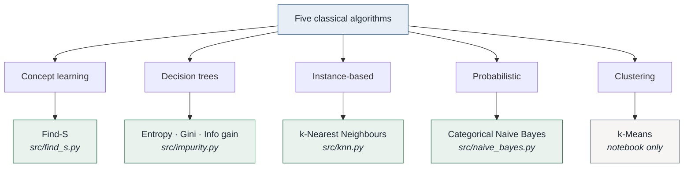

### Supervised vs unsupervised

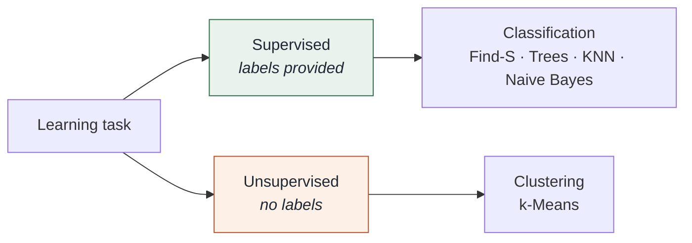

### How each implementation is checked

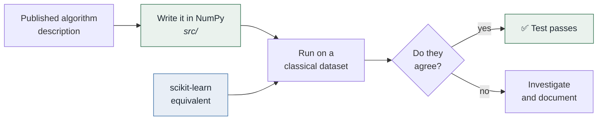

## What is verified

Every claim below is asserted by a test in `tests/`. Run `pytest` to reproduce.

| Implementation | Verified against | Result |
|---|---|---|
| `entropy`, `gini` | `DecisionTreeClassifier.tree_.impurity[0]` | Exact match |
| `information_gain` | Mitchell's published PlayTennis gains | Match to 4 decimal places |
| `best_split` | `DecisionTreeClassifier` root feature | Same feature chosen (`outlook`) |
| `KNearestNeighbours` | `KNeighborsClassifier`, k ∈ {1,3,5,10}, p ∈ {1,2} | Identical predictions and distances |
| `CategoricalNaiveBayes` | `CategoricalNB`, α ∈ {0.5,1.0,2.0} | Posteriors agree to **5.6e-16** |
| `FindS` | Mitchell's worked EnjoySport example | Exact hypothesis match |

```
72 passed in 2.10s
```

### Headline numbers

| Quantity | Value | Where it comes from |
|---|---|---|
| PlayTennis root entropy | 0.9403 bits | 9 Yes / 5 No |
| PlayTennis root Gini | 0.4592 | same distribution |
| Best root split | `outlook`, gain 0.2467 bits | beats humidity (0.1518), wind (0.0481), temp (0.0292) |
| Find-S learned hypothesis | `⟨sunny, warm, ?, strong, ?, ?⟩` | 3 positive examples |
| KNN on Iris (k=5) | 1.0000 test accuracy | identical to scikit-learn |
| KNN on Iris (k=10) | 0.9667 test accuracy | identical to scikit-learn |
| Naive Bayes on PlayTennis | 0.9286 training accuracy | identical to scikit-learn |

Iris accuracy of 1.0 at k=5 is a property of a 30-sample test split of an easy
dataset, not evidence of a good model. It is reported here only because
scikit-learn produces exactly the same number.

---

## The five algorithms

### 1. Find-S — concept learning

`src/find_s.py` · [notebook](notebooks/01_find_s_concept_learning.ipynb)

The first algorithm in Mitchell's *Machine Learning*. It searches for the most
specific hypothesis consistent with the positive examples, generalising a
constraint to `?` whenever a new positive example disagrees with it.

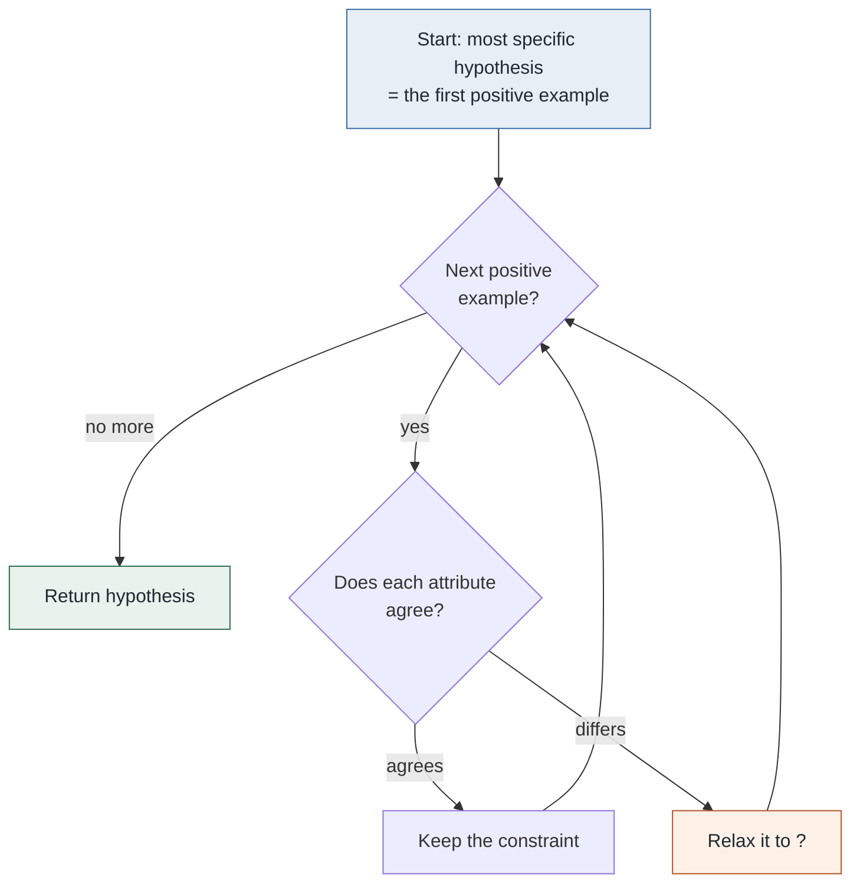

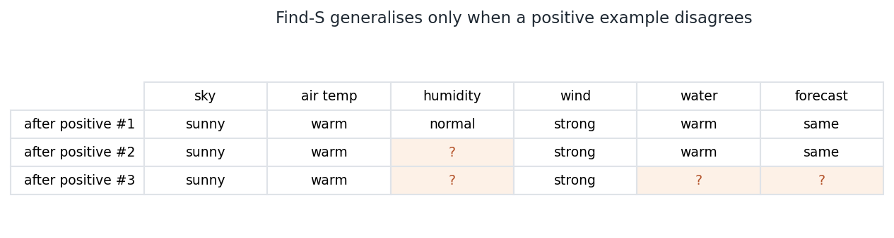

Find-S is worth implementing precisely because of what it gets wrong:

- **It ignores negative examples entirely.** `test_negative_examples_are_ignored`
  proves this — adding a negative example to the training set leaves the learned
  hypothesis byte-identical.
- **It cannot express disjunction.** Two positive examples that disagree on an
  attribute collapse it straight to `?`, losing the information that only two
  specific values were ever seen.
- **It assumes the data is noise-free.** A single mislabelled positive example
  permanently over-generalises the hypothesis, with no mechanism to recover.

Everything that came later — version spaces, decision trees, ensembles — is in
some sense a response to one of these three failures.

### 2 & 3. Entropy, Gini, and information gain — decision trees

`src/impurity.py` · [entropy notebook](notebooks/02_decision_tree_entropy.ipynb) · [gini notebook](notebooks/03_decision_tree_gini.ipynb)

Three functions constitute the entire arithmetic core of ID3 and CART:

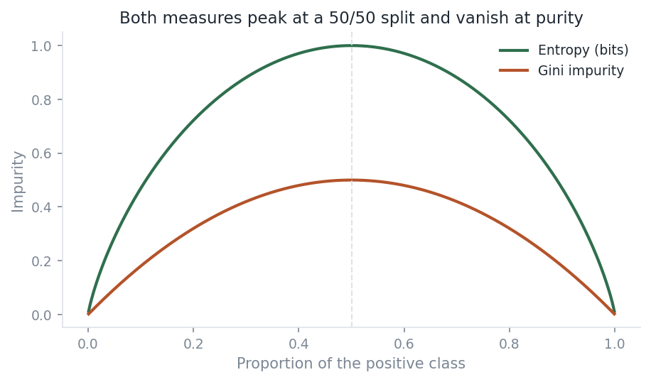

Both measures peak on a 50/50 split and reach zero on a pure node. They differ
in scale, not in shape — which is why the two criteria so often build the same
tree, as `test_best_split_matches_sklearn_root_feature` confirms on PlayTennis.

How a tree picks its root split:

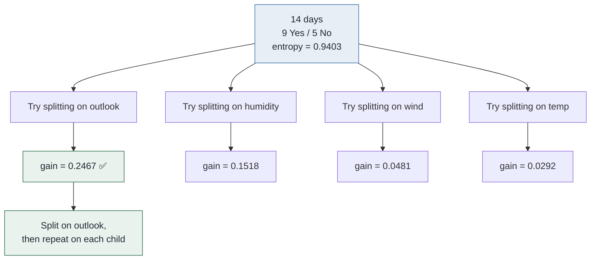

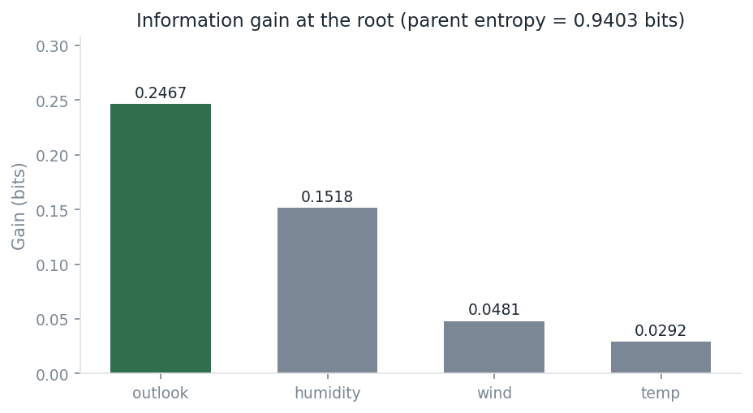

`outlook` wins at the root with 0.2467 bits. `temp` is nearly useless at 0.0292
bits. Reproducing these exact published numbers is what gives confidence the
implementation is right rather than merely plausible.

### 4. k-nearest neighbours

`src/knn.py` · [Iris notebook](notebooks/05_knn_iris.ipynb) · [synthetic notebook](notebooks/06_knn_synthetic_fruits.ipynb)

KNN has no training step — `fit` only stores the data. All cost is deferred to
prediction time.

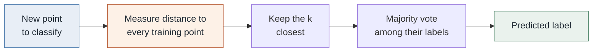

`fit` only stores the data — all the work is in that second box, which is why
KNN is instant to train and slow to serve.

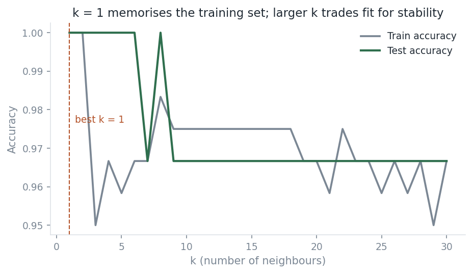

At k=1 training accuracy is exactly 1.0, because every training point is its own
nearest neighbour. That is memorisation, not learning, and the gap between the
two curves is the clearest picture of overfitting in this folder.

**On distance ties.** Iris measurements are recorded to one decimal place, so
exact ties are common: under Manhattan distance **17 of 30** test queries have
the k-th and (k+1)-th neighbour equidistant. When that happens the neighbour set
is genuinely ambiguous and two correct implementations may legitimately disagree.
This implementation and scikit-learn's differ on exactly such a query. Rather
than fudge the tie-break to force agreement, the test-suite compares only
unambiguous queries and asserts separately that the *distance profiles* always
match exactly. See `TestDistanceTies` in `tests/test_knn.py`.

### 5. Categorical Naive Bayes

`src/naive_bayes.py` · [notebook](notebooks/04_naive_bayes.ipynb)

The "naive" conditional-independence assumption is plainly false on PlayTennis —
humidity and outlook are related — and the classifier works anyway.

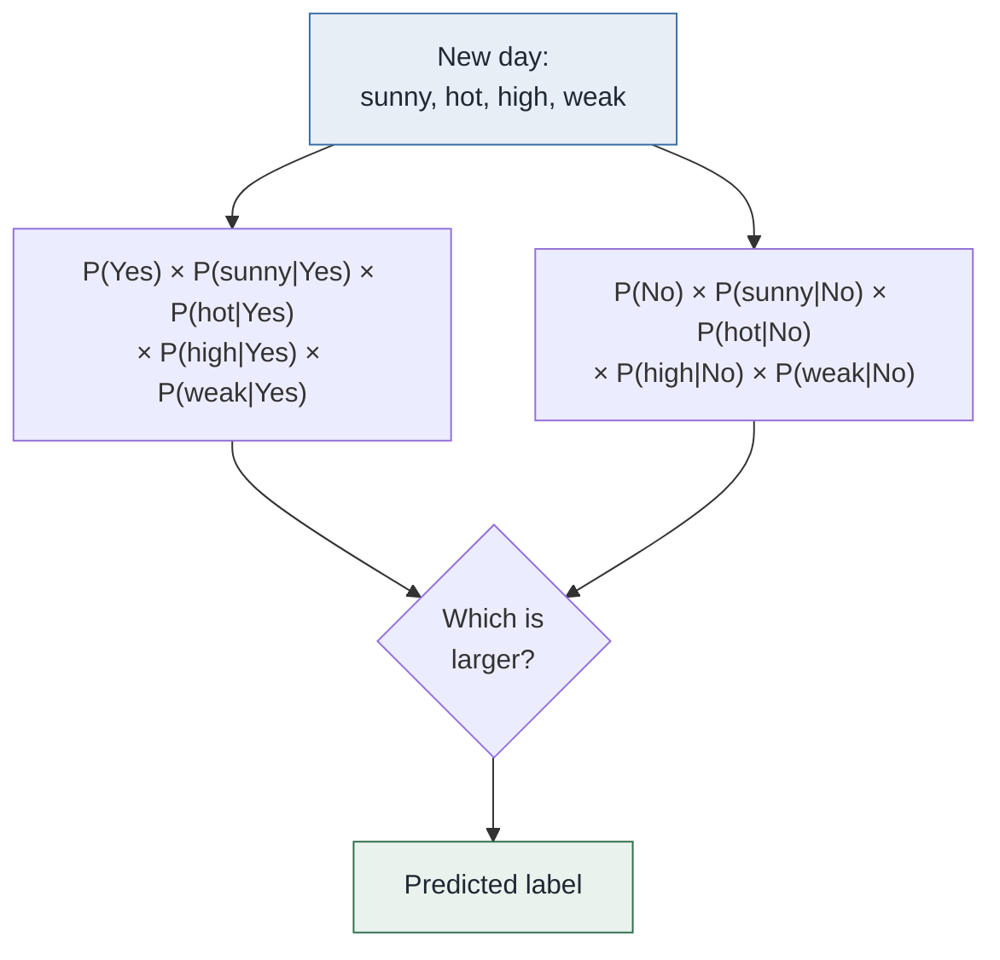

Multiply the prior by one conditional probability per feature, and pick the
larger. Two implementation details carry the whole thing:

- **Laplace smoothing.** Without it, one unseen `(feature, value, class)`
  combination sends the entire product to zero and that class can never be
  predicted, no matter how strong the remaining evidence.
  `test_smoothing_prevents_zero_probability` pins both behaviours.
- **Log-space arithmetic.** Multiplying many small probabilities underflows to
  zero in float64. `test_log_space_avoids_underflow_on_wide_input` builds a
  400-feature case that would collapse under naive multiplication and checks the
  posteriors remain finite and sum to 1.

Posteriors match `sklearn.naive_bayes.CategoricalNB` to 5.6e-16 — floating-point
identical, not merely close.

### Bonus: k-means and the scaling trap

[notebook](notebooks/07_kmeans_clustering.ipynb)

k-means is not reimplemented here — Lloyd's algorithm adds little beyond what
the above already demonstrates — but the notebook makes one point worth keeping:

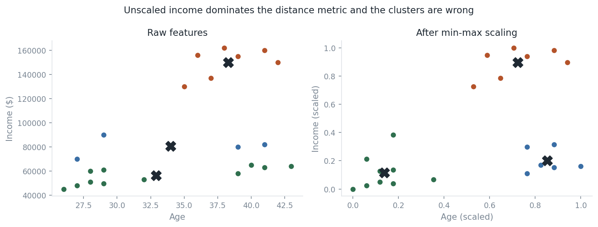

Income spans ~45k–162k; age spans 26–43. Euclidean distance is therefore
determined almost entirely by income, and unscaled k-means recovers horizontal
income bands instead of the visible age/income groups. Min-max scaling first
fixes it. Every distance-based method in this folder inherits this sensitivity.

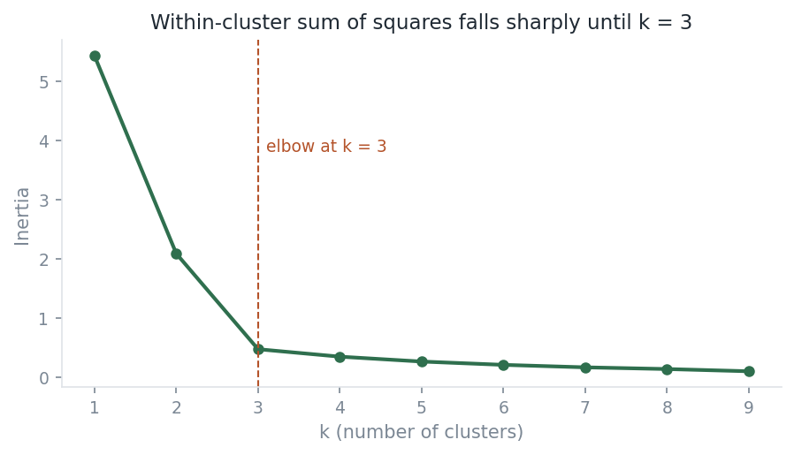

---

## Running it

```bash
cd 00-foundations
python -m venv .venv
source .venv/bin/activate        # Windows: .venv\Scripts\activate
pip install -r requirements.txt
```

Run the test-suite — this is the fastest way to confirm everything works:

```bash
pytest
```

Regenerate every figure in this README:

```bash
python scripts/make_figures.py
```

Use the implementations directly:

```python
from src.datasets import load_play_tennis
from src.impurity import best_split, entropy

X, y = load_play_tennis()
print(entropy(y))        # 0.9402859586706311
print(best_split(X, y))  # ('outlook', 0.24674981977443933)
```

---

## Layout

```text
00-foundations/
├── src/                 # from-scratch implementations (NumPy only)
│   ├── datasets.py      # path-independent loaders
│   ├── find_s.py        # concept learning
│   ├── impurity.py      # entropy, gini, information gain, best split
│   ├── knn.py           # k-nearest neighbours
│   └── naive_bayes.py   # categorical naive bayes
├── tests/               # 72 tests, mostly agreement-with-sklearn
├── notebooks/           # original coursework, preserved and repaired
├── data/                # three small datasets + provenance notes
├── docs/assets/         # figures, regenerated by scripts/
└── scripts/
    └── make_figures.py
```

---

## Provenance and attribution

Not all of this is original work, and the distinction matters:

| Notebook | Origin |
|---|---|
| `01_find_s_concept_learning` | My own implementation, from the algorithm description |
| `02_decision_tree_entropy` | My own, on Quinlan's dataset |
| `03_decision_tree_gini` | My own |
| `04_naive_bayes` | My own |
| `05_knn_iris` | **Followed from [codebasics](https://github.com/codebasics/py) tutorial 17** |
| `06_knn_synthetic_fruits` | My own, on generated data |
| `07_kmeans_clustering` | **Followed from [codebasics](https://github.com/codebasics/py) tutorial 13** |

Everything under `src/` is written from scratch by me, which is what the tests
in `tests/` are there to substantiate.

Datasets and their citations are documented in [`data/README.md`](data/README.md).

---

## What this folder is not

- Not a replacement for scikit-learn. These implementations are unoptimised and
  handle only the cases the tests cover.
- Not a complete decision-tree implementation. `impurity.py` provides the split
  criterion; recursive tree induction is left to scikit-learn.
- Not evidence of model quality. The datasets have 4, 14, and 150 rows. They
  demonstrate mechanics, and nothing here should be read as a performance claim.

**Next:** [01 — Fake News Classifier](../01-fake-news-classifier/) applies these
ideas to real text data, where the datasets are large enough for the evaluation
to mean something.
