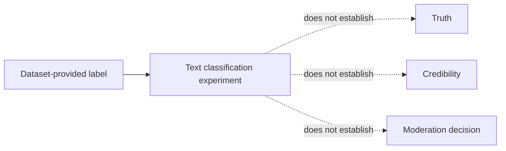
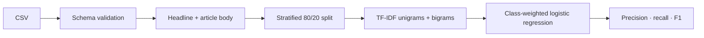
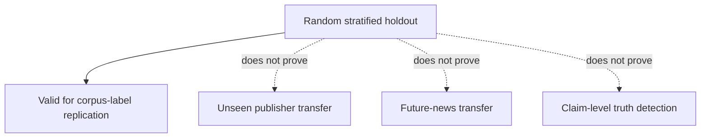

# Fake News Classifier

**A reproducible text-classification baseline for a labelled news dataset—not a system that determines truth.**

`preserved LSTM experiment · tested TF-IDF baseline · 3 required columns · source dataset absent from this checkout · 2 unit tests`

> The central limitation is semantic, not computational: a dataset label is a label supplied by a dataset. It is not a universal finding that an article, author, organisation, or claim is “fake.” The project therefore documents text classification as an experiment and makes no automated fact-checking claim.

---

## Contents

| | | |
|---|---|---|
| [1 · The label is not truth](#1--the-label-is-not-truth) | [5 · The baseline](#5--the-baseline) | [9 · Verification and state](#9--verification-and-state) |
| [2 · System at a glance](#2--system-at-a-glance) | [6 · Evaluation boundary](#6--evaluation-boundary) | [10 · Limitations](#10--limitations) |
| [3 · Data contract](#3--data-contract) | [7 · Original failures](#7--original-failures) | [A · Commands and layout](#a--commands-and-layout) |
| [4 · Text construction](#4--text-construction) | [8 · What is deliberately absent](#8--what-is-deliberately-absent) | |

## 1 · The label is not truth

The intended task is a binary or multiclass **dataset-label prediction**: infer the `label` field associated with a news record from its supplied headline and body text. That task may be useful for studying language patterns in a particular corpus. It cannot establish whether a claim is accurate, whether a source is credible, or whether a person has acted deceptively.

A classifier can achieve a high held-out score by learning artefacts of the dataset: recurring publishers, headline style, topic, date range, boilerplate, or a train/test duplicate. Those shortcuts can be statistically real and socially useless.



## 2 · System at a glance

The original TensorFlow/LSTM notebook is preserved. The recommended path is a compact TF-IDF and logistic-regression baseline because it is fast, inspectable, and reveals whether deep-learning complexity is justified at all.



| Artefact | Responsibility | Status |
|---|---|---|
| `FakeNewsClassifier.ipynb` | Preserved original LSTM experiment | Not deleted; data unavailable |
| `fake_news_model.py` | Schema validation, text construction, baseline pipeline | 2 passing unit tests |
| `main.py` | Command-line run with explicit dataset path | Implementation verified |
| `data/` | Expected authorised source data location | Intentionally ignored by Git |
| `docs/index.html` | Standalone technical walkthrough | Mirrors this account |

## 3 · Data contract

The original file, `fake_or_real_news.csv`, is not present anywhere in this repository. The workflow refuses to train without it instead of silently downloading an unreviewed substitute or reporting a fabricated metric.

```text
FakeNewsClassifier/
└── data/
    └── fake_or_real_news.csv
```

| Required column | Meaning | Validation |
|---|---|---|
| `title` | Headline text | May be missing; becomes an empty string |
| `text` | Article body | May be missing; becomes an empty string |
| `label` | Dataset class | Must contain at least two labels |

The source's licence, collection rules, publisher distribution, time period, annotation policy, and duplicate policy must be recorded when the CSV is restored. They are model inputs in the broad sense: they determine what a held-out score means.

## 4 · Text construction

The original notebook creates a combined title/body column but then trains only on `title`; it also calls `lower()` without storing the result and joins stemmed words without spaces. The rewrite preserves every word boundary and uses both supplied text fields:

```python
title = data["title"].fillna("").astype(str).str.strip()
body = data["text"].fillna("").astype(str).str.strip()
combined = (title + " " + body).str.strip()
```

This does not claim that longer text is always better. It makes the model task match the project’s stated object—an article record rather than a headline-only classifier—and makes missingness handling visible.

## 5 · The baseline

| Choice | Decision | Why |
|---|---|---|
| Representation | TF-IDF, 1–2 word n-grams | Captures word and short-phrase evidence in a sparse inspectable form |
| Classifier | Logistic regression | Strong transparent baseline for linear text signals |
| Class weights | Balanced | Prevents a majority class from dominating the loss by default |
| Split | Stratified 80/20, seed 42 | Preserves label share across train and test |
| Metrics | Per-class report plus weighted precision/recall/F1 | Avoids an accuracy-only story |

The baseline is deliberately a starting point, not an assertion that neural networks are unnecessary. A preserved LSTM is worth comparing only after the same split, input text, and metrics are applied to both systems.

## 6 · Evaluation boundary

The split is stratified but not source-, topic-, or time-blocked. It answers only: *on a random holdout from the same labelled corpus, how well does the model reproduce that corpus's labels?*



When data is restored, duplicate detection and source/time-grouped splits are the next mandatory checks. Without them, a high F1 can be an artefact of the corpus boundary.

## 7 · Original failures

The original notebook's errors are recorded because a rewrite is only useful if it preserves the reason it was necessary:

1. It references a CSV that is absent from the project.
2. It builds title-plus-body text but subsequently trains on headline only.
3. Its lowercasing and stemming workflow does not persist transformations correctly and removes whitespace when joining tokens.
4. It performs an unseeded, non-stratified split.
5. It uses only training/validation accuracy history without a complete, class-sensitive holdout report.

The revised unit tests pin the schema and text-construction behaviour. The dataset-dependent full run is intentionally not marked verified.

## 8 · What is deliberately absent

No OpenAI call, web search, source reputation lookup, citation verification, or human-review queue is hidden behind the word “classifier.” Those systems would be separate products with different privacy, safety, and accountability requirements. This repository contains a corpus-label baseline only.

## 9 · Verification and state

```text
python -m pytest tests -q
2 passed

python main.py
FileNotFoundError: Dataset not found: data/fake_or_real_news.csv
```

| State | Evidence |
|---|---|
| Implementation verified | Unit tests validate required schema and title/body combination |
| Full training blocked | Original CSV is absent from the checkout |
| Original work preserved | LSTM notebook remains unchanged |
| Metric claim | None; no source-data run has occurred |

## 10 · Limitations

- Labels are dataset annotations, not universal truth judgements.
- Corpus provenance and licensing are currently unknown because the CSV is absent.
- Random splits can leak source, author, topic, and duplicate patterns.
- Text-only features cannot inspect evidence quality or external reality.
- No calibration, fairness, multilingual, adversarial, or temporal-drift study has been run.
- This must not be used for moderation, reputation scoring, employment, education, financial, legal, medical, or safety decisions.

**Current state:** implementation verified; full corpus run blocked on the missing source CSV. **Open next step:** restore an authorised source file with its provenance, then run duplicate/source/time audits before reporting any classification score.

## A · Commands and layout

```powershell
python -m venv .venv
.venv\Scripts\Activate.ps1
pip install -r requirements.txt
python main.py --data data/fake_or_real_news.csv
python -m pytest tests -q
```

```text
FakeNewsClassifier/
├── FakeNewsClassifier.ipynb    # preserved original LSTM
├── fake_news_model.py          # current recommended baseline
├── main.py
├── data/                       # not committed
├── tests/
└── docs/index.html
```
