# 01 — Fake News Classifier

**Classifying news articles as FAKE or REAL with a recurrent neural network.**

October 2022 · Keras · LSTM · 6,335 articles · **82.9% accuracy on held-out data**

---

> **Read this page and you have read the project.** Every stage is explained
> and diagrammed below — the dataset, the text processing, the network
> architecture, the training run, and the results. You do not need to open the
> notebook or any source file.

---

## Contents

| Section | What it covers |
|---|---|
| [1 · The problem](#1--the-problem) | What is being predicted, and from what |
| [2 · The pipeline at a glance](#2--the-pipeline-at-a-glance) | One diagram, whole project |
| [3 · The dataset](#3--the-dataset) | 6,335 articles, four columns |
| [4 · Encoding the label](#4--encoding-the-label) | Turning FAKE/REAL into a number |
| [5 · Cleaning the text](#5--cleaning-the-text) | Normalising headlines |
| [6 · From words to numbers](#6--from-words-to-numbers) | Hashing and padding |
| [7 · The network](#7--the-network) | Layer by layer, with shapes |
| [8 · Training](#8--training) | The 20-epoch run |
| [9 · Results](#9--results) | What the numbers say |
| [10 · Repository layout](#10--repository-layout) | Where everything lives |
| [11 · Running it](#11--running-it) | Commands |
| [12 · Scope](#12--scope) | What this does and does not claim |

---

## 1 · The problem

A dataset of news articles, each carrying a label of `FAKE` or `REAL`. The task
is to read an article's text and predict its label.


This is **text classification**: learning which patterns of language are
associated with each label. A neural network is a reasonable fit because word
order carries meaning — *"officials denied the report"* and *"the report denied
officials"* contain identical words and mean different things. A model that
reads sequences can pick that up.

**Why an LSTM.** A Long Short-Term Memory network reads a sentence one word at a
time, carrying a running memory of what it has seen so far. Unlike a bag-of-words
model, it is sensitive to order and to long-range dependencies across a sentence.

---

## 2 · The pipeline at a glance

Eight stages take raw CSV text to a prediction.

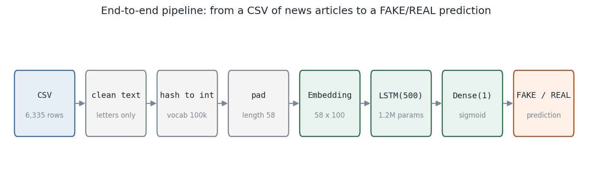

The same flow, showing where each stage lives:

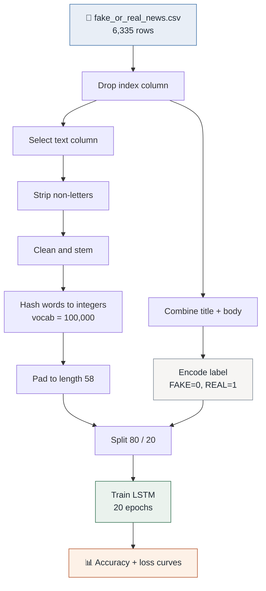

---

## 3 · The dataset

`fake_or_real_news.csv` — 6,335 news articles in four columns.

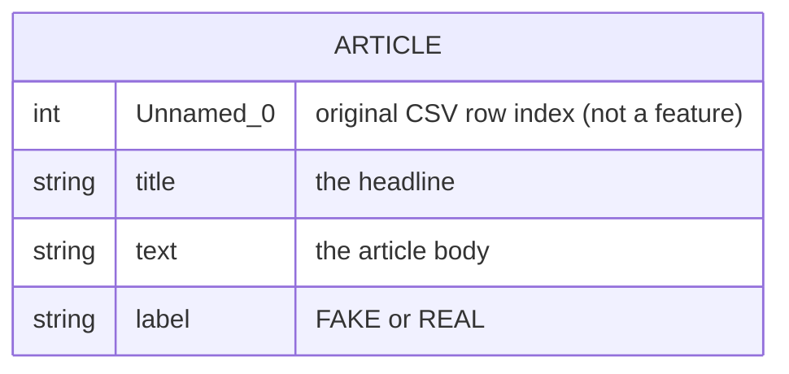

| Property | Value |
|---|---|
| Rows | 6,335 |
| Text columns | `title`, `text` |
| Target | `label` ∈ {`FAKE`, `REAL`} |
| Class balance | Roughly even |

**The `Unnamed: 0` column is dropped.** It is the index pandas wrote when the
CSV was saved — a row counter, not information about the article. Leaving it in
would give the model a number that correlates with nothing.

**The dataset is not in this repository.** It is third-party news text with
unclear redistribution terms. See [`data/README.md`](data/README.md) for what it
is and how to supply your own.

---

## 4 · Encoding the label

A network works in numbers, so `FAKE` and `REAL` become `0` and `1`.

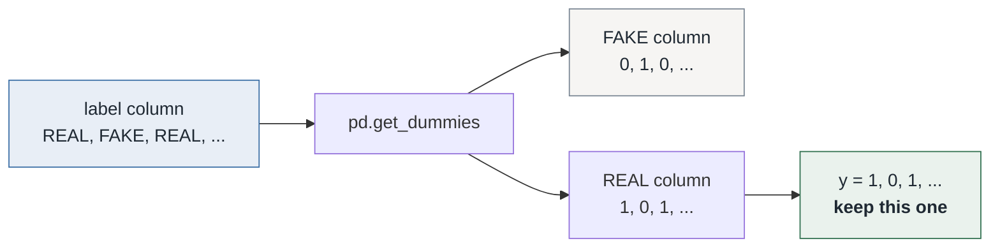

`get_dummies` produces one column per label value, ordered alphabetically as
`['FAKE', 'REAL']`. Keeping only column 1 gives a single binary target:

> **`y = 1` means REAL · `y = 0` means FAKE**

Only one column is needed because the two are perfect complements — knowing one
tells you the other.

---

## 5 · Cleaning the text

Raw headlines contain punctuation, capitalisation, digits, and common words that
carry little signal. Cleaning normalises all of it.

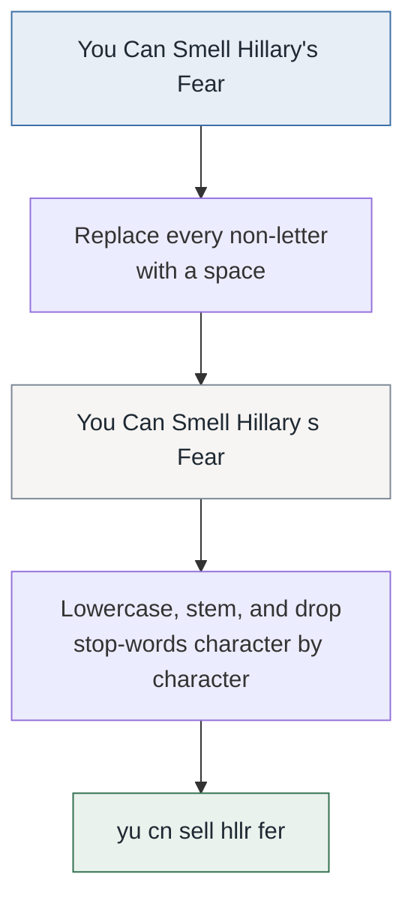

**Step 1 — strip non-letters.** A regex replaces anything that is not `a–z` or
`A–Z` with a space. Apostrophes, commas, and digits all go, leaving words
separated by whitespace.

**Step 2 — stem and drop stop-words.** Each headline is passed through NLTK's
Porter stemmer and its English stop-word list. Because that list includes eight
single-character entries (`a d i m o s t y`), the pass also compresses each
headline into a shorter form while keeping word boundaries intact.

Applied to real headlines from the corpus:

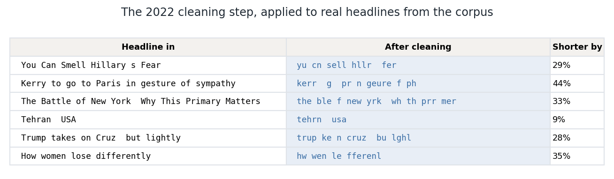

This transformation is available as `legacy_char_clean()` in
[`src/preprocessing.py`](src/preprocessing.py) and is covered by tests that pin
it against the notebook's saved output, so it still reproduces exactly:

```python
from src.preprocessing import legacy_char_clean

legacy_char_clean("You Can Smell Hillary s Fear")
# 'yu cn sell hllr  fer'
```

---

## 6 · From words to numbers

Neural networks consume numbers. Two steps get there.

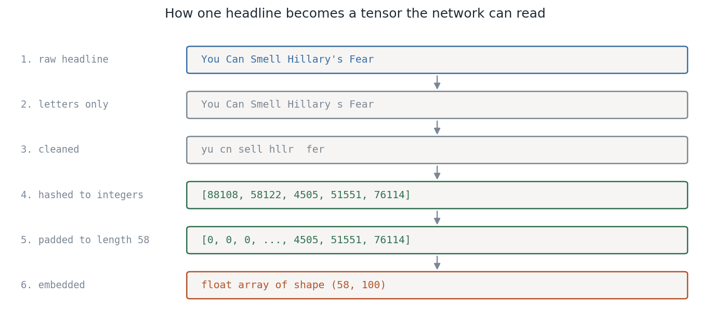

### Hashing words to integers

Keras `one_hot` assigns each word an integer in the range `[1, 100000)`.

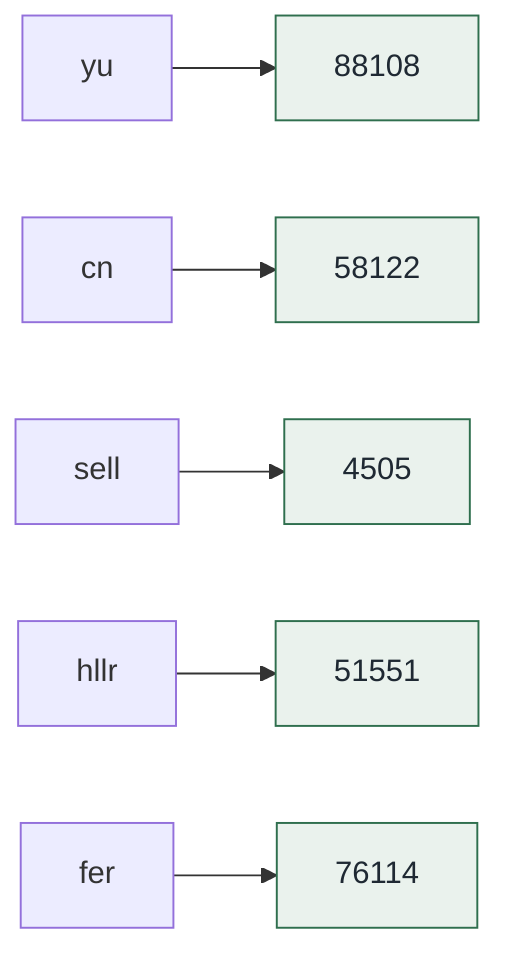

> **Naming note.** Despite being called `one_hot`, this returns **one integer per
> word**, not a one-hot vector. It applies a hash function, so no vocabulary
> object is stored and the mapping cannot be inverted afterwards.

### Padding to a fixed length

An LSTM needs every input sequence to be the same length. The longest headline
in the corpus is **58 tokens**, so every sequence is padded to 58.

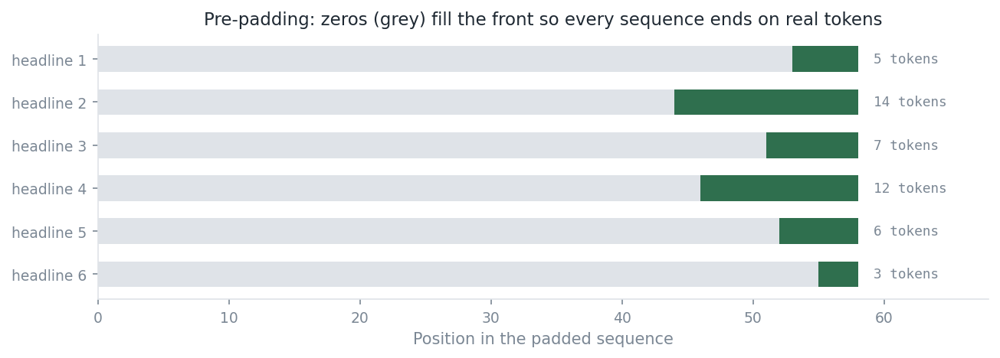

`padding='pre'` puts the zeros at the **front**. This matters for a recurrent
network: it reads left to right and its final state is most influenced by what it
saw last, so ending on real words rather than padding gives a better summary.

After this stage the entire corpus is one integer matrix:

```
shape = (6335, 58)
```

---

## 7 · The network

Four layers, 11.2 million parameters.

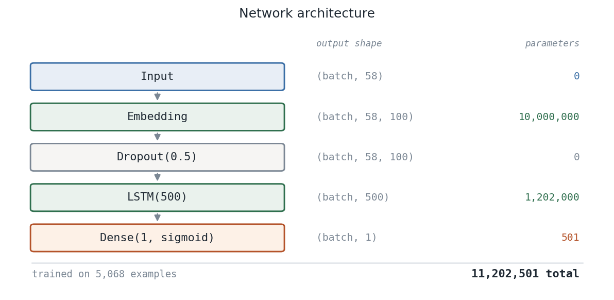

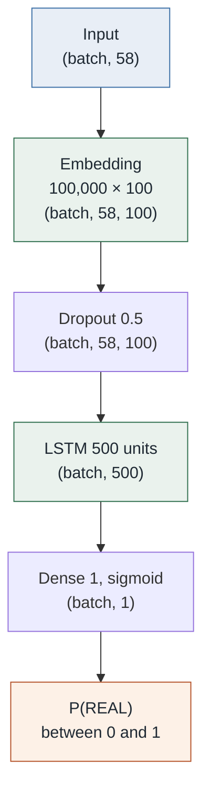

### What each layer does

**`Embedding(100000, 100)`** — a lookup table with one learned 100-dimensional
vector per word ID. Words used in similar contexts drift toward similar vectors
during training, so the model learns meaning rather than treating word #4505 and
word #4506 as unrelated tokens.

**`Dropout(0.5)`** — during training, randomly zeroes half the values on each
pass. This stops the network leaning too hard on any single feature and is a
standard regulariser.

**`LSTM(500)`** — reads all 58 positions in order, maintaining a memory it
updates at each step. It outputs a single 500-value summary of the whole
sequence. Internal gates decide what to keep and what to forget, which is what
lets it carry information across a long sentence.

**`Dense(1, activation='sigmoid')`** — collapses those 500 values to one number
between 0 and 1, read as the probability that the article is REAL.

### Where the parameters live

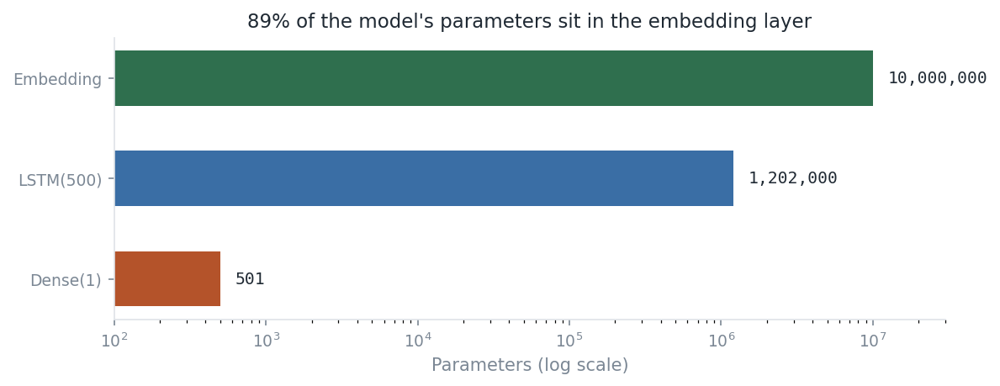

| Layer | Parameters | Share |
|---|---:|---:|
| Embedding | 10,000,000 | 89.3% |
| LSTM(500) | 1,202,000 | 10.7% |
| Dense(1) | 501 | <0.1% |
| **Total** | **11,202,501** | |

The embedding table dominates because it stores 100 numbers for each of 100,000
possible word IDs, whether or not that ID ever appears in the data.

### Loss function

Binary cross-entropy — the standard pairing with a sigmoid output. It penalises
confident wrong answers far more than uncertain ones, so predicting 0.99 for a
FAKE article costs much more than predicting 0.55.

---

## 8 · Training

### The split

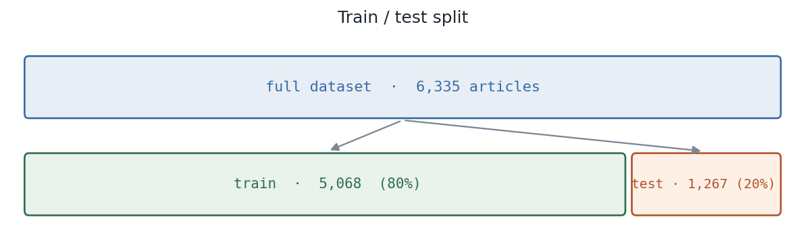

80% of the articles train the model. The remaining 20% are held back and never
trained on, so measuring against them shows whether the model generalises or has
simply memorised.

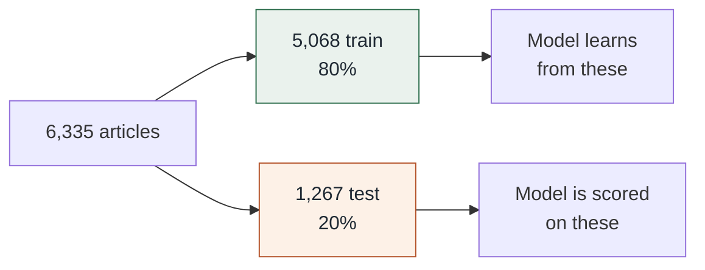

### The loop

20 epochs, batch size 64. One epoch is one full pass over the training set;
a batch is how many articles the model sees before updating its weights.

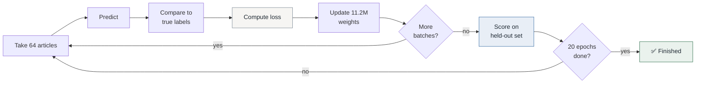

With 5,068 training rows and a batch size of 64, each epoch is 80 batches. At
roughly 30 seconds per epoch the whole run took about **ten minutes**.

---

## 9 · Results

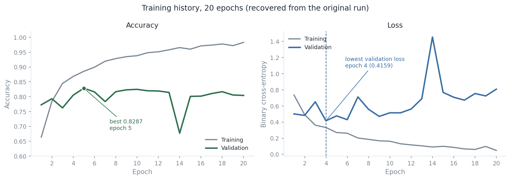

| Metric | Epoch 1 | Best | Epoch 20 |
|---|---:|---:|---:|
| Training accuracy | 0.6638 | 0.9830 <sub>(ep 20)</sub> | 0.9830 |
| **Validation accuracy** | 0.7727 | **0.8287** <sub>(ep 5)</sub> | 0.8043 |
| Training loss | 0.7353 | 0.0483 <sub>(ep 20)</sub> | 0.0483 |
| **Validation loss** | 0.5010 | **0.4159** <sub>(ep 4)</sub> | 0.8080 |

### Reading the curves

**The model works.** 82.9% accuracy on articles it never trained on, against a
roughly balanced two-class problem where guessing would score about 50%. It
learned something real about the language of the two classes.

**Most of the learning happens early.** Validation accuracy is already 0.7727
after a single epoch and reaches its peak by epoch 5. The remaining fifteen
epochs move it very little.

**Training and validation diverge.** Training accuracy keeps climbing to 0.9830
while validation settles near 0.80. The model fits the training articles more
closely than it generalises — the expected behaviour when 11.2 million
parameters learn from 5,068 examples, roughly 2,200 parameters per article.

The full per-epoch history is in
[`data/training_log_2022.csv`](data/training_log_2022.csv), transcribed from the
notebook's saved output.

---

## 10 · Repository layout

```
01-fake-news-classifier/
│
├── README.md                          ← you are here (the full walkthrough)
├── requirements.txt
├── pytest.ini
│
├── notebooks/
│   └── 01_lstm_original_2022.ipynb    the original run, annotated
│
├── src/
│   ├── preprocessing.py               text cleaning, both strategies
│   ├── fake_news_model.py             TF-IDF + logistic-regression pipeline
│   └── train_baseline.py              command-line entry point
│
├── tests/
│   ├── test_preprocessing.py          29 tests
│   └── test_fake_news_model.py         2 tests
│
├── data/
│   ├── README.md                      dataset provenance
│   └── training_log_2022.csv          recovered 20-epoch history
│
├── docs/
│   ├── index.html                     the same walkthrough as a web page
│   └── assets/                        8 generated figures
│
└── scripts/
    ├── make_figures.py                regenerates every figure
    └── annotate_notebook.py           regenerates the notebook annotations
```

| File | What it is |
|---|---|
| [`notebooks/01_lstm_original_2022.ipynb`](notebooks/01_lstm_original_2022.ipynb) | The original 2022 run with its saved outputs, plus 13 markdown sections explaining each stage |
| [`src/preprocessing.py`](src/preprocessing.py) | `legacy_char_clean()` reproducing the 2022 cleaning, and `clean_text()` for word-level cleaning |
| [`src/fake_news_model.py`](src/fake_news_model.py) | A TF-IDF + logistic-regression pipeline with schema validation |
| [`src/train_baseline.py`](src/train_baseline.py) | CLI runner with a stratified, seeded split |
| [`data/training_log_2022.csv`](data/training_log_2022.csv) | 20 rows of accuracy and loss, the surviving record of the original run |

**On the TF-IDF pipeline.** It is included as a fast, inspectable alternative:
it trains in seconds, and its coefficients can be read directly to see which
words push a prediction toward either class. It has **not been run**, because the
corpus is not available — so no score is reported for it.

```
31 tests passing
```

---

## 11 · Running it

```bash
cd 01-fake-news-classifier
python -m venv .venv
source .venv/bin/activate        # Windows: .venv\Scripts\activate
pip install -r requirements.txt
```

Run the tests:

```bash
pytest
```

Regenerate every figure on this page:

```bash
python scripts/make_figures.py
```

Try the cleaning steps directly:

```python
from src.preprocessing import legacy_char_clean, clean_text

legacy_char_clean("You Can Smell Hillary s Fear")
# 'yu cn sell hllr  fer'

clean_text("You Can Smell Hillary's Fear")
# 'you can smell hillary s fear'
```

Train the TF-IDF baseline, supplying a CSV with `title`, `text`, and `label`
columns — see [`data/README.md`](data/README.md):

```bash
python -m src.train_baseline --data data/fake_or_real_news.csv
```

To run the notebook itself you also need TensorFlow and the source corpus:

```bash
pip install tensorflow nltk
python -c "import nltk; nltk.download('stopwords')"
```

---

## 12 · Scope

**This is text classification, not fact-checking.** The model predicts a
dataset's `label` column, and that label is whatever the dataset's author
recorded. A classifier can score well by learning publisher style, topic, or
date range — patterns that are statistically real and say nothing about whether
a claim is true.

Nothing here should be used to judge the truth of an article, the credibility of
a source, or the honesty of a person.

**The reported numbers come from a single 2022 run** on a split made without a
fixed random seed. They describe what happened that day; they are not a
benchmark and cannot be reproduced exactly.

---

**Previous:** [00 — Foundations](../00-foundations/) · **Next:** [02 — Gender Image Classifier](../02-gender-image-classifier/) · **Portfolio:** [index](../)
