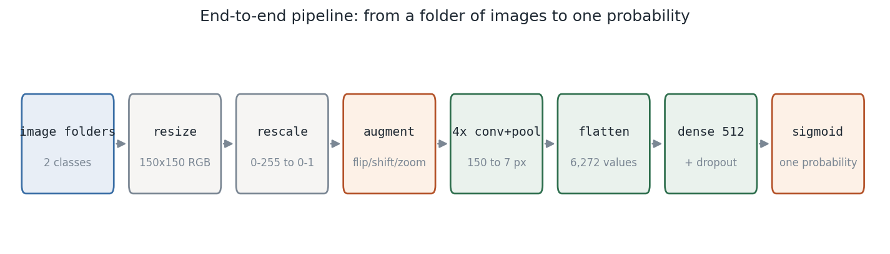
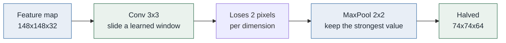
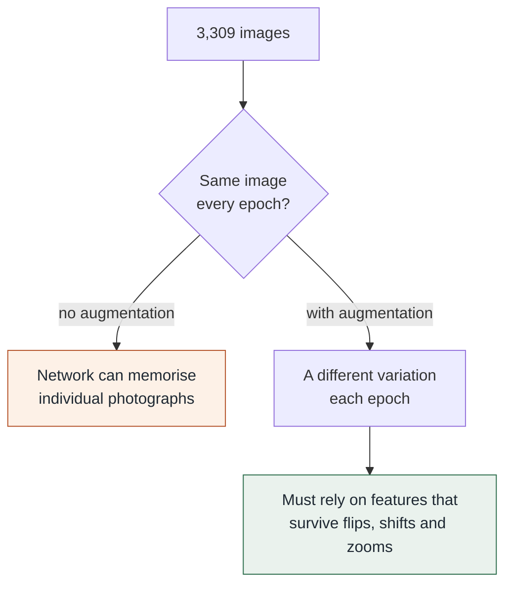
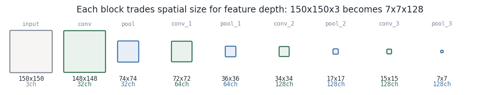
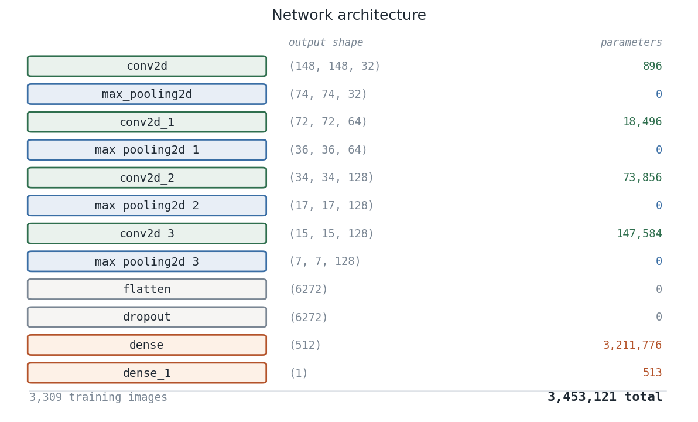
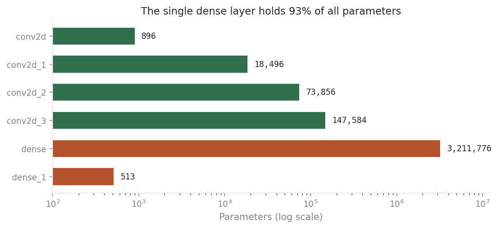
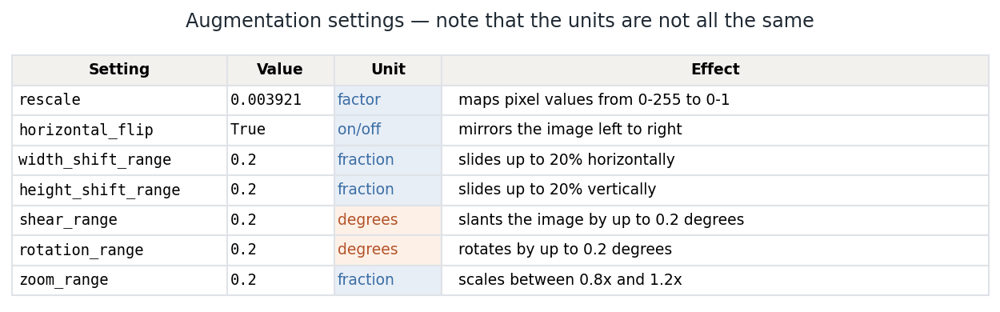
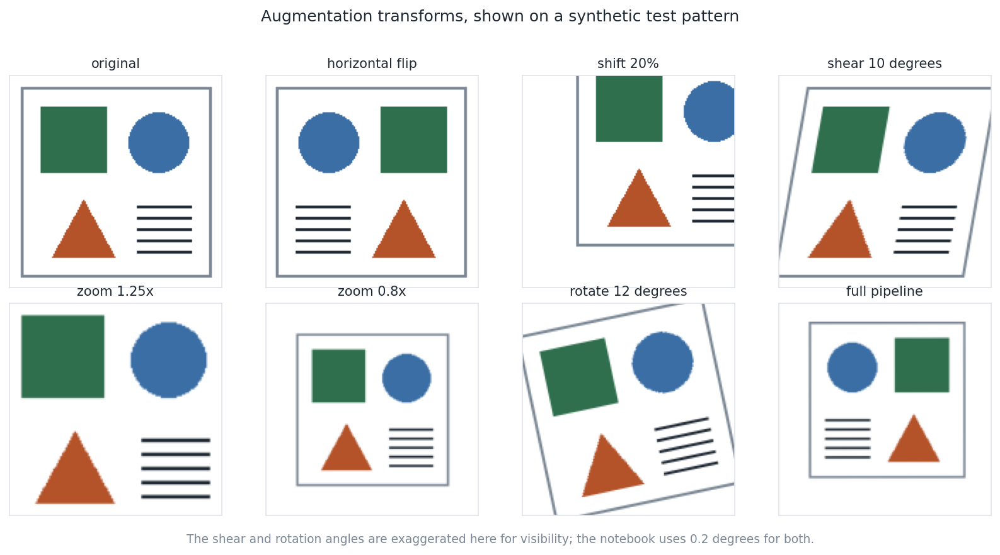
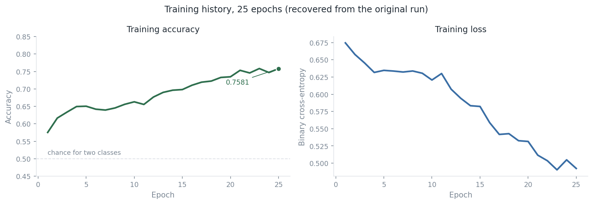

# Binary Appearance-Label Image Classifier

> **Historical CNN, reconstructed and documented.** This project preserves a
> 2022 Keras experiment trained on 3,309 images across two folder-defined
> classes. Its original 25-epoch training log and exact CNN architecture are
> recoverable; source images, label definition, provenance, and evaluation split
> are not. This walkthrough makes that boundary explicit.

## Executive summary

The original notebook trains a four-block convolutional neural network on
150×150 RGB images. Training accuracy rose from **0.5753** at epoch 1 to
**0.7581** at epoch 25, while binary cross-entropy fell from **0.6746** to
**0.4923**. Those are **training** measurements only: the notebook creates one
image iterator, trains on it, and then predicts on that same iterator. They are
not a held-out accuracy or generalisation result.

The historical folder name refers to gender, but image appearance does not
establish gender identity. The model can only learn patterns related to the two
labels supplied by its source directories. It must not be used to infer identity
or for hiring, admissions, surveillance, access control, profiling, moderation,
or any decision about a person.

| Evidence | What is known | What is not known |
|---|---|---|
| Training input | 3,309 images, two source folders, 150×150 RGB | Source, consent, licence, class semantics, demographics |
| Network | 12 layers, 3,453,121 trainable parameters | Whether it generalises |
| Training | 25 epochs, 100 batches × 32 images, Adam + BCE | Validation/test performance or calibrated probabilities |
| Rebuild | 44 deterministic tests reproduce the contract | TensorFlow execution without the dataset |

## The recovered system

~~~mermaid
flowchart LR
    A[Two source folders] --> B[ImageDataGenerator]
    B --> C[Resize: 150 × 150 RGB]
    C --> D[Rescale: 0–255 → 0–1]
    D --> E[Training-only augmentation]
    E --> F[4 × convolution + max pooling]
    F --> G[Flatten: 6,272 values]
    G --> H[Dropout 0.5 + Dense 512]
    H --> I[Sigmoid probability]
~~~

The diagram is an exact reconstruction of the saved notebook configuration. It
is not a claim that the system was rerun in this repository.

## Pipeline at a glance

```mermaid
flowchart LR
    A["Image folders<br/>2 classes, 3,309 files"] --> B["Resize to 150x150"]
    B --> C["Rescale 0-255 to 0-1"]
    C --> D["Augment<br/>flip · shift · shear · zoom"]
    D --> E["4x Conv + MaxPool"]
    E --> F["Flatten<br/>6,272 values"]
    F --> G["Dropout 0.5"]
    G --> H["Dense 512"]
    H --> I["Sigmoid<br/>one probability"]

    style A fill:#e8eef6,stroke:#3a6ea5,color:#1f2933
    style D fill:#fdf1e7,stroke:#b4532a,color:#1f2933
    style E fill:#eaf2ed,stroke:#2f6f4e,color:#1f2933
    style I fill:#fdf1e7,stroke:#b4532a,color:#1f2933
```

### How a convolution block works

Each block detects patterns at a coarser scale than the last, trading spatial
resolution for feature depth — less *where*, more *what*.

### Why augment at all

## What the notebook actually does

The historical notebook is now readable end to end:

| Stage | Notebook section | Reason it exists |
|---|---|---|
| Imports and local path | 1–2 | Loads numerical utilities, Keras, and the original developer-specific directory. |
| Image generator | 3 | Streams and transforms images rather than loading them all into memory. |
| Folder loader | 3 | Assigns the two class indices from subfolder names. |
| CNN construction | 4 | Learns increasingly abstract visual features. |
| Compilation | 5 | Pairs sigmoid output with binary cross-entropy and Adam. |
| Training | 6 | Optimises weights for 25 × 100 training batches. |
| Save/predict | 7–8 | Saves legacy pickle artifacts and makes training-set predictions. |

The annotated [notebook](notebooks/01_gender_image_classifier.ipynb) contains
12 explanatory Markdown sections and 17 inline code comments. Original
executable cells and saved outputs remain intact.

## CNN architecture: exact, testable reconstruction

The notebook’s model summary is recoverable. Rather than require TensorFlow to
inspect it, [src/architecture.py](src/architecture.py) reproduces Keras shape
and parameter arithmetic as a pure-Python model. Its tests assert every layer
exactly matches the saved summary.

| Layer | Output shape | Parameters | Why it is there |
|---|---:|---:|---|
| Conv2D, 32 filters | 148 × 148 × 32 | 896 | Finds simple local patterns in RGB input. |
| Max pool | 74 × 74 × 32 | 0 | Halves spatial dimensions while retaining strong responses. |
| Conv2D, 64 filters | 72 × 72 × 64 | 18,496 | Combines early patterns into richer features. |
| Max pool | 36 × 36 × 64 | 0 | Reduces spatial cost. |
| Conv2D, 128 filters | 34 × 34 × 128 | 73,856 | Builds higher-level patterns. |
| Max pool | 17 × 17 × 128 | 0 | Continues the spatial/depth trade. |
| Conv2D, 128 filters | 15 × 15 × 128 | 147,584 | Last convolutional feature extractor. |
| Max pool | 7 × 7 × 128 | 0 | Produces the final feature map. |
| Flatten + dropout | 6,272 | 0 | Unrolls features; dropout masks 50% during training. |
| Dense, 512 units | 512 | 3,211,776 | Combines all feature positions. |
| Dense + sigmoid | 1 | 513 | Produces one probability for folder class 1. |

~~~mermaid
flowchart TB
    A[150 × 150 × 3] --> B[Conv 3×3, 32 filters]
    B --> C[148 × 148 × 32]
    C --> D[MaxPool 2×2]
    D --> E[74 × 74 × 32]
    E --> F[Three more conv/pool blocks]
    F --> G[7 × 7 × 128]
    G --> H[Flatten: 6,272]
    H --> I[Dropout: 0.5]
    I --> J[Dense: 512 ReLU]
    J --> K[Dense: 1 sigmoid]
~~~

For a valid, stride-1 3×3 convolution, each spatial dimension becomes
input − 3 + 1. Pooling performs integer floor division by two. A convolution
with f filters and c input channels has (3 × 3 × c + 1) × f trainable values;
the final +1 is one bias per filter.

### One dense layer holds 93% of the parameters

The 6,272-value flattened map connects to 512 dense units, creating
**3,211,776 parameters—93% of the model’s entire 3,453,121-parameter budget.**
This is expressive, but also gives the network ample capacity to memorise a
small dataset. The original notebook has no validation curve to show whether
that happened.

## Image preparation and augmentation

ImageDataGenerator rescales RGB pixels from [0, 255] to [0, 1], then produces
a slightly different training variation each time an image is drawn. This
reduces sensitivity to small photographic changes; it does not create new
identities, consent, representative coverage, or a valid test set.

| Setting | Notebook value | Unit | Meaning |
|---|---:|---|---|
| rescale | 1/255 | factor | Maps eight-bit pixels to [0, 1]. |
| horizontal_flip | True | boolean | Mirrors the image left to right. |
| width_shift_range | 0.2 | fraction | Shifts up to 20% of width. |
| height_shift_range | 0.2 | fraction | Shifts up to 20% of height. |
| shear_range | 0.2 | degrees | Applies a small horizontal slant. |
| rotation_range | 0.2 | degrees | Applies a small rotation. |
| zoom_range | 0.2 | fraction | Samples approximately 0.8×–1.2× zoom. |

The illustration below uses geometric shapes, not a person’s photograph.
Angles are exaggerated for visibility; the notebook uses only 0.2 degrees for
shear and rotation.

## Recovered training history

All 25 epochs of notebook output are transcribed exactly in
[data/training_log_2022.csv](data/training_log_2022.csv).

~~~mermaid
sequenceDiagram
    participant G as Image generator
    participant M as CNN
    participant O as Adam optimiser
    loop 25 epochs × 100 batches
        G->>M: Batch of 32 augmented images
        M->>M: Forward sigmoid probabilities
        M->>O: Binary cross-entropy gradients
        O->>M: Updated weights
    end
~~~

| Training signal | Epoch 1 | Epoch 25 | Change |
|---|---:|---:|---:|
| Binary cross-entropy | 0.6746 | 0.4923 | −0.1823 |
| Training accuracy | 0.5753 | 0.7581 | +0.1828 |

The trajectory is noisy but generally improves. It does **not** establish that
the model works on unseen images: no validation split, separate validation
directory, held-out test directory, or group-safe split appears in the workflow.

## What the original run can and cannot prove

~~~mermaid
flowchart TD
    A[Training accuracy: 0.7581] --> B{Was the image unseen?}
    B -->|No: same generator used| C[Measures training fit only]
    B -->|Yes: locked held-out set| D[Could measure generalisation]
    C --> E[Do not report as model accuracy]
    D --> F[Report uncertainty and error analysis]
~~~

| Claim | Supported? | Why |
|---|---|---|
| The CNN trained for 25 epochs | Yes | Saved log and reconstructed architecture. |
| Training fit improved | Yes | Loss decreased and training accuracy increased. |
| The model is 75.81% accurate on new images | No | No unseen evaluation partition exists. |
| The model identifies gender | No | Folder labels are unavailable; appearance does not define identity. |
| The model is fair or safe to deploy | No | No consent, subgroup, calibration, privacy, or harm evaluation exists. |

There is also a legacy prediction-cell issue: after rounding an (n, 1) sigmoid
output, argmax across axis 1 returns zero for every row. These cells do not
form a valid evaluation and are preserved only as historical code.

## A defensible rerun needs a different boundary

~~~mermaid
flowchart LR
    A[Authorised images + dataset card] --> B[Deduplicate]
    B --> C[Attach person/source/session metadata]
    C --> D[Group-safe train/validation/test manifest]
    D --> E[Fit transforms on training only]
    E --> F[Tune against validation only]
    F --> G[Lock configuration]
    G --> H[Evaluate once on untouched test set]
    H --> I[Document errors and prohibited uses]
~~~

The same person, photo session, or near-duplicate must never cross the split.
Otherwise, a test score can reflect recognition of a photograph or background
rather than meaningful generalisation. See [data/README.md](data/README.md) for
the local data contract.

## Reproduce the auditable parts today

Architecture, augmentation reconstruction, figures, and notebook annotation
work without TensorFlow or source images:

~~~powershell
cd 02-gender-image-classifier
python -m venv .venv
.\.venv\Scripts\Activate.ps1
python -m pip install -r requirements.txt
python -m pytest
python scripts\make_figures.py
python scripts\annotate_notebook.py
~~~

The annotation script is idempotent: it detects its marker and makes no further
notebook changes. The suite covers shapes, parameter counts, augmentation
settings, transform behaviour, determinism, and invalid inputs:
**44 tests passed**.

## Project map

~~~text
02-gender-image-classifier/
├── notebooks/01_gender_image_classifier.ipynb  # preserved, annotated run
├── src/architecture.py                          # pure-Python CNN reconstruction
├── src/augmentation.py                          # testable transform reproduction
├── tests/                                       # deterministic checks
├── data/training_log_2022.csv                   # recovered 25-epoch log
├── data/README.md                               # external-data recovery contract
├── docs/assets/                                 # generated, non-personal figures
├── docs/index.html                              # standalone master walkthrough
└── scripts/                                     # figure + notebook build tools
~~~

## Responsible-use boundary

This is a documented historical CNN experiment, not a system for classifying
people. A valid research continuation begins with consent, provenance, and a
group-safe evaluation protocol—not more epochs.

For the print-friendly master document, open [docs/index.html](docs/index.html).
