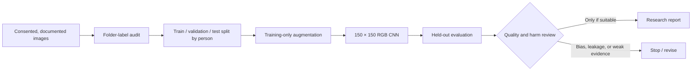
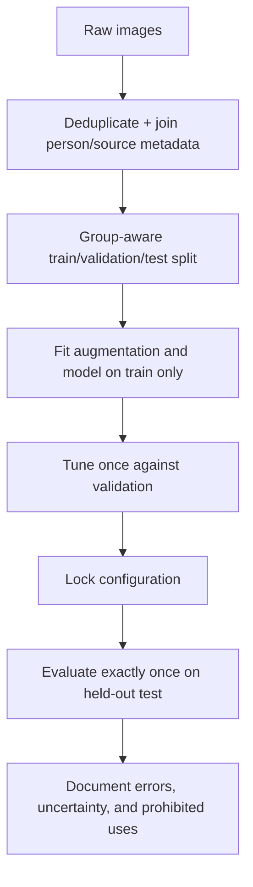

# Appearance-Label Image Classifier

> **Project status — recovery required.** The original notebook and CNN design are
> preserved, but the image dataset and its provenance are not present in this
> repository. No accuracy, fairness, or deployment claim is made here.

## Start with the boundary

This is **not a gender-recognition system**. Gender identity is personal and
cannot be reliably inferred from a face or an image. The original notebook is a
binary image-classification experiment over two dataset-folder labels; those
labels describe the supplied dataset, not a person's identity, expression, or
capability. The folder name is retained for historical continuity, while this
documentation uses the more precise term **appearance-label classification**.

That distinction is practical, not cosmetic. A model trained on a limited,
consented image collection can learn camera angle, hairstyle, lighting, age,
presentation, or dataset-source artifacts instead of any meaningful visual
concept. It must not be used for hiring, admissions, surveillance, profiling,
access control, or any decision about people.

## What is in this repository

| Asset | Role | Evidence state |
|---|---|---|
| `ManWomanClassifier.ipynb` | Original TensorFlow/Keras CNN experiment | Preserved; cannot run without its data |
| `LEGACY_README.md` | Original project description | Preserved for project history |
| `docs/index.html` | Standalone technical walkthrough | Current documentation |
| `requirements.txt` | Minimal runtime dependencies | Declared, not installed or executed here |

The original notebook hard-codes `C:\\Users\\abalu\\Desktop\\data`; that local
path is intentionally not treated as a reproducible dataset contract.

## System at a glance



The important control is the split. Images of the same individual must never
appear in both training and evaluation. If they do, a strong score can merely
show that the network recognises a person or a photo session.

## Original workflow, reconstructed

The notebook builds a Keras `Sequential` CNN:

```text
Input (150 × 150 × 3)
  → Conv2D(32) → MaxPool
  → Conv2D(64) → MaxPool
  → Conv2D(128) → MaxPool
  → Conv2D(128) → MaxPool
  → Flatten → Dropout(0.5) → Dense(512) → Sigmoid(1)
```

`ImageDataGenerator` rescales pixels to `[0, 1]` and applies horizontal flips,
shifts, shear, rotation, and zoom while training. Augmentation can improve
robustness to small photographic changes, but it does not create demographic
coverage, establish consent, or repair biased labels.

The original training cell uses `fit_generator(..., steps_per_epoch=100,
epochs=25)` on one directory iterator. It does not create a validation or test
set, record a class mapping, seed the run, or calculate reliable held-out
metrics. Its saved `model.pkl`/`modelman.pkl` are therefore not reproducible
artifacts and are deliberately absent from the repository.

## Data contract before any rerun

Do not simply collect arbitrary images to make the notebook execute. A valid
research dataset must document:

| Requirement | Why it matters |
|---|---|
| Explicit consent and reuse rights | Faces are sensitive personal data. |
| Dataset-card provenance | Allows label source, collection method, exclusions, and known biases to be audited. |
| A clearly defined task label | A binary visual label must not be described as gender identity. |
| Person/group identifier | Enables leakage-safe splitting by individual, source, and session. |
| De-identification and retention plan | Limits exposure and supports removal requests. |
| Representative coverage statement | Makes limitations visible rather than hidden behind a single metric. |

Place any authorised data under an ignored `data/` directory, never in a
developer-specific absolute path. A proposed structure is:

```text
data/
  train/
    label_a/
    label_b/
  validation/
    label_a/
    label_b/
  test/
    label_a/
    label_b/
  dataset_card.md
  split_manifest.csv       # image, person_id, source_id, split, label
```

For a defensible experiment, generate the split from `split_manifest.csv` so
the same person and near-duplicate images cannot cross the boundary.

## Evaluation that would be required

Accuracy alone is insufficient, especially if classes are imbalanced. A rerun
should report a fixed, untouched test-set confusion matrix; precision, recall,
and F1 for each folder label; ROC-AUC and PR-AUC where appropriate; confidence
calibration; and stratified error analysis only where consent and sample size
support it. It must report counts and confidence intervals, not just a single
percentage.



An error review must look for shortcut learning: background, watermark,
compression, image source, pose, or accessories. If performance varies by
source or fails under realistic conditions, the appropriate outcome is to stop
or narrow the research question—not to market the model as reliable.

## Reproduction status

```bash
cd ManWomanClassifier
python -m pip install -r requirements.txt
jupyter notebook ManWomanClassifier.ipynb
```

The commands only establish the historical runtime. They will not complete
until a documented, authorised dataset replaces the missing hard-coded path.
The project deliberately provides no fabricated score or prediction demo.

## Limitations and non-goals

- No dataset, trained weights, training logs, label mapping, or split manifest
  is committed, so the original result cannot be independently reproduced.
- A two-folder image label is not a valid proxy for gender identity or a basis
  for classifying real people.
- The notebook has no held-out evaluation, fairness assessment, provenance
  record, or deployment safeguards.
- This repository does not expose webcam classification or an API endpoint;
  doing so would widen a sensitive capability without evidence it is safe.

See the [technical walkthrough](docs/index.html) for the full architecture,
failure analysis, and recovery checklist.
