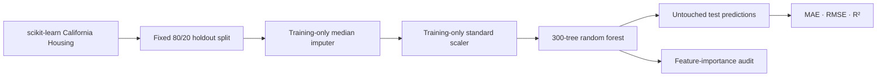
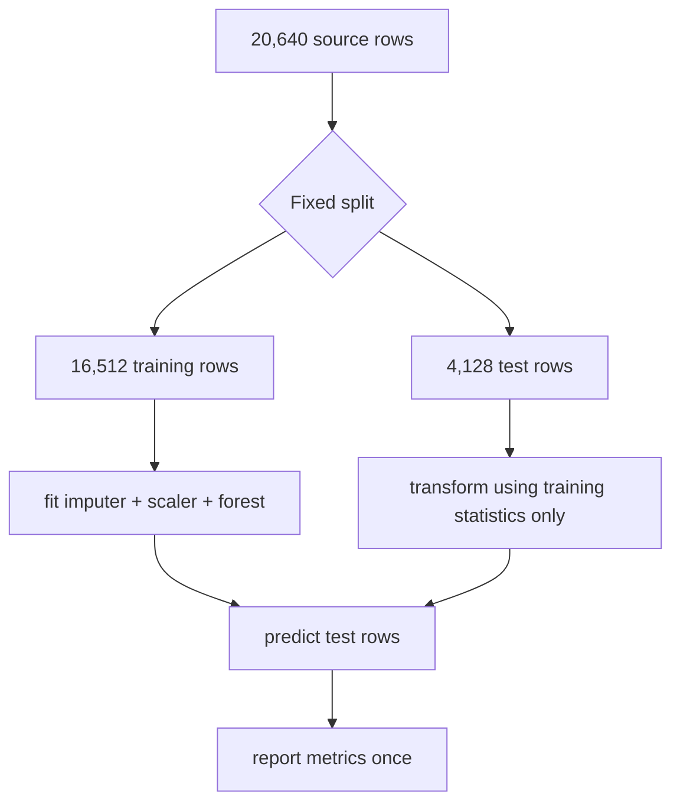

# California House Price Predictor

**A reproducible baseline for estimating 1990 California district median house values from eight census-derived features.**

`20,640 districts · 8 features · 16,512 training rows · 4,128 untouched test rows · 3 regression tests`

> This README is the technical account of the project. It records the data boundary, model decisions, measured result, what the original implementation got wrong, and what a reader must not conclude from the score.

---

## Contents

| | | |
|---|---|---|
| [1 · The problem is not a valuation](#1--the-problem-is-not-a-valuation) | [5 · The model](#5--the-model) | [9 · Verification](#9--verification) |
| [2 · System at a glance](#2--system-at-a-glance) | [6 · Results](#6--results) | [10 · Limitations](#10--limitations) |
| [3 · The data contract](#3--the-data-contract) | [7 · What the model uses](#7--what-the-model-uses) | [A · Commands and layout](#a--commands-and-layout) |
| [4 · The leakage boundary](#4--the-leakage-boundary) | [8 · The original failure](#8--the-original-failure) | |

---

## 1 · The problem is not a valuation

The task is to predict the target supplied by scikit-learn's California Housing dataset: a district-level **median house value in units of $100,000**, derived from the 1990 U.S. Census. It is not a listing-price predictor, an appraisal, or a current-market forecast.

That distinction changes the claim this project can make. A model can explain variation in a historical, capped census target and still be unsuitable for estimating the value of a specific property today. The target itself is capped at **5.00001** ($500,001), so the dataset deliberately loses variation at the expensive end of the market.

| | |
|---|---:|
| districts | **20,640** |
| source period | **1990 census** |
| predictor columns | **8** |
| missing feature values | **0** |
| target median | **1.797** ($179,700) |
| target maximum | **5.00001** ($500,001; cap) |

## 2 · System at a glance

The project has one deliberately small runnable path. The model script fetches the maintained public dataset, reserves a holdout set before fitting any transformation, trains a fixed random-forest baseline, and reports prediction error and feature reliance.



| File | Responsibility | Verification |
|---|---|---|
| `main.py` | Fetches data, trains, prints measured holdout metrics | Executed against the source data |
| `housing_model.py` | Split, model pipeline, metrics, feature-importance helpers | Unit tested |
| `final_california_house_price_modeling.ipynb` | EDA, training, residual and importance visuals | Executed, no saved errors |
| `tests/test_housing_model.py` | Reproducible splitting, finite predictions, metric arithmetic | 3 passing tests |
| `docs/index.html` | Standalone walkthrough | Mirrors this evidence |

The stage order is load → split → fit preprocessing/model → predict → measure. It is not cosmetic: fitting a scaler or imputer before the split would let information from the test districts influence training.

## 3 · The data contract

`fetch_california_housing(as_frame=True)` fetches and caches the dataset. No copy is committed to this repository, which avoids presenting a stale or ambiguously licensed extract as project-owned data.

| Feature | Meaning | Observed range | Caveat |
|---|---|---:|---|
| `MedInc` | Median income, tens of thousands of dollars | 0.50–15.00 | Historical and area-level |
| `HouseAge` | Median house age | 1–52 years | Top-coded at 52 |
| `AveRooms` / `AveBedrms` | Mean rooms/bedrooms per household | 0.85–141.91 / 0.33–34.07 | Extreme values exist |
| `Population` | Block-group population | 3–35,682 | Strongly skewed |
| `AveOccup` | Mean household occupancy | 0.69–1,243.33 | Extreme outliers exist |
| `Latitude` / `Longitude` | District location | 32.54–41.95 / −124.35–−114.31 | Coordinates are not a property address |

The source contains no missing values in this execution. Median imputation remains in the pipeline because it makes the workflow robust if the input contract later changes; the imputer is fitted on training rows only.

## 4 · The leakage boundary

The holdout is created first with `random_state=42`. Only the 16,512 training rows fit the imputer, scaler, and forest. The 4,128 test rows are unseen until `predict()`.



This is a sound **tabular baseline** split, not a proof of geographic generalisation. Nearby districts may be distributed across both partitions; a stronger next study would use spatially blocked validation to ask whether the model transfers to an unseen region.

## 5 · The model

A random forest with 300 trees and `min_samples_leaf=2` is used as the first credible model. It can express nonlinear relationships—income behaving differently by location, for example—without a deep-learning stack for a dataset of only 20,640 rows.

| Choice | Decision | Why |
|---|---|---|
| Model | `RandomForestRegressor` | Nonlinear baseline, stable with mixed scales |
| Trees | 300 | Reduces variance without making the example slow to run |
| Minimum leaf | 2 | Avoids leaves containing single training districts |
| Imputation | Median | Robust default if future inputs include gaps |
| Scaling | StandardScaler | Reproducible common preprocessing; tree splits do not require it |
| Seed | 42 | Same split and forest across runs |

The scaler is intentionally retained even though trees do not need it. It keeps the preprocessing interface ready for linear or distance-based comparisons. It is not the source of the forest's performance.

## 6 · Results

The command-line workflow was run against the fetched data with the exact fixed configuration above.

| Metric | Measured value | What it says | What it does **not** say |
|---|---:|---|---|
| MAE | **0.326** | Average miss is about **$32,600** | Every district is equally well estimated |
| RMSE | **0.504** | Large misses raise the error to about **$50,400** | Error distribution is symmetric |
| R² | **0.806** | About 80.6% of holdout target variation is captured | 80.6% of a property's value is known |

```text
California House Price Predictor
Training rows: 16,512 | Test rows: 4,128
MAE:  0.326 ($100,000s)
RMSE: 0.504 ($100,000s)
R2:   0.806
```

The final notebook plots predicted-versus-actual values and residuals. The cap in the target means errors close to $500,000 deserve special scrutiny: the dataset cannot distinguish the full range of high-value districts.

## 7 · What the model uses

The fitted forest's impurity-based ranking is:

| Rank | Feature | Importance |
|---:|---|---:|
| 1 | `MedInc` | **0.535** |
| 2 | `AveOccup` | **0.138** |
| 3 | `Latitude` | **0.088** |
| 4 | `Longitude` | **0.088** |
| 5 | `HouseAge` | **0.053** |

This is a description of the fitted forest, not a causal claim. Income and location encode many unobserved variables; changing `MedInc` in a district does not mechanically change a house price. Impurity-based importances can also overstate variables with many possible split points. Permutation importance and geographic error slices are the next defensible checks.

## 8 · The original failure

The original `main.py` could not run. Its `train_test_split` call passed the dataset object as the target; the Keras architecture omitted commas and used a non-existent `input_state` argument; compilation used misspelled `mertics` and an outdated optimizer parameter; and predictions were requested from the training history object rather than the model.

The rewrite did not hide those failures behind a new README. It replaced the broken single script with small testable functions and pins three conditions:

1. the split is repeatable and retains all rows;
2. the pipeline returns one finite prediction per holdout row;
3. MAE, RMSE, and R² calculations have known behavior.

## 9 · Verification

```text
3 passed in 2.52s
```

| Check | Guard |
|---|---|
| Repeated split has identical rows | A seed or split refactor cannot silently destabilise reported results |
| Prediction shape and finiteness | The pipeline produces a valid result for every test row |
| Metric arithmetic | Reported errors use the intended formulas |
| Full command run | Data fetch, training, and reporting work together |
| Final notebook | 0 saved execution errors |

## 10 · Limitations

Read these before quoting the R².

- **Historical target:** the data represents 1990 census districts, not live housing markets.
- **Target cap:** values above roughly $500,000 are censored, weakening high-end interpretation.
- **Spatial leakage risk:** the random holdout can place neighbouring districts on both sides of the split.
- **Area-level data:** a district mean cannot appraise an individual property.
- **Absent drivers:** property condition, school quality, rates, transaction timing, zoning, and local supply are not included.
- **No fairness or error-slice audit:** error by geography or population group has not been evaluated.
- **Not deployment-ready:** a real valuation system needs current licensed data, spatial/temporal validation, calibration, drift monitoring, and domain governance.

## A · Commands and layout

```powershell
python -m venv .venv
.venv\Scripts\Activate.ps1
python -m pip install --upgrade pip
pip install -r requirements.txt
python main.py
python -m pytest tests -q
```

Execute the final notebook:

```powershell
python -m jupyter nbconvert --to notebook --execute final_california_house_price_modeling.ipynb --output final_california_house_price_modeling.ipynb
```

```text
CaliforniaHousePricePredictor/
├── main.py
├── housing_model.py
├── final_california_house_price_modeling.ipynb
├── tests/
├── docs/index.html
└── requirements.txt
```

**Current state:** verified local baseline. **Open next step:** replace random holdout with spatially blocked validation before making any geographic-transfer claim.
