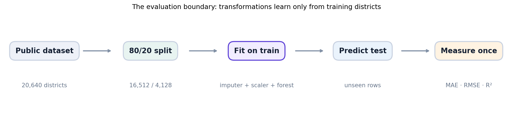
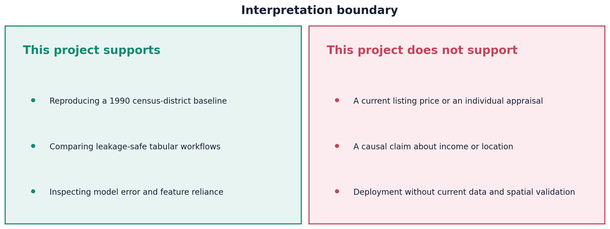
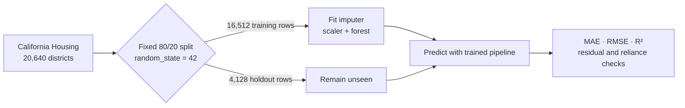
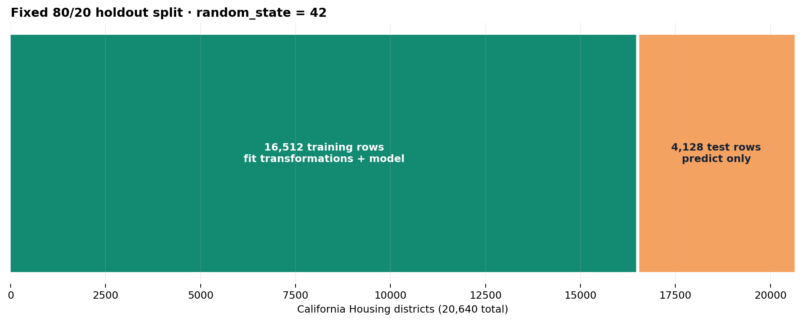
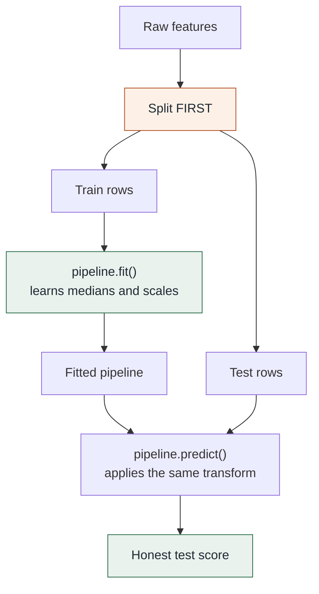
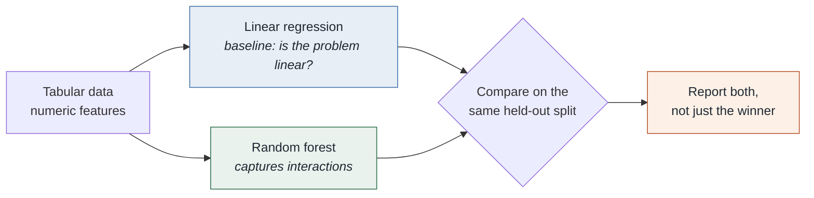
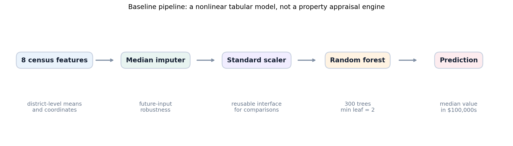
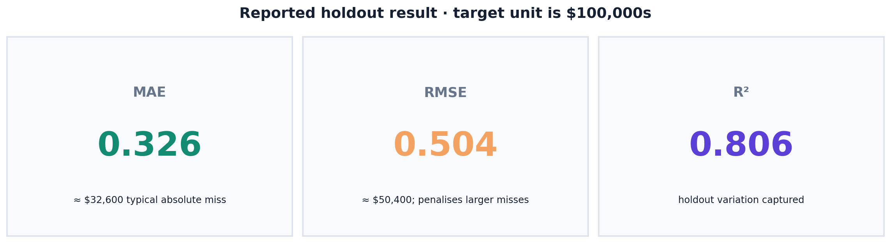
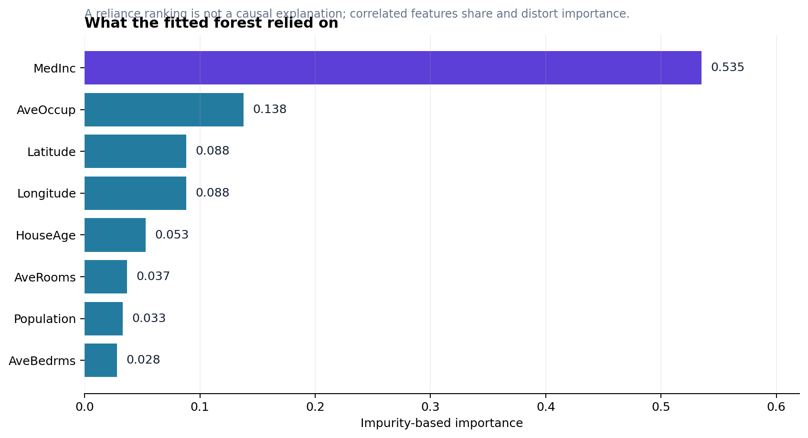

# California Housing Regression Baseline

> A reproducible, leakage-safe benchmark for estimating **1990 California census-district median house values** from eight numeric features. It is not a current-market forecast, a property appraisal, or a production pricing system.



## Executive summary

This repository turns a fragile original house-price script into a small, verifiable machine-learning project. It fetches scikit-learn's California Housing dataset at runtime, reserves an untouched 20% holdout, fits a 300-tree random forest inside a preprocessing pipeline, and reports complementary holdout metrics.

The preserved executed baseline reported **MAE 0.326**, **RMSE 0.504**, and **R² 0.806**. Because the target is in $100,000s, the MAE translates to roughly **$32,600** per district. That is evidence from one historical random-split experiment—not a promise for a current property, geography, or price band.

| Evidence | Value | Interpretation boundary |
|---|---:|---|
| Source rows | 20,640 | Census-district rows, not individual homes |
| Features | 8 | Numeric area-level attributes and coordinates |
| Target period | 1990 | Not a live housing market |
| Holdout | 4,128 rows | Random split; nearby areas can cross partitions |
| MAE | 0.326 | ≈ $32,600 average absolute district-level miss |
| RMSE | 0.504 | ≈ $50,400; gives larger errors extra weight |
| R² | 0.806 | Variation captured on this specific holdout |
| Test suite | 4 passing tests | Split, predictions, metrics, direct-script imports |

## Start here

```powershell
cd 03-california-housing
python -m venv .venv
.venv\Scripts\Activate.ps1
python -m pip install --upgrade pip
pip install -r requirements.txt

# Fetches/caches the public source on first run, trains, and prints metrics.
python src/train.py

# Regression guards for the project helpers and direct command import path.
python -m pytest
```

The first model run needs internet access unless scikit-learn already has the dataset in its cache. No raw extract is committed; see [data/README.md](data/README.md) for the data boundary.

## What problem is actually being solved?

`fetch_california_housing(as_frame=True)` provides a historical target named `MedHouseVal`: the median house value of a California census district, in $100,000s. It is derived from 1990 census data and has a maximum of **5.00001** ($500,001). The cap matters: the label does not distinguish the full range of high-value districts, so no model trained on it can recover that missing variation.

This project may support a portfolio discussion about safe tabular-regression workflow. It must not be described as:

- an estimate for a particular home;
- a current price prediction;
- proof that a feature causes house values; or
- a geographically robust model for new regions.



## Repository map

```text
03-california-housing/
├── notebooks/
│   ├── 01_house_price_modeling.ipynb          # preserved combined baseline
│   ├── 01_exploratory_data_analysis.ipynb    # guided EDA companion
│   └── 02_model_development.ipynb            # guided modelling companion
├── src/
│   ├── housing_model.py                       # split, pipeline, metrics, importance helpers
│   └── train.py                               # end-to-end command-line entry point
├── tests/test_housing_model.py                # four focused regression checks
├── data/README.md                             # provenance and no-raw-data rule
├── docs/index.html                            # standalone master walkthrough
├── docs/assets/                               # evidence-led diagrams and charts
└── scripts/                                   # reproducible notebook/figure builders
```

The existing combined notebook remains deliberately. The two new notebooks separate EDA from model development without deleting the prior work:

| Notebook | Read it for | Why it is separate |
|---|---|---|
| `01_house_price_modeling.ipynb` | Legacy, combined executed baseline | Preserves prior work and saved output |
| `01_exploratory_data_analysis.ipynb` | Data contract, distributions, correlations, location | Keeps descriptive evidence distinct from fitting |
| `02_model_development.ipynb` | Split, pipeline, scoring, residuals, importance | Makes the evaluation boundary auditable |

## End-to-end data flow



The ordering is the core correctness rule. The project splits raw data first. Only training rows fit the imputer, scaler, and forest. Test rows are transformed with training statistics—not with their own information—and are measured after prediction.



## Data contract and EDA findings

The source has eight features and no missing values in the fetched baseline. The model still includes a median imputer, fitted only on training rows, so a future input gap does not make the workflow fail silently.

| Feature | What it represents | Why an analyst should care |
|---|---|---|
| `MedInc` | Median income in tens of thousands of dollars | Historical area-level proxy, not causal input |
| `HouseAge` | Median age of houses | Top-coded at 52 years |
| `AveRooms`, `AveBedrms` | Mean rooms/bedrooms per household | Ratios can have extreme values |
| `Population` | District population | Strongly right-skewed |
| `AveOccup` | Mean household occupancy | Contains unusually large values |
| `Latitude`, `Longitude` | District location | Encodes spatial structure, not an address |

The EDA notebook deliberately shows null counts and numeric types; target distribution and count at the cap; tail-aware summaries; rank correlations; and an income/location view. These are descriptive diagnostics, not causal evidence.

Coordinates create the key caveat: a random split can put nearby districts in both train and test sets. The score is therefore a credible **tabular baseline**, but spatially blocked cross-validation is required before making a geographic-transfer claim.

### Why a pipeline rather than loose steps

Fitting the scaler on the full dataset before splitting would let the test rows
influence the training transformation. Wrapping every step in a `Pipeline` means
`fit` touches training data only, and the identical transformation is replayed
at prediction time.



### Choosing the model




## Model decision record



| Decision | Chosen baseline | Reason | Important caveat |
|---|---|---|---|
| Estimator | `RandomForestRegressor` | Captures nonlinear tabular patterns with a small dependable stack | Baseline, not an optimised model search |
| Trees | 300 | Stabilises individual-tree variance | More trees do not fix target/split limitations |
| Minimum leaf | 2 | Discourages one-row leaves | Not a substitute for validation |
| Imputation | Median | Robust fallback for future gaps | Current source has no missing values |
| Scaling | `StandardScaler` | Reusable preprocessing contract for future comparisons | Trees themselves do not need scaling |
| Seed | 42 | Repeatable split and model configuration | Does not establish external validity |

The runnable pipeline is in [`src/housing_model.py`](src/housing_model.py). Its focused, tested functions are:

```python
split_data(features, targets, test_size=0.2, random_state=42)
build_pipeline(random_state=42)
evaluate_predictions(actual, predicted)
feature_importance(pipeline, feature_names)
```

## Results: read all three together



| Metric | Reported value | Plain-language reading | It does not establish |
|---|---:|---|---|
| MAE | 0.326 | Typical holdout miss ≈ $32,600 | Uniform error across districts |
| RMSE | 0.504 | Larger misses raise error to ≈ $50,400 | Symmetric or well-behaved residuals |
| R² | 0.806 | 80.6% of holdout variation captured | That 80.6% of a property’s value is “known” |

The numbers come from the preserved executed notebook using the fixed configuration. Reruns may differ across library or hardware versions, so the exact workflow and dependency minimums are documented.

## What did the fitted forest rely on?



`MedInc` is the largest impurity-based importance in the saved baseline, followed by occupancy and geographic coordinates. This chart describes how the fitted forest selected splits; it does **not** make a causal statement. Correlated predictors can share or distort importance, and variables with many potential splits can be favoured. A stronger next analysis uses permutation importance and reports errors by geography and target range.

## Verification and reproducibility

The test suite currently covers four high-value failure modes:

| Check | Failure it prevents |
|---|---|
| Fixed split is reproducible and keeps every row | Accidental seed/split drift |
| Pipeline returns one finite prediction per holdout row | Shape errors and failed transformations |
| MAE/RMSE metric arithmetic | Incorrect score reporting |
| `python src/train.py` resolves local imports | A documented command that fails outside a test runner |

```text
4 passed
```

Rebuild local documentation artefacts after changing their sources:

```powershell
python scripts/make_figures.py
python scripts/build_notebooks.py
```

Execute companion notebooks from the project root:

```powershell
python -m jupyter nbconvert --to notebook --execute notebooks/01_exploratory_data_analysis.ipynb --output 01_exploratory_data_analysis.executed.ipynb
python -m jupyter nbconvert --to notebook --execute notebooks/02_model_development.ipynb --output 02_model_development.executed.ipynb
```

Output notebooks are intentionally not committed; they are local evidence for your environment.

## Limitations and a defensible next iteration

- **Historical data:** 1990 census statistics do not represent today’s market.
- **Censored labels:** the $500,001 cap weakens high-value conclusions.
- **Spatial leakage risk:** random splitting can mix neighbouring areas across partitions.
- **Area-level features:** district means cannot value an individual property.
- **Missing real-world drivers:** condition, schools, rates, transaction time, zoning, and supply are absent.
- **No group/error-slice audit:** no claim is made about performance across regions or populations.

The highest-value next experiment is geographically blocked validation. Form spatial groups, train on some regions, test on withheld regions, and compare the metrics and residual patterns with this random-split baseline. Add permutation importance and a current, licensed, well-governed dataset only if the project’s scope changes from education to real decision support.

## Master document

Open the standalone visual guide at [docs/index.html](docs/index.html). It carries the same evidence trail in presentation form, so a reader can understand the project before running code.
