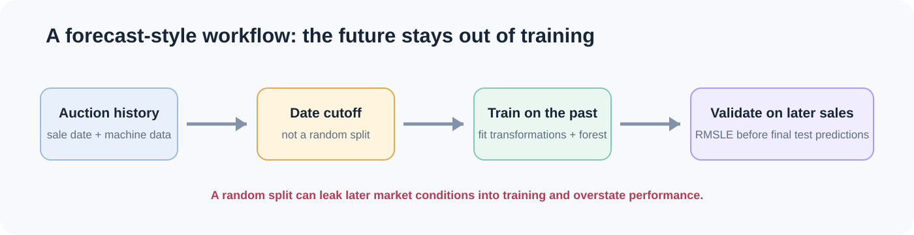
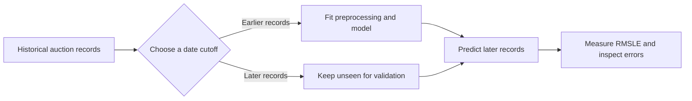
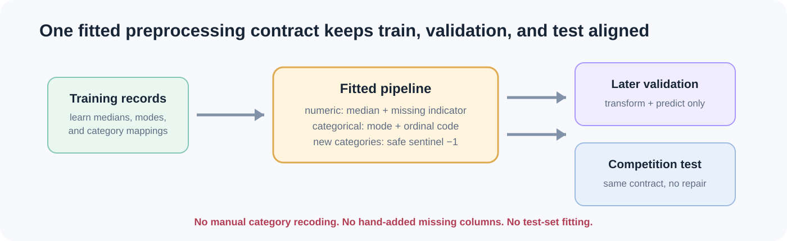
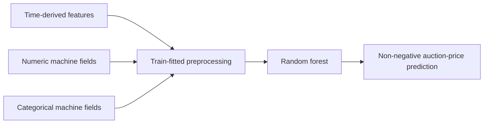
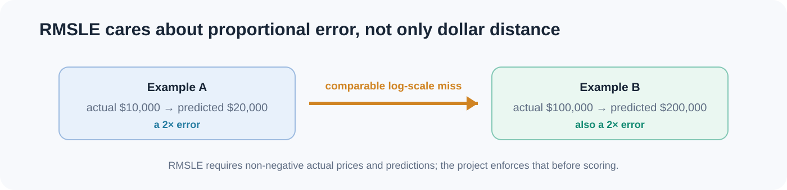
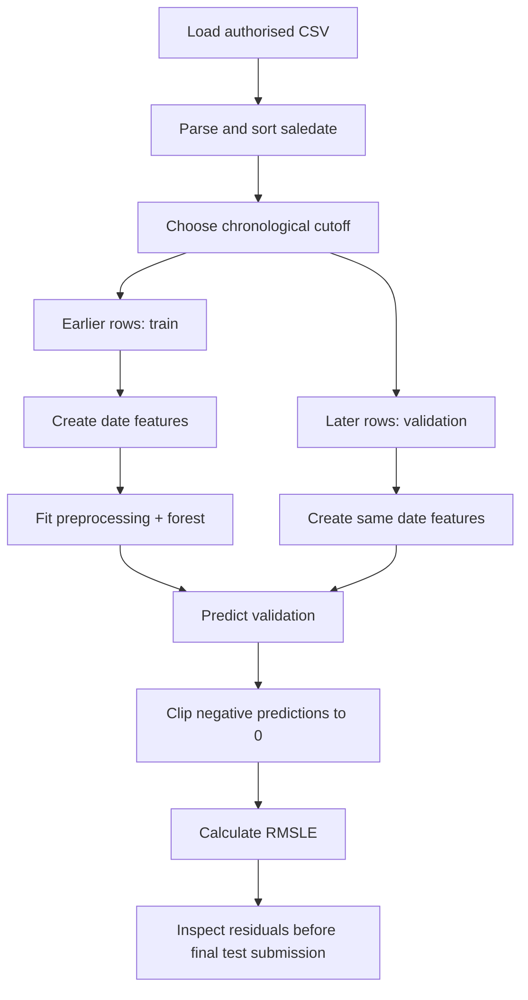

# Blue Book for Bulldozers: Time-Aware Auction Price Regression

> Predicting historical bulldozer auction sale prices from machine characteristics and sale records—using a validation design that respects time.



## Why this project matters

Pricing a machine at auction is not a normal “one row in, one price out” regression problem. Markets change over time. A model trained using information from a later market period can appear excellent on paper while being useless for a genuine future prediction.

This project builds a reliable baseline for the **Blue Book for Bulldozers** historical Kaggle task. It explains the full reasoning chain: what the data represents, why the split is chronological, how missing and categorical information is handled, why RMSLE is used, and how to interpret a result without overstating it.

The result is a project someone can understand from this page before opening a single code file.

## The question being answered

Given a bulldozer’s known characteristics at auction—such as its model, age, configuration, location-like fields, and sale date—estimate its **auction sale price**.

The output is not a retail price, guaranteed resale value, insurance appraisal, or a statement of physical condition. It is a model estimate for a historical auction context.

| What the model can support | What it cannot support |
|---|---|
| A reproducible baseline on historical competition data | A current-market appraisal for an individual machine |
| A time-aware comparison of regression approaches | A guarantee of auction outcome |
| Analysis of model error and feature reliance | A causal explanation of what “sets” price |

## The central design decision: predict the future from the past

The competition is inherently chronological. The training period contains earlier auction records; validation occurs on later records; the final test period comes later still. The project never uses a random split as its primary evaluation because that would mix market periods.



Why this matters:

1. A machine sold in a later period may reflect a different economic climate, demand pattern, or auction behaviour.
2. Training transformations must learn from earlier records only.
3. Later-period error is a more honest simulation of making a future estimate.

## The data, explained

The authorised competition dataset contains historical auction records with `SalePrice` as the target and `saledate` as the time anchor. The remaining columns combine numerical machine data, identifiers, product descriptions, configuration fields, and categorical attributes.

### What makes this data challenging?

| Characteristic | Why it matters | How this project responds |
|---|---|---|
| Dates | Time is part of the prediction problem | Creates calendar features and splits chronologically |
| Missing values | Machine hours and configuration fields are often incomplete | Learns median/mode imputations from training rows only |
| Many categories | Models, states, equipment options, and descriptions vary widely | Uses a train-fitted unknown-aware encoder |
| New categories later in time | A later/test machine can have a category not seen earlier | Maps unknown categories to a safe sentinel rather than failing |
| Skewed sale prices | A raw dollar error does not tell the whole story | Evaluates with RMSLE |

The source CSVs are deliberately not redistributed here. To run the data-dependent notebooks, place your authorised copies here:

```text
data/bluebook-for-bulldozers/
├── TrainAndValid.csv
└── Test.csv
```

## From raw sale date to useful signals

A date string is not directly useful to a typical scikit-learn regression model. Instead, the project derives interpretable calendar attributes:

```text
saledate → saleYear, saleMonth, saleDay, saleDayOfWeek, saleDayOfYear
```

These features give the model a way to learn recurring annual, monthly, and weekly patterns without treating a raw datetime as an arbitrary number. The date helper works on a copy of the input frame, so analysis code cannot accidentally overwrite the original data.

## The preprocessing contract



The most important engineering idea in this project is that preprocessing is part of the model—not an ad-hoc setup step.

The pipeline is fitted once on the training period. That fitted pipeline is then reused unchanged for validation and final-test records.

| Data type | Training-time action | Later validation/test action |
|---|---|---|
| Numeric field with gaps | Learn its training median and add a missingness flag | Fill using that same training median |
| Known categorical value | Learn its training category mapping | Apply the same mapping |
| New categorical value | Not applicable—it was not seen yet | Encode as `-1`; predict safely without changing columns |

This avoids two common failure modes:

- fitting imputation or category mappings with future rows, which leaks information; and
- manually repairing mismatched test columns after a model has already been trained.

## The model: random forest as a dependable baseline

The baseline uses a `RandomForestRegressor`. A forest combines many decision trees, with each tree learning different partitions of the historical feature space. Averaging their predictions generally reduces the instability of a single tree and handles nonlinear tabular patterns well.

The model is deliberately a baseline rather than a claim of global optimality. Its role is to establish a solid, inspectable benchmark before trying gradient boosting, CatBoost, XGBoost, or more specialised approaches.



## Why RMSLE is the right evaluation metric



The competition evaluates **root mean squared logarithmic error**:

```text
RMSLE = sqrt(mean((log1p(actual_price) - log1p(predicted_price))²))
```

Unlike a simple dollar-distance metric, RMSLE is sensitive to proportional error. Predicting $20,000 for a $10,000 sale and predicting $200,000 for a $100,000 sale are both two-times-too-high errors, even though their raw dollar differences are very different.

The project checks two conditions before calculating the metric:

1. actual and predicted arrays must have the same shape; and
2. both must be non-negative.

Those checks turn a subtle invalid-metric mistake into a clear, early error.

## The complete modelling journey



Every stage exists for a reason. Sorting makes the chronology visible. The cutoff produces a future-like holdout. The pipeline prevents train/test feature drift. RMSLE matches the task. Residual analysis prevents a single score from becoming the whole story.

## How to run it

```powershell
cd 04-bulldozer-price-regression
python -m venv .venv
.venv\Scripts\Activate.ps1
pip install -r requirements.txt
python -m pytest
jupyter lab
```

Start with `notebooks/01_exploratory_data_analysis.ipynb` to understand the dataset, then open `notebooks/02_time_aware_model_development.ipynb` for the complete training and validation sequence. Every section contains contextual Markdown and comments explaining what it does and why.

## Verification built into the project

The project has focused automated checks for the parts most likely to become silently wrong:

| Verification | What it protects |
|---|---|
| Date feature test | Calendar features are correct and raw input remains unchanged |
| Temporal split test | Future rows are never placed in training |
| RMSLE test | Formula is correct and invalid negative values are rejected |
| Category-alignment test | Missing and unseen categorical values do not break prediction |

```text
4 passed
```

## Reading a result responsibly

When you run the project with authorised data, report the RMSLE alongside the date cutoff, train/validation windows, row counts, model configuration, and error slices. A single overall score can hide poor performance for a particular product group, age band, geography, or price range.

Before using any model in a real operational setting, add current licensed data, repeated temporal backtests, monitoring for market drift, error analysis by relevant machine segment, audit logs, and qualified human review.

## Further reading

For a presentation-style version of this guide, open [docs/index.html](docs/index.html). The original competition notebook remains available as project history, but the two companion notebooks and this README are the recommended way to understand and run the project.
