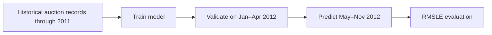
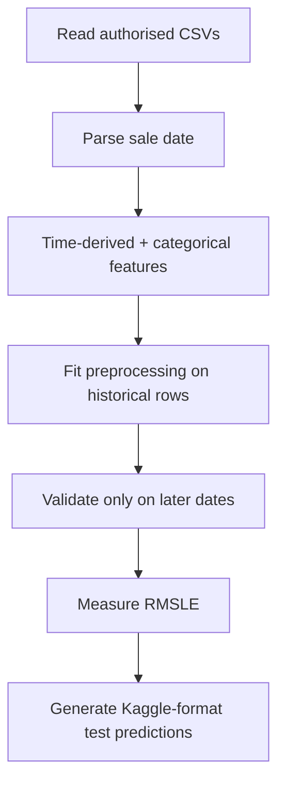

# Blue Book for Bulldozers — Sale Price Regression

**A preserved historical Kaggle regression notebook for predicting bulldozer auction sale prices from machine characteristics and prior sale records.**

`116-cell original notebook · time-ordered auction task · RMSLE metric · original Kaggle data absent`

> The folder is historically named `Bluetooth Sale Predictor`, but its code and README describe the **Blue Book for Bulldozers** competition. This README uses the correct project identity while retaining the folder and original notebook to avoid breaking repository history.

---

## 1 · The problem is time, not just price

The task is to estimate a bulldozer's auction sale price from characteristics and historical records. The Kaggle competition's key constraint is temporal: training data runs through 2011, validation is early 2012, and test is later in 2012. A random split would let future market conditions appear in training and turn a forecasting-style task into a misleading tabular regression score.



## 2 · What is preserved

| Artefact | Role | State |
|---|---|---|
| `sale_price_bluetooth.ipynb` | Original 116-cell end-to-end competition notebook | Preserved unchanged |
| Original project description | Dataset, time windows, data dictionary link, metric definition | Rewritten here with provenance boundary |
| Folder name | Historical repository path | Kept for compatibility; identity clarified |

## 3 · Data contract

The notebook expects these Kaggle Blue Book for Bulldozers files:

```text
data/bluebook-for-bulldozers/
├── TrainAndValid.csv
├── train_tmp.csv                 # generated during preprocessing in the notebook
└── Test.csv
```

They are not included in this repository. The dataset's Kaggle licence, competition terms, and data dictionary must be reviewed before restoration. The project will remain intentionally unexecuted until the original authorised files are present.

| Partition | Period | Purpose |
|---|---|---|
| Train | Through end of 2011 | Fit feature processing and model |
| Validation | 2012-01-01 to 2012-04-30 | Iterative model comparison |
| Test | 2012-05-01 to 2012-11-30 | Final competition prediction period |

## 4 · Evaluation: RMSLE

The competition evaluates root mean squared logarithmic error:

```text
RMSLE = sqrt(mean((log1p(actual_price) - log1p(predicted_price))²))
```

Log error measures multiplicative rather than raw-currency misses: an error from $10,000 to $20,000 is treated comparably to $100,000 to $200,000. It also requires non-negative predictions. A project claiming MAE or R² alone would be measuring a different task from the one the competition defines.

## 5 · Expected workflow



The original notebook contains useful competition work, but it must be re-executed and audited after the source data is recovered before any stored output or score can be presented as verified.

## 6 · Known documentation boundary

No measured metric is reported in this README. The notebook's saved outputs are not a substitute for an executed, reproducible data run, especially when the input data is absent from the repository.

## 7 · Limits and responsible use

- Auction sale prices are not retail values, appraisals, or guarantees.
- The historical 2011–2012 competition setting may not transfer to a current equipment market.
- Price data can encode geography, seller, equipment condition, and market-cycle effects not represented by the available fields.
- A production valuation tool would require current licensed data, temporal backtesting, error slices by machine category and geography, audit logs, and human review.

**Current state:** original notebook preserved; data-dependent execution blocked. **Open next step:** restore the authorised Kaggle data, run the notebook end-to-end, then separate EDA, time-aware model development, and a final verified workflow.

## A · Recovery commands and layout

```powershell
pip install pandas numpy matplotlib scikit-learn jupyter
jupyter lab
```

Open `sale_price_bluetooth.ipynb` only after placing the authorised source CSVs under the required `data/bluebook-for-bulldozers/` directory.
