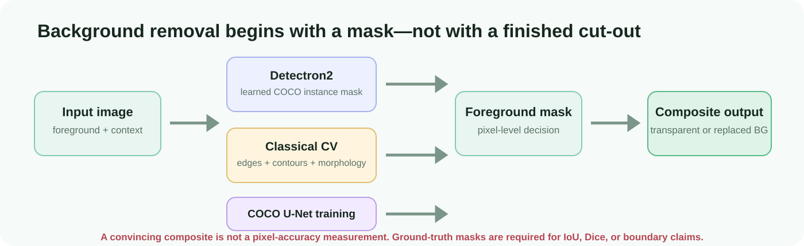
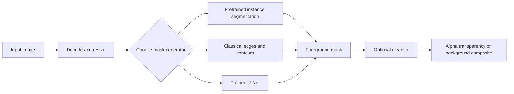
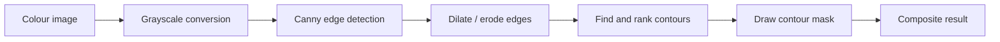
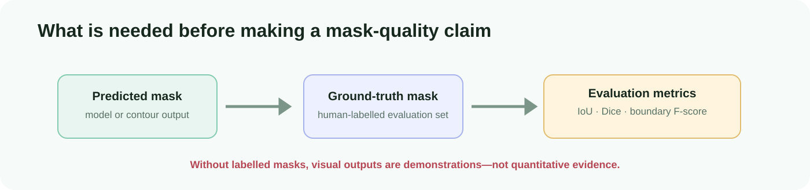

# Background Removal as Foreground Segmentation

> A computer-vision study of three ways to identify foreground pixels and create a transparent or replaced-background image.



## What this project teaches

“Remove the background” sounds like a simple image-editing command. Technically, it is a **segmentation** task: for every pixel, decide whether it belongs to the chosen foreground object or the background. The final composited image is only as good as that foreground mask.

This project explores the problem from three angles:

| Approach | Core idea | Best use | Important limitation |
|---|---|---|---|
| Pretrained Detectron2 | Use a model already trained to recognise COCO object instances | Fast masks for supported everyday objects | It cannot reliably segment every object, occlusion, or fine boundary |
| Classical computer vision | Infer foreground from contrast, edges, contours, and morphology | Explainable experimentation on controlled images | Background clutter, shadows, and similar colours break the assumptions |
| U-Net training exploration | Learn a pixel mask from labelled COCO images | Task-specific segmentation research | Requires a large labelled dataset, compute, and genuine evaluation |

The purpose is not to claim a universally accurate background-removal product. It is to make the mask-generation choices, assumptions, and failure modes visible.

## The core workflow



Each step has a clear purpose:

1. **Decode and resize** makes image dimensions and colour representation explicit.
2. **Mask generation** decides which pixels are foreground.
3. **Cleanup** can remove isolated noise or close small holes, but may also damage hair, thin objects, or gaps.
4. **Compositing** uses the mask to retain foreground pixels and replace or hide background pixels.

## Method 1: pretrained instance segmentation

Detectron2’s Mask R-CNN family is trained on COCO-style object categories. Given an image, it returns object instances, class labels, confidence scores, and a predicted mask for each instance.

```text
image → model backbone → region proposals → object class + confidence + instance mask → selected mask → composite
```

### Why it is useful

The model has learned shape and context from a large external dataset. It can often produce a plausible mask even when edges are weak or the background is visually complex.

### What the notebook actually does

The notebook configures a Detectron2 model-zoo checkpoint, applies a confidence threshold, extracts predicted instance masks, merges selected masks, then uses OpenCV operations and either a colour or uploaded replacement background to create the output.

### Failure modes to expect

- The foreground is not a COCO-supported category.
- Two nearby objects are merged or the wrong instance is selected.
- Hair, glass, shadows, reflections, and occlusion have ambiguous boundaries.
- The first checkpoint download and GPU/CUDA compatibility are environment-dependent.

## Method 2: classical contour-based masking

The classical path deliberately avoids semantic learning. It uses image structure instead:



This method is valuable because every parameter is inspectable—blur size, Canny thresholds, contour-area bounds, dilation, erosion, and output size. It is useful for teaching how a mask can emerge from pixel geometry.

It is not semantic segmentation. It cannot know what the “subject” is; it only follows contrast and connected boundaries. A dark object on a dark background, textured scenery, shadows, and weak edges are normal ways for it to fail.

## Method 3: U-Net and labelled-mask training

The COCO/U-Net notebook explores a fully supervised path. It converts annotated images into image/mask pairs, builds an encoder–decoder U-Net with skip connections, and trains a pixel classifier.

The saved notebook history records a 20-epoch training run, but it is not treated as a final quality claim here: the local COCO files and an independently held-out labelled evaluation set are absent. Training accuracy alone is not enough to demonstrate boundary quality or generalisation.

## How a mask becomes an output image

Let `M` be a binary mask, `I` the original image, and `B` a replacement background. The conceptual composite is:

```text
output = M × I + (1 − M) × B
```

If the desired output is transparent PNG rather than a replacement background, `M` becomes the alpha channel. This preserves the original foreground pixel values while making background pixels transparent.

Mask cleanup changes `M` before compositing. Morphological opening can remove isolated noise; closing can fill small holes. Both are trade-offs: aggressive cleanup can erase thin foreground details.

## How quality should be evaluated



A visually convincing cut-out is an illustration, not a measurement. To claim quantitative quality, the project needs a held-out set of images with human-labelled masks and a clearly defined foreground policy.

| Metric | What it measures | Why it helps |
|---|---|---|
| IoU / Jaccard | Overlap of predicted and true foreground regions | Standard whole-mask agreement |
| Dice / F1 | Similarity with more emphasis on smaller regions | Helpful when foreground occupies little image area |
| Boundary F-score | Alignment around the object edge | Reveals hair/thin-object boundary problems |
| Latency and memory | Runtime cost per image | Needed before describing an interactive workflow as practical |

The authorised COCO paths and labelled local evaluation set are not in this repository, so this README deliberately makes no IoU, Dice, latency, or benchmark claim.

## Running the experiments

The interactive notebooks were originally designed for Colab/Kaggle-style environments.

```powershell
cd 05-background-remover
python -m venv .venv
.venv\Scripts\Activate.ps1
pip install -r requirements.txt
jupyter lab
```

For the pretrained route, install Detectron2 according to its official compatibility instructions for your chosen PyTorch and CUDA build. The main notebook expects user-provided foreground/background images. The U-Net notebook additionally expects an authorised COCO 2017 layout:

```text
/kaggle/input/coco-2017-dataset/coco2017/
├── train2017/
├── val2017/
├── test2017/
└── annotations/
```

## Responsible image handling

- Preserve originals and disclose any image alteration.
- Obtain the rights and consent needed before uploading images to a notebook host or external model service.
- Do not use an automatically generated mask as final evidence in medical, legal, surveillance, identity, or safety-critical contexts.
- Treat unintended foreground removal and background retention as expected operational risks.

## Takeaway

This project demonstrates that background removal is a question of **how the foreground mask is obtained**. Pretrained segmentation supplies learned object priors, classical CV supplies transparent pixel heuristics, and U-Net training supplies a path toward task-specific learning. Good engineering makes the mask-generation choice, evaluation evidence, and limits explicit.

The visual master guide is available at [docs/index.html](docs/index.html).
