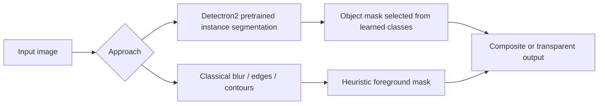
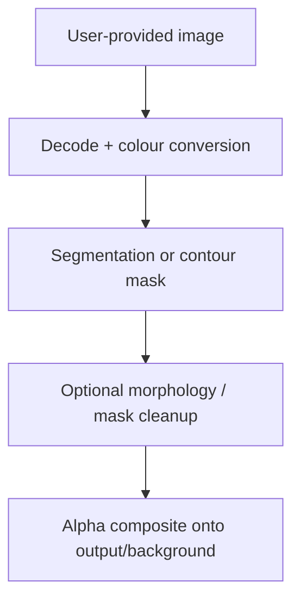
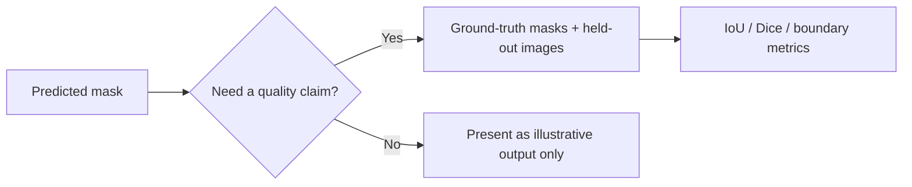

# Background Remover — Segmentation Experiments

**A preserved computer-vision experiment comparing pretrained instance segmentation with classical contour-based masking.**

`3 original notebooks · Detectron2 + classical CV paths · COCO/Kaggle paths absent · no local output-quality claim`

> Removing a background is a segmentation problem: classify which pixels belong to a selected foreground object. A visually plausible cut-out is not proof that every boundary pixel is correct—hair, glass, shadows, occlusion, and multiple subjects make the problem inherently ambiguous.

---

## 1 · Two methods answer different questions

The project contains two approaches that should not be presented as interchangeable.



| Approach | What it learns/assumes | Strength | Main failure mode |
|---|---|---|---|
| Detectron2 | COCO-pretrained object categories and masks | General object boundaries for supported classes | Unsupported/occluded objects, class confusion, download/runtime dependency |
| Classical CV | Pixel contrast, blur, contours, morphology | Useful educational baseline, no semantic model | Similar foreground/background colours, shadows, clutter |

The deep path is not automatically “better”; it has a stronger learned prior. The classical path is not an alternative semantic segmentation system; it is an explainable heuristic experiment.

## 2 · System at a glance

| Notebook | Role | Runtime boundary |
|---|---|---|
| `Background_Removal.ipynb` | Main interactive Detectron2 and classical-CV walkthrough | Designed for Google Colab GPU and uploaded images |
| `Flask_BG_Remove.ipynb` | Notebook-hosted Flask demonstration | Colab, GPU, temporary ngrok-style endpoint |
| `coco-UNET-.ipynb` | COCO/U-Net training exploration | Kaggle COCO 2017 paths and GPU training |
| `templates/index.html` | Original Flask template | Preserved support asset |



## 3 · Data and runtime contract

The COCO U-Net notebook references these Kaggle-only paths, which do not exist in the local checkout:

```text
/kaggle/input/coco-2017-dataset/coco2017/
├── train2017/
├── val2017/
├── test2017/
└── annotations/
```

The main notebook instead expects a user to upload a foreground image and, where relevant, a replacement background. The Flask notebook is a temporary demonstration, not a deployable service: a Colab runtime and tunnel URL end when the session ends.

## 4 · Mask-quality boundary

No local labelled-mask dataset or benchmark output is included. Therefore this project cannot currently report IoU, Dice, boundary F-score, class-specific recall, latency, or an accuracy figure. Visual examples are useful demonstrations, not evaluation evidence.



## 5 · Original operational risks

The notebooks make several environment-specific assumptions: a compatible GPU, dynamic package installation, a forced runtime restart, a temporary web tunnel, Colab upload widgets, and Kaggle-mounted COCO paths. These are not defects in a classroom exploration, but they prevent a visitor from reproducing the project on a local machine without a data/runtime contract.

The original material is preserved. The recovery path is to extract a local Python service/CLI with explicit input/output paths, pinned dependencies, model-download provenance, and an optional CPU fallback before calling it deployable.

## 6 · Responsible use

- A mask can remove or alter context; preserve originals and disclose transformations.
- Do not use automatic masks as final evidence in medical, legal, surveillance, identity, or safety-critical workflows.
- Confirm rights and consent before uploading images to a notebook host or third-party model service.
- Treat missed pixels and accidental foreground/background swaps as expected failure modes, not edge cases.

## 7 · Verification and state

| State | Evidence |
|---|---|
| Original notebooks preserved | Three notebooks and Flask template remain local |
| Local COCO training unavailable | Kaggle input hierarchy absent |
| Local mask-quality metrics unavailable | No ground-truth evaluation set included |
| Flask deployment not claimed | Notebook hosts only a temporary Colab/tunnel demonstration |
| Open next step | Localise paths, pin environment, restore authorised test masks, measure mask quality |

**Current state:** documented preserved experiment; data/runtime-dependent execution blocked. No performance or deployment claim is made.

## A · Recommended recovery layout

```text
background_remover/
├── data/
│   ├── input/
│   └── evaluation/             # images and ground-truth masks
├── models/                     # declared model weights and provenance
├── outputs/                    # generated; not source images
├── Background_Removal.ipynb    # preserved original
└── README.md
```

Run only after reproducing the original environment and reviewing dependency compatibility:

```powershell
jupyter lab
```
