# Cervical Cancer Risk-Factor Modeling

An end-to-end, leakage-aware machine-learning study of cervical biopsy outcomes using demographic, behavioral, reproductive, and medical-history risk factors from 858 patients.

> [!IMPORTANT]
> This is an educational project—not a medical device, medical advice, or a clinically validated diagnostic system. Predictions must never replace screening, biopsy, or a qualified clinician.

## Read this as an evidence record

This repository intentionally distinguishes the inspected, executed workflow
from claims it cannot support. The main achievement is not a high score; it is
making the hard boundary—what is available before a biopsy and what would leak
the answer—visible and testable.

| Question | Evidence | Conclusion |
|---|---|---|
| Does the final notebook run? | Saved notebook contains no execution errors; regression tests pass | Verified locally |
| Are `?` values handled? | Both final notebooks convert them to missing numeric values | Verified in code |
| Are diagnostic near-outcomes excluded? | Explicit `LEAKAGE_COLUMNS` contract and tests | Verified in code |
| Are results clinically valid? | Small historical dataset, no external/temporal validation | **Not claimed** |
| Can this screen or diagnose patients? | No prospective study, calibration, workflow, or regulatory evidence | **No** |

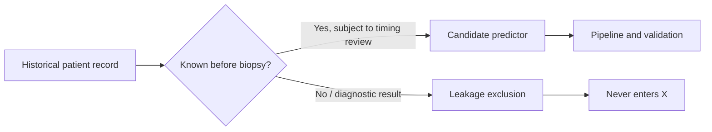

## At a glance

| Item | Value |
|---|---|
| Task | Binary classification of `Biopsy` |
| Dataset | 858 patients × 36 columns |
| Positive biopsies | 55 (6.41%) |
| Modeling features | 28 pre-diagnostic risk factors |
| Models | Class-weighted logistic regression, random forest, and retained XGBoost comparison |
| Validation | Stratified 5-fold CV + untouched 20% holdout |
| Key metrics | Recall, precision, F1, ROC-AUC, PR-AUC |
| Primary limitation | Small, imbalanced, single-center dataset |

## Why the original approach needed rebuilding

The retained legacy notebook had useful exploratory figures and an XGBoost
idea, but its model cells were duplicated and did not clearly prove that
preprocessing, splitting, and diagnosis-like variables were isolated from the
final evaluation. The final notebook preserves the useful EDA views while
replacing duplicate/unsafe model cells with one declared data contract,
stratified split, pipelines, and explicit precision-recall evaluation.

```text
Historical notebook: exploratory outputs + duplicated modeling cells
                         │
                         ▼
Final notebook: retained EDA → declared leakage contract → one split
                         → train-only preprocessing → CV → holdout report
```

## Project map

```text
06-cervical-cancer-risk/
├── notebooks/01_exploratory_data_analysis.ipynb  # quality, distributions, missingness
├── notebooks/02_model_development.ipynb          # preprocessing, CV, evaluation
├── notebooks/03_final_modeling.ipynb             # preserved + consolidated final notebook
├── data/cervical_cancer.csv            # source dataset
├── docs/
│   ├── index.html                      # standalone master document
│   └── assets/                         # notebook-generated figures
├── requirements.txt
└── README.md
```

## The problem

Cervical cancer screening data combines relatively few positive outcomes, missing patient-history fields, correlated variables, and diagnostic measurements that can accidentally reveal the target. This project demonstrates an auditable way to turn that raw data into a machine-learning experiment while keeping its limitations visible.

The target is `Biopsy`: `0` means a negative biopsy and `1` means a positive biopsy.

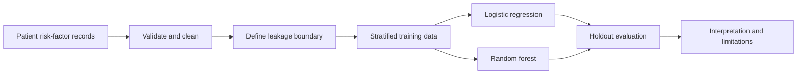

## Why there are two notebooks

Exploration describes the dataset and determines the modeling rules. Modeling then follows those fixed rules and keeps the test set untouched until the final comparison. Separating these responsibilities makes the work easier to audit and reduces accidental test-set tuning.

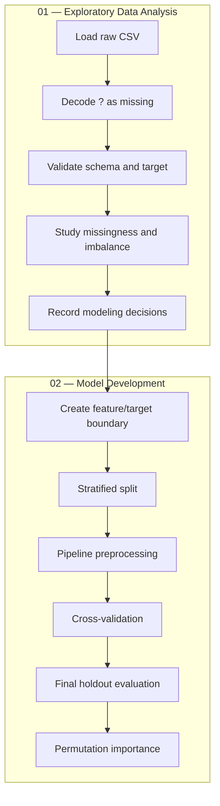

## Dataset walkthrough

Each row represents one patient. The columns fall into these groups:

| Group | Examples | Role |
|---|---|---|
| Demographics | `Age` | Predictor |
| Behavioral history | sexual partners, smoking history | Predictor |
| Reproductive history | pregnancies, contraceptive and IUD history | Predictor |
| STD history | STD indicators, timing, diagnosis counts | Predictor |
| Screening/diagnosis outcomes | `Hinselmann`, `Schiller`, `Citology`, `Dx:*` | Excluded |
| Confirmatory outcome | `Biopsy` | Target |

### Missing values

The CSV encodes missing observations with `?`, causing otherwise numeric columns to load as text. Both notebooks make the conversion explicit:

```python
data = (
    pd.read_csv(DATA_PATH)
    .replace("?", np.nan)
    .apply(pd.to_numeric, errors="coerce")
)
```

Rows are retained. During modeling, medians learned only from the training partition fill missing feature values. Keeping the imputer inside the pipeline prevents test-set statistics from influencing training.

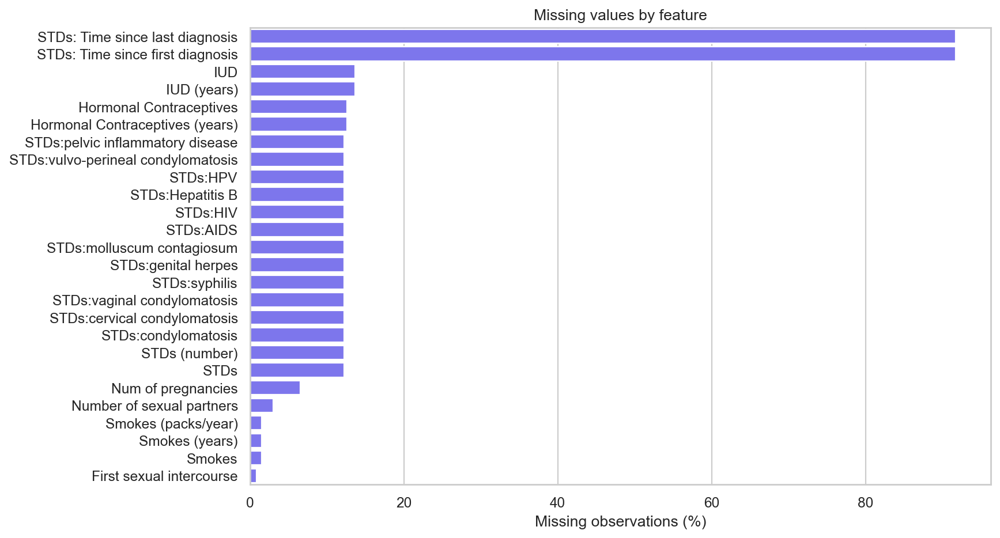

### Class imbalance

Only 55 of 858 observations—6.41%—have a positive biopsy. A classifier that always predicts “negative” would be about 93.6% accurate while detecting no positive cases. Therefore, accuracy cannot tell the full story.

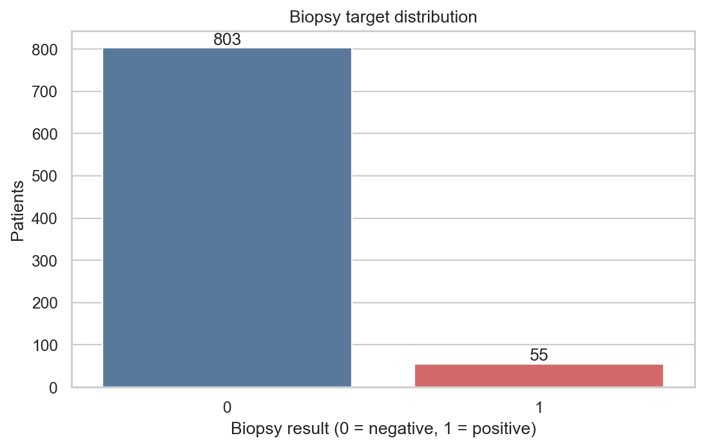

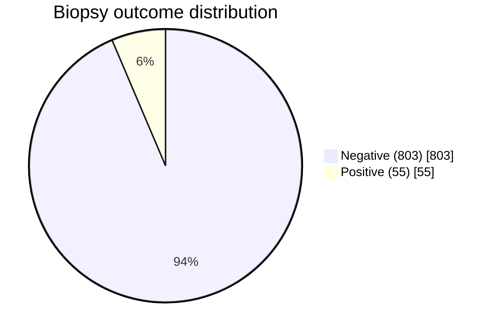

EDA also examines age and univariate correlations. These patterns generate hypotheses; they do not establish causation.

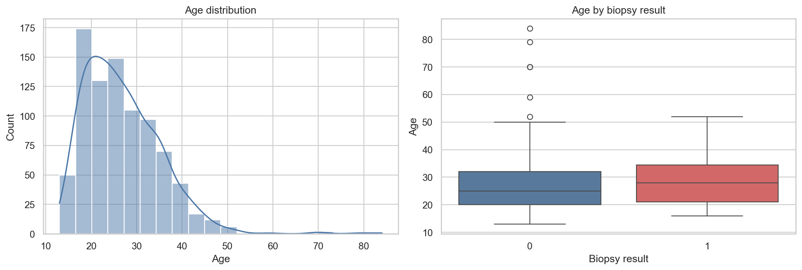

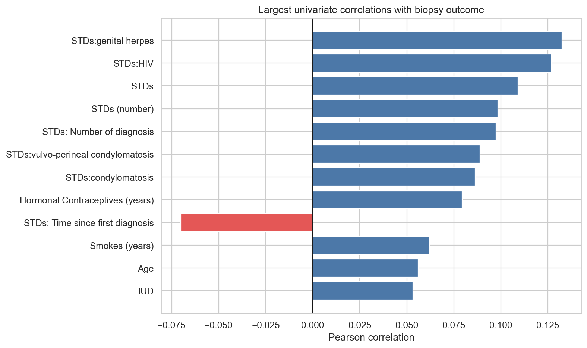

## Preventing target leakage

Leakage occurs when a predictor reveals information that would not genuinely be available at prediction time. Other screening results and recorded diagnoses are too close to the biopsy outcome, so the project removes them.

```text
Biopsy       → prediction target
Hinselmann   → excluded screening result
Schiller     → excluded screening result
Citology     → excluded screening result
Dx:Cancer    → excluded diagnosis
Dx:CIN       → excluded diagnosis
Dx:HPV       → excluded diagnosis
Dx           → excluded diagnosis summary
```

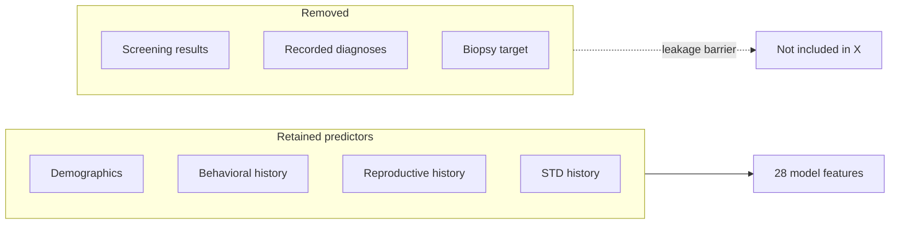

This is a defensible educational boundary, not proof of temporal validity. A clinical study must confirm when every variable becomes available.

## Modeling workflow

### 1. Stratified holdout

The fixed 80/20 split preserves the rare positive-class proportion.

| Partition | Rows | Positive cases | Positive rate |
|---|---:|---:|---:|
| Training | 686 | 44 | 6.41% |
| Test | 172 | 11 | 6.40% |

The test partition is not used during cross-validation or preprocessing design.

### 2. Leakage-safe preprocessing

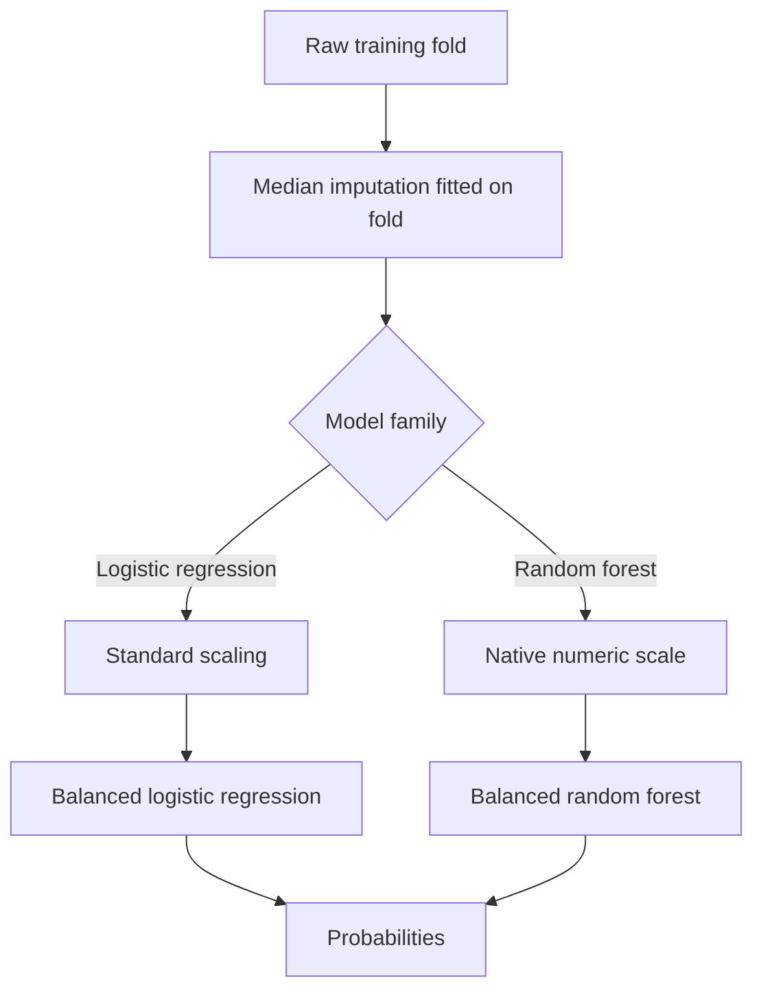

- Median imputation is robust to skew and outliers.
- Standardization gives logistic regression comparable feature scales.
- Tree splits do not need feature scaling.
- Balanced class weights penalize rare-positive errors more heavily.
- Pipelines refit preprocessing independently inside every CV fold.

### 3. Why these models?

| Model | Reason | Trade-off |
|---|---|---|
| Logistic regression | Transparent, stable baseline | May miss nonlinear interactions |
| Random forest | Captures nonlinearities and interactions | Less transparent; conservative on rare cases |

### 4. Five-fold cross-validation

Cross-validation operates only on the 686 training rows. Each fold becomes validation data once.

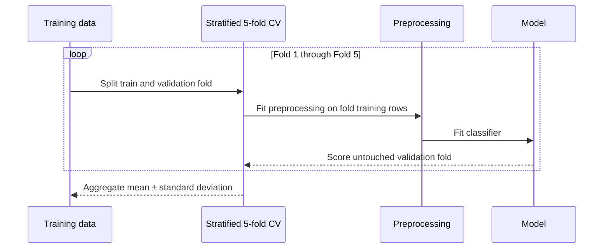

| Model | ROC-AUC | PR-AUC | Recall | Precision | F1 |
|---|---:|---:|---:|---:|---:|
| Logistic regression | 0.573 ± 0.074 | 0.133 ± 0.030 | 0.431 ± 0.103 | 0.111 ± 0.023 | 0.176 ± 0.035 |
| Random forest | 0.622 ± 0.045 | 0.161 ± 0.058 | 0.044 ± 0.089 | 0.067 ± 0.133 | 0.053 ± 0.107 |

The modest and variable positive-class scores are more informative than an accuracy-only claim. They expose the difficulty and data limitations of this task.

### 5. Final holdout results

At the default probability threshold of 0.50:

| Model | Accuracy | Precision | Recall | F1 | ROC-AUC | PR-AUC |
|---|---:|---:|---:|---:|---:|---:|
| Logistic regression | 0.738 | 0.095 | 0.364 | 0.151 | 0.578 | 0.092 |
| Random forest | 0.924 | 0.250 | 0.091 | 0.133 | 0.685 | 0.185 |
| XGBoost comparison | 0.797 | 0.125 | 0.364 | 0.186 | 0.660 | 0.219 |

Random forest has higher accuracy and ranking metrics but detects only 1 of 11 positive holdout cases. Logistic regression detects 4 of 11 at the cost of many false positives. The retained XGBoost comparison also detects 4 of 11, but its precision remains 0.125. Neither is clinically suitable.

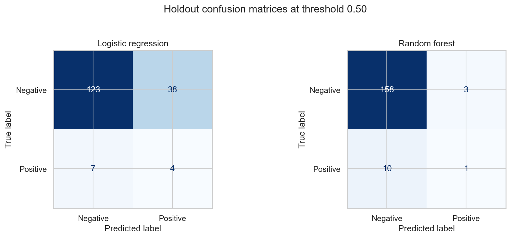

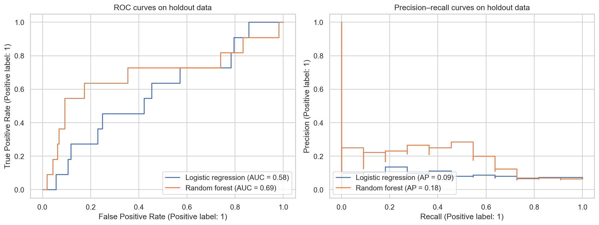

### Metric interpretation

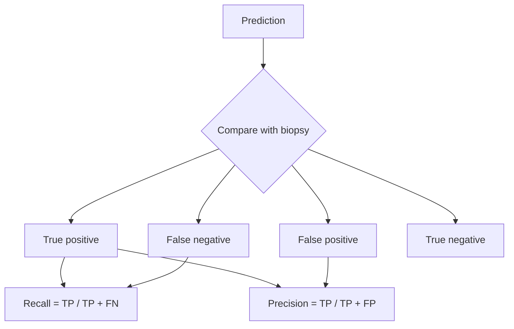

- **Recall:** among positive biopsies, how many were detected?
- **Precision:** among positive predictions, how many were truly positive?
- **F1:** harmonic balance of precision and recall.
- **ROC-AUC:** ranking quality across all thresholds.
- **PR-AUC:** precision–recall trade-off across thresholds; valuable for rare outcomes.
- **Accuracy:** total fraction correct; potentially misleading under imbalance.

### 6. Interpretation

Permutation importance shuffles one feature and measures the decrease in holdout ROC-AUC. It describes model reliance, not biological causation. With only 11 positive holdout cases, the ranking is exploratory and unstable.

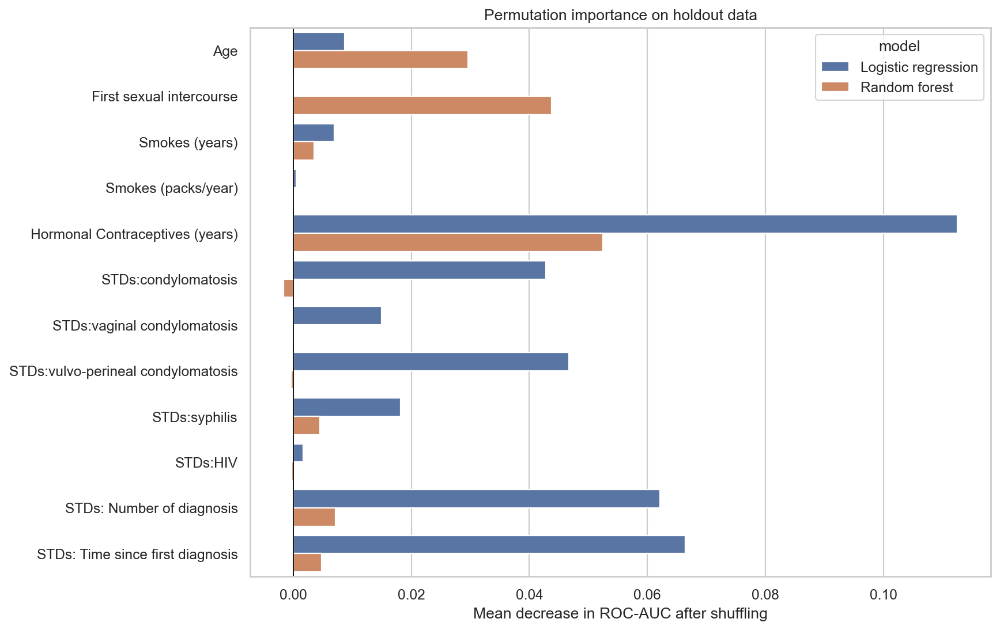

## Run the project

Requirements: Python 3.10+, Git, and roughly 1 GB for the environment and outputs.

```powershell
python -m venv .venv
.venv\Scripts\Activate.ps1
python -m pip install --upgrade pip
pip install -r requirements.txt
jupyter lab
```

Run in order:

1. `01_exploratory_data_analysis.ipynb`
2. `02_model_development.ipynb`

For a single complete walkthrough—including the original project's retained EDA
views and its rebuilt XGBoost comparison—open
`notebooks/03_final_modeling.ipynb` instead.

Or execute non-interactively:

```powershell
python -m jupyter nbconvert --to notebook --execute 01_exploratory_data_analysis.ipynb --output 01_exploratory_data_analysis.ipynb
python -m jupyter nbconvert --to notebook --execute 02_model_development.ipynb --output 02_model_development.ipynb
```

## Reproducibility safeguards

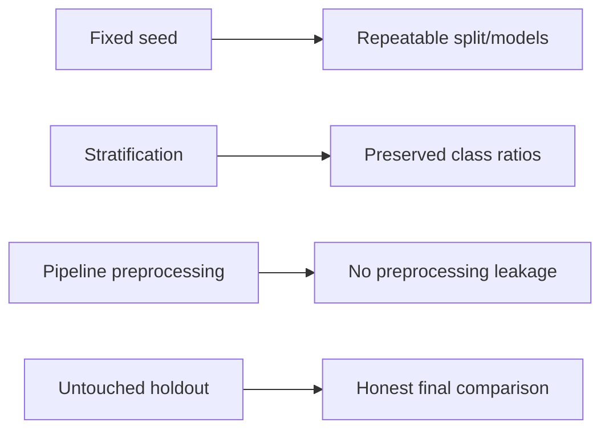

- `RANDOM_STATE = 42` controls stochastic operations.
- Splits and CV folds are stratified.
- Preprocessing lives inside scikit-learn pipelines.
- Target and leakage fields are declared explicitly.
- Notebook outputs contain results from a successful execution.
- `tests/test_final_notebook.py` prevents regression of the explanatory Markdown,
  legacy EDA retention, declared leakage columns, stratification, pipelines,
  PR-AUC metric, and no-error final notebook state.
- Dependencies are isolated in this project’s `requirements.txt`.

## Limitations and responsible use

1. Only 55 positive biopsies are available.
2. A single-center dataset may not generalize across populations or hospitals.
3. Median imputation simplifies unknown missing-data mechanisms.
4. There is no external or temporal validation.
5. Predicted probabilities have not been calibrated.
6. Clinically relevant subgroup fairness has not been evaluated.
7. Exact predictor timing needs domain confirmation.
8. The 0.50 threshold is illustrative, not a medical decision boundary.
9. Correlation and importance do not establish causation.

## Before any real-world consideration

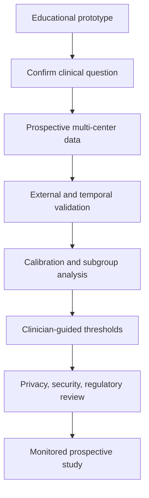

This requires clinicians, statisticians, patient representatives, security specialists, and regulators. It cannot be replaced by a higher notebook score.

## Documentation and data acknowledgement

- Both notebooks contain detailed Markdown explanations and comments around each non-obvious step.
- [`docs/index.html`](docs/index.html) is the standalone master document for offline reading.
- Figures in `docs/assets/` are generated by the executed notebooks.

The dataset describes 858 patients from Hospital Universitario de Caracas, Venezuela, and is commonly distributed as the UCI Cervical Cancer (Risk Factors) dataset. Verify the dataset’s current license, citation requirements, and permitted uses before redistribution or deployment.

The parent repository uses the MIT License; dataset rights may be separate from the code license.
