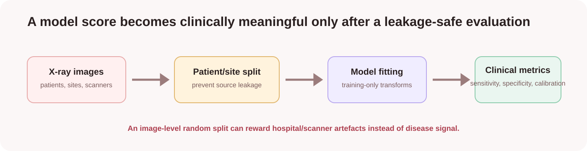
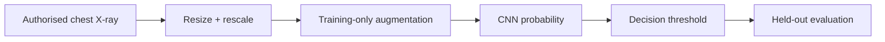
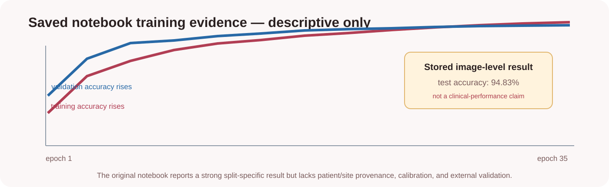
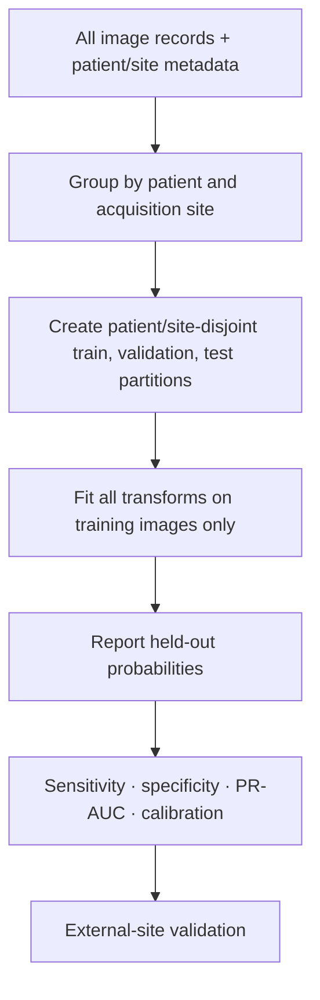

# COVID-19 Chest X-Ray Classification

> An educational image-classification experiment that distinguishes the mechanics of training a CNN from evidence required for a medical claim.



## Scope and limits

This is **not** a diagnostic device, medical advice, triage tool, or substitute for laboratory testing, radiologist interpretation, or clinician judgement. It is a historical TensorFlow notebook experiment on a labelled chest-X-ray folder.

The important lesson is not that a CNN can return a high score. It is that in medical imaging, the **data split and provenance** determine whether that score measures disease signal or accidental shortcuts such as scanner, hospital, patient, annotation, or image-processing artefacts.

## What the model attempts to do

The original workflow trains a binary convolutional neural network on images arranged in two folders:

```text
train/
├── COVID19/
└── NORMAL/

test/
├── COVID19/
└── NORMAL/
```

It resizes images to 150 × 150 pixels, rescales pixel values, augments training images, trains a two-convolution CNN, and evaluates it on the supplied test folder.



## The model architecture, explained

| Stage | Role | Why it is used |
|---|---|---|
| Conv2D, 32 filters | Detect local image patterns | Learns edges, contrast patterns, and textures |
| Max pooling | Reduces spatial size | Retains strong activations while lowering compute |
| Dropout, 50% | Regularisation | Reduces reliance on any one activation pattern |
| Conv2D, 64 filters | Learns more complex feature combinations | Builds on earlier local features |
| Flatten + dense 256 | Combines learned features | Produces an image-level representation |
| Sigmoid output | Binary probability-like score | Supports two labelled folder classes |

The saved model summary reports **22,483,905 parameters**. Most come from the flattened feature map feeding the dense layer; this is large relative to the small image folder reported by the notebook and raises overfitting risk.

## What the stored notebook result shows—and does not show



The saved notebook reports 1,449 training images, 362 validation images, 484 test images, and a split-specific test accuracy of **94.83%**. These are historical notebook outputs, not a validated clinical result.

Accuracy is not enough because it does not reveal:

- how many COVID-labelled images were missed (**sensitivity**);
- how many normal images were wrongly flagged (**specificity**);
- whether predicted probabilities are trustworthy (**calibration**);
- whether the same patient or hospital appears in more than one folder; or
- whether the model transfers to a different site, scanner, region, or time period.

## The hardest problem: independent evaluation



An image-level split may place two images from the same patient or same imaging pipeline in training and test. A CNN can learn that source signature without learning COVID-related pathology. Patient-level and, ideally, site-level separation are therefore required before even considering clinical-like performance.

## Data and provenance contract

The original notebook clones a third-party GitHub image repository. That image hierarchy is not present locally. Before restoring it, document:

| Required evidence | Why it matters |
|---|---|
| Licence and de-identification | Protects data rights and privacy |
| Patient identifiers or patient grouping | Prevents same-patient leakage |
| Hospital/site and scanner metadata | Reveals source shortcuts and enables external tests |
| X-ray view and acquisition protocol | Avoids mixing incomparable image types |
| Labelling definition and adjudication | Clarifies what “COVID19” actually means |
| Class balance and exclusions | Prevents misleading aggregate accuracy |

## Evaluation that would be required

| Metric or check | What it adds beyond accuracy |
|---|---|
| Confusion matrix | Counts each type of correct/incorrect outcome |
| Sensitivity / recall | Detects potentially missed positive cases |
| Specificity | Detects normal cases incorrectly flagged |
| Precision and PR-AUC | More informative when positives are uncommon |
| ROC-AUC | Threshold-independent ranking summary |
| Calibration curve | Checks whether predicted confidence matches observed risk |
| Confidence intervals | Shows uncertainty from a finite sample |
| External-site validation | Tests whether performance survives a new acquisition setting |

No current metric in this repository satisfies that evidence standard, so no medical-performance claim is made.

## Running the educational experiment

```powershell
cd 07-covid-xray-classifier
python -m venv .venv
.venv\Scripts\Activate.ps1
pip install -r requirements.txt
jupyter lab
```

Only execute after you have authorised data and a documented patient/site-aware split. The primary notebook is `notebooks/01_covid_xray_classification.ipynb`; the companion notebook retains scratch experiments. Do not upload real patient images to a public notebook service without appropriate authority and privacy controls.

## Key takeaway

This project demonstrates CNN training mechanics—image generators, augmentation, convolution, dropout, loss curves, and test prediction. It does **not** demonstrate clinical COVID detection. Strong medical ML needs rigorous provenance, independent grouping, external validation, calibration, clinical collaborators, privacy governance, and regulatory assessment.

For a standalone visual guide, open [docs/index.html](docs/index.html).
