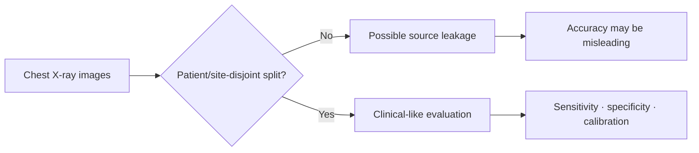
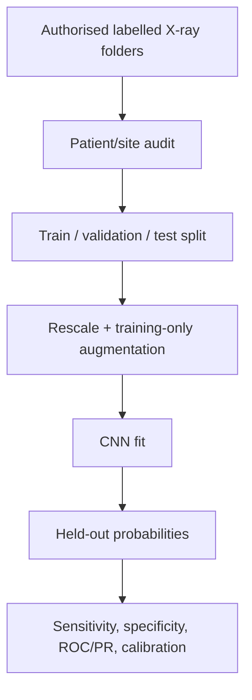

# COVID-19 Chest X-Ray Classification — Preserved Experiment

**A preserved binary chest-X-ray image-classification notebook, not a COVID case-forecasting tool and not a medical diagnostic device.**

`2 original notebooks · TensorFlow CNN · expected image dataset absent · no local clinical metric claimed`

> A model trained on a labelled image folder can learn the differences present in that folder. It cannot establish that it detects COVID-19 in clinical practice. Dataset source, acquisition protocol, patient-level splitting, confounds, calibration, and external validation determine whether any medical claim is meaningful.

---

## 1 · The hardest problem is the split

The original notebook is titled “Predicting COVID-19 from Chest X-Ray Images.” Its workflow clones an image repository, applies augmentation, trains a CNN, and reports accuracy. The central risk in this kind of project is not selecting a convolution size: it is that images from the same patient, hospital, scanner, or preprocessing pipeline can appear across partitions. A model can then identify a source artefact rather than disease.



## 2 · What is preserved

| Artefact | Role | State |
|---|---|---|
| `002_COVID_19_Prediction.ipynb` | Main CNN/augmentation experiment | Preserved |
| `Untitled.ipynb` | Secondary original notebook | Preserved |
| `Chext-X-ray-Images-Data-Set/` | Expected cloned image-data root | Empty in this checkout |

The old README described generic infection-trend prediction. That was inaccurate for this codebase; this README names the actual image-classification task.

## 3 · Expected data contract

The notebook clones a third-party GitHub dataset at runtime and expects this hierarchy:

```text
Chext-X-ray-Images-Data-Set/
└── DataSet/Data/
    ├── train/
    │   ├── COVID/
    │   └── NORMAL/
    └── test/
        ├── COVID/
        └── NORMAL/
```

That hierarchy is empty locally. Before restoring it, record the source licence, de-identification status, patient IDs, hospital/site provenance, image views, labelling protocol, class definition, and whether images originate from the same patients across folders.

## 4 · Preserved workflow



The original notebook uses image rescaling, rotation/translation/shear/zoom augmentation, a sequential CNN, and 35 epochs. The code should be re-executed only after data provenance and split integrity are established.

## 5 · Why accuracy is insufficient

Medical-image classes can be imbalanced, and false negatives and false positives have different consequences. Accuracy conceals both. A legitimate evaluation must report at least sensitivity/recall, specificity, precision, ROC-AUC, PR-AUC, a confusion matrix, confidence intervals, calibration, and performance by site/device/subgroup where available.

No such metric is claimed by this repository because the original images and patient-level metadata are absent.

## 6 · What the original notebook cannot show

- It does not establish that COVID can be diagnosed from a chest X-ray alone.
- It does not demonstrate generalisation to another hospital, scanner, country, or later variant wave.
- It does not document patient-level data independence.
- It does not provide clinical calibration, a decision threshold, or prospective validation.
- It does not replace PCR/antigen testing, radiologist review, or clinical judgement.

## 7 · Current state and recovery path

| State | Evidence |
|---|---|
| Original CNN notebooks | Preserved locally |
| Expected image-data directory | Present but empty |
| Local model run | Not attempted; no authorised image data |
| Reported medical performance | None |
| Open next step | Restore authorised data with patient/site metadata, perform leakage audit, then rebuild a verified evaluation workflow |

## 8 · Responsible use

This project is educational only. Do not use it for patient triage, diagnosis, medical advice, clinical decision-making, or any real-world health outcome. Any future medical ML work needs institutional review, privacy controls, clinical collaborators, external validation, regulatory assessment, and human oversight.

## A · Environment and recovery layout

```powershell
pip install tensorflow matplotlib numpy pandas scikit-learn
jupyter lab
```

```text
Covid 19 predictor/
├── 002_COVID_19_Prediction.ipynb
├── Untitled.ipynb
├── Chext-X-ray-Images-Data-Set/  # restore only authorised data
└── README.md
```
