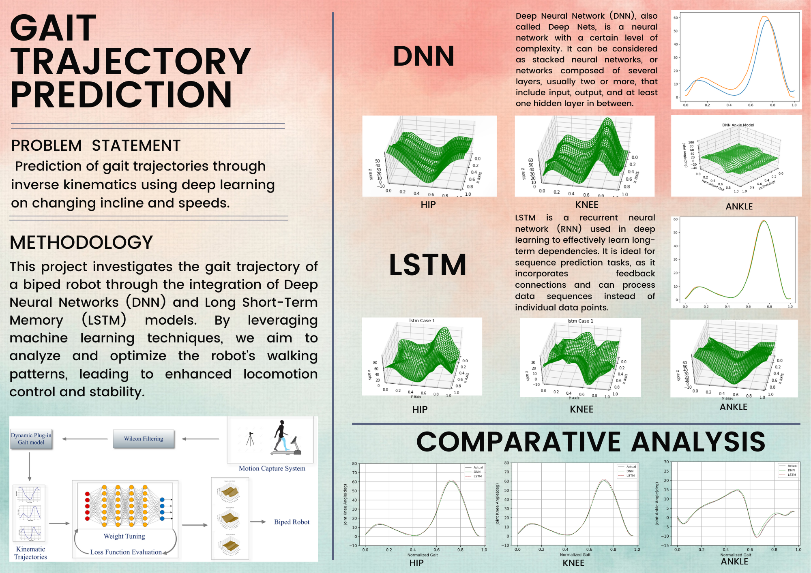
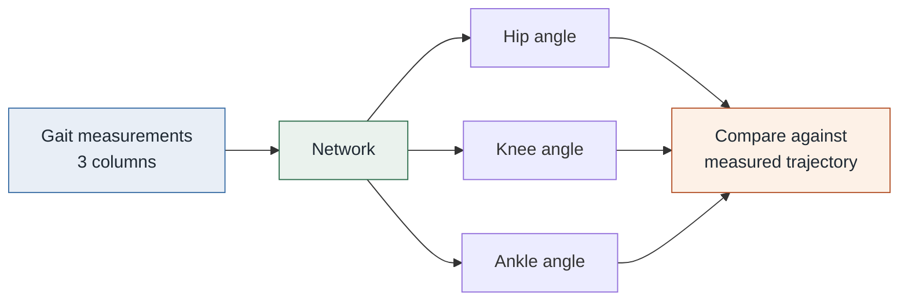
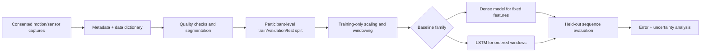
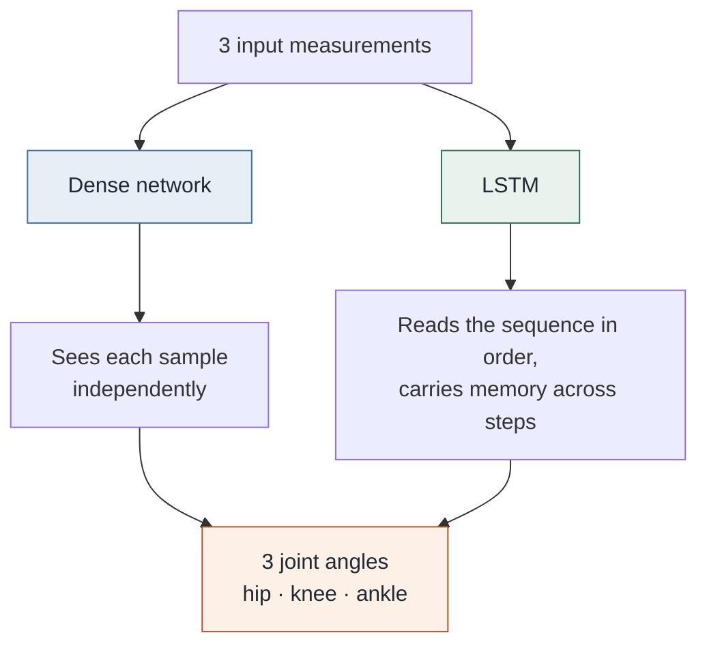
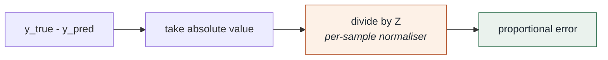

# Gait Trajectory Prediction

**Predicting hip, knee and ankle joint angles from gait measurements, comparing a dense network against an LSTM.**

2023 · TensorFlow/Keras · Multi-output regression · Custom proportional loss



---

## What this project does

Human walking is cyclical and smooth. Given a set of gait measurements, the goal
is to reconstruct the three lower-limb joint angles across the gait cycle.

| | |
|---|---|
| Inputs | 3 measurement columns |
| Outputs | 3 joint angles — hip, knee, ankle |
| Task type | Multi-output **regression** (continuous values, not classes) |
| Training | 500 epochs, batch size 1 |
| Architectures | Dense network and LSTM, trained on the same budget |

This is a regression problem rather than a classification one: the model
predicts three continuous angles, and is judged on how closely the predicted
trajectory follows the measured one.



Why the shape of the curve matters as much as the loss value: a prediction can
have a low average error while still having the wrong shape across the cycle,
which is why every notebook ends by plotting predicted against measured.

---

## Running it today

The notebooks reference local CSV files — `Book14.csv`, `Book13.csv`,
`s1i-5.csv`, `lstm1 ankle.csv` and others — that are not in this repository, so
they cannot be re-run here. The code, the architectures, and the saved plots are
preserved; see [`data/README.md`](data/README.md) for the expected schema.

Because of that, **no accuracy figure is quoted anywhere in this README.**
Reporting one would mean inventing it.

---

## What is in this repository

| Asset | What it contains | What can be verified now |
|---|---|---|
| `notebooks/02_dense_network.ipynb` | Dense-network experiments, CSV transforms, plots | Code and missing file references inspected |
| `notebooks/03_lstm.ipynb` | Recurrent-sequence experimentation | Code and missing file references inspected |
| `notebooks/01_gait_trajectory_final.ipynb` | Consolidated exploratory visualizations and sequence attempts | Preserved; contains historical notebook outputs/errors |
| `docs/assets/gait_trajectory_plot.png` | Project visual asset | Preserved |
| `src/train.py` | A scheduling utility unrelated to the gait notebooks | Preserved |
| `LEGACY_README.md` | Original description | Preserved as historical context |

The notebooks reference local CSV names including `Book14.csv`, `Book13.csv`, `Book.csv`, `s1i-5.csv`, and `lstm1 ankle.csv`. They are not in this checkout, so no execution or metric claim has been made during the revamp.

## Intended experimental shape



The comparison is meaningful only after a baseline and the split are fixed. A dense neural network can model fixed-length engineered features; an LSTM can model ordered samples and temporal dependence. Neither is automatically better—an LSTM is inappropriate if rows have no consistent time order or if windows mix participants.

### The two architectures compared



Gait is periodic — each point in the cycle follows from the one before it. That
is the argument for a recurrent model, and the reason both were tried.

### The proportional loss

Rather than plain squared error, the notebooks divide the error by a per-sample
normaliser, so a miss is judged relative to the size of the angle being
predicted:



A 2-degree miss on a large hip angle is then not penalised more heavily than a
2-degree miss on a small ankle angle.


## What the archived notebooks attempt

The DNN notebook loads CSV data, selects numeric columns, and constructs a multi-output dense network with ReLU hidden layers and a linear output layer. It uses mean-squared error as a **loss**, not as an activation function (the legacy README conflated those concepts). It also writes intermediate CSV files such as `train.csv`, `test.csv`, and `data.csv` without recording their input schema or provenance.

The LSTM work indicates an intention to learn trajectories from ordered samples. For that intention to be valid, every sample must specify at least a participant identifier, trial/session, timestamp or frame order, coordinate convention, sampling rate, and target units. A sequence model must be split by participant and trial before overlapping windows are generated; otherwise adjacent windows leak almost identical motion into evaluation.

```text
one participant / one trial
  raw frames ──► quality check ──► ordered window ──► target at horizon h
                                  │
                                  └──── belongs to exactly one split
```

## Recovery data contract

Place authorised source data under ignored `data/`, with a small, non-sensitive data dictionary checked into the project:

```text
data/
  raw/                       # local, access-controlled source CSVs
  manifests/
    participants.csv          # pseudonymous ID, consent/scope, cohort metadata
    trials.csv                # trial ID, participant ID, device, rate, split
  processed/                  # generated locally; not committed
docs/
  data-dictionary.md          # units, axes, target definition, missing-value code
```

The manifest must assign whole participants (and preferably all closely related sessions) to train, validation, or test. It must never infer medical labels from unverified files or make sensitive attributes public.

## Evaluation plan—not an existing result

The right metric depends on the target:

| Target type | Minimum report |
|---|---|
| Future coordinate/trajectory | MAE and RMSE in stated physical units, horizon-wise error, trajectory plot with uncertainty |
| Discrete gait event/class | Per-class precision/recall/F1, confusion matrix, class counts |
| Continuous clinical score | MAE/RMSE, calibration or residual analysis, participant-level confidence intervals |

Every result should compare against simple baselines—last-value persistence, mean trajectory, and a non-sequential regression where appropriate. Aggregate metrics can hide a model that fails for particular devices, speeds, sessions, or participants, so evaluation needs those breakdowns only where privacy and sample sizes allow.

## Known gaps and regression guards

| Observed issue | Why it matters | Required guard |
|---|---|---|
| Source CSVs are absent | The code’s inputs and targets cannot be checked | Versioned data manifest and dictionary |
| Multiple ad-hoc filenames | Data lineage is ambiguous | Single config/CLI input, no notebook-local filenames |
| Notebook outputs include historical failures | Old outputs can be mistaken for current evidence | Execute cleanly from a fresh kernel and retain logs |
| No visible participant-level split contract | Sequence leakage produces misleadingly low error | Group split before normalisation/windowing |
| `main.py` is unrelated | A project entry point could confuse reviewers | Keep it labelled as a separate utility or move it in a future scoped cleanup |

## Reproduction status

Do not run the notebooks expecting a result until the source dataset is restored and a data dictionary is reviewed. The minimal historical environment is:

```bash
cd "Gait trajectory"
python -m pip install -r requirements.txt
jupyter notebook
```

This establishes packages only. It does not authorize or replace the missing dataset, participant metadata, or evaluation protocol.

## Summary

The repository preserves useful exploratory work around dense and recurrent models. The next professional milestone is not more epochs: it is a documented data contract and participant-safe evaluation design. Until then, the project remains an unverified research archive rather than a working gait predictor.

Read the [technical walkthrough](docs/index.html) for the full data-flow and recovery plan.
