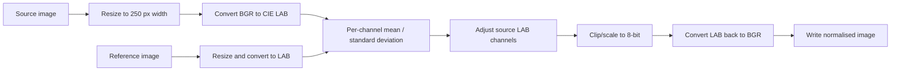
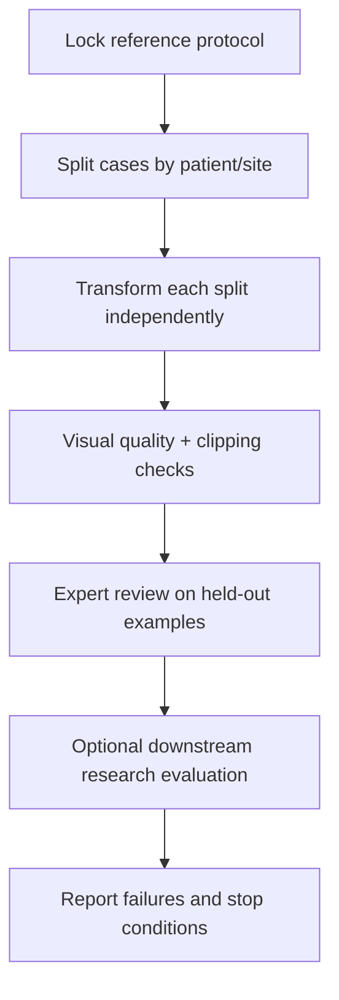

# Histology Colour-Normalisation Exploration

> **Project status — recovery required.** The historical `ImageCRC` name and
> legacy README describe compression, but the inspected code applies colour
> transfer/normalisation to pathology-style images. The original Google Drive
> data hierarchy and governance context are unavailable. No clinical,
> classification, or image-quality performance is claimed.

## The actual problem

Histology imagery can vary in colour because stain concentration, scanner,
illumination, or acquisition workflow changes between sites. Colour
normalisation tries to make an image resemble a selected reference image so a
downstream research workflow is less sensitive to that variation. It does not
create tissue truth, repair all scan artifacts, or make an image clinically
equivalent to its source.

This archive must not alter diagnostic images, produce diagnoses, or support
clinical decisions. Colour changes can conceal or exaggerate visual features.

## Evidence ledger

| Asset | Role | Evidence state |
|---|---|---|
| `batch_color_normalization_for_crc_data (2).py` | Colab-exported batch colour-transfer script | Inspected; not portable or executed |
| `Batch_Color_Normalization_for_CRC_Data (2).ipynb` | Notebook batch experiment | Preserved |
| `suhcitsir.ipynb` | LAB/HSV/YCbCr and colour-transfer exploration | Preserved |
| `Untitled.ipynb` | Additional historical exploration | Preserved |
| `Final_Images/` | Existing image assets with unclear provenance | Preserved; not a benchmark |
| `LEGACY_README.md` | Original compression-focused description | Preserved for history |

The script mounts a personal Google Drive, reads
`/content/drive/MyDrive/Paper_Data/images`, uses
`images/Patient_012_01_Normal.png` as reference, and writes back to Drive.
That is an experimental Colab workflow, not a reproducible data contract.

## Pipeline, as implemented



The code measures LAB-channel statistics and moves source channels toward the
target. It also exports HSV, LAB, and YCrCb representations. These are colour
conversions and normalisation experiments—not a trained CNN, GAN, autoencoder,
image compressor, or CRC classifier. Legacy claims about PSNR, SSIM,
autoencoders, and CIFAR-10 are unsupported by inspected project files.

## Reference choice is a model choice

This line governs every output colour:

```python
target_path = "images/Patient_012_01_Normal.png"
```

A filename cannot establish that a reference is “normal.” Its acquisition,
stain protocol, tissue class, quality review, and selection rationale need to
be documented. A poor or unrepresentative reference can systematically shift a
whole batch in an undesirable direction.

```text
source image ──┐
               ├── LAB statistics ──► transformed output
reference image ┘                         ▲
                                          │
               reference choice sets the visual target
```

## Data and governance contract

`Final_Images/` filenames suggest benign/malignant and organ classes, but names
are not labels, diagnoses, consent records, or licences. Do not train,
evaluate, or redistribute those images until provenance is established.

| Required record | Reason |
|---|---|
| Source institution/dataset and licence | Confirms rights to use and publish |
| De-identification and access controls | Pathology imagery may be governed/sensitive |
| Restricted image-to-case mapping | Prevents patient/case leakage later |
| Stain, scanner, magnification, site metadata | Measures effects by source |
| Reference-image protocol | Makes the key visual choice auditable |
| Ground truth for any downstream task | Separates preprocessing from a clinical claim |

Keep approved data outside Git:

```text
data/                         # ignored and access controlled
  raw/
  references/
  manifests/                  # restricted case/source metadata
  outputs/                    # generated locally
docs/
  data-governance.md
  reference-selection.md
```

## Validation a future rewrite must earn

There is no universal “better looking” score for medical colour normalisation.
A credible study needs locked acceptance criteria, held-out images, and expert
review. It should measure channel shifts, clipping, tissue-structure
preservation, and downstream task stability. Any downstream evaluation needs
case-level splits, calibration, uncertainty, and domain review.



PSNR/SSIM compare an image with known pixel-level ground truth. They are not
automatically meaningful for stain normalisation because its aim is distribution
alignment rather than reproducing the original source pixels.

## Observed failures and regression guards

| Observation | Consequence | Future guard |
|---|---|---|
| `pip install color_transfer` is Python source | Invalid in ordinary Python | Pinned environment and normal installation |
| Personal Drive paths | Non-portable/private storage assumptions | CLI arguments or project-relative paths |
| Hard-coded reference image | Undocumented batch-wide choice | Versioned reference manifest |
| `q` branch has inconsistent chroma adjustment | Output is difficult to reason about | Synthetic colour-patch tests and explicit policy |
| No output-directory/write checks | Partial work can be silent | Atomic output, hashes, per-file logs |
| Compression-centric legacy README | Scope and metrics are misleading | Docs tied to inspected implementation |

## Reproduction status

The original Colab workflow is not run: the data hierarchy, reference image,
permissions, and reproducible runtime are missing. Dependencies below are a
starting point for a future authorised rewrite, not proof the old script runs.

```bash
cd ImageCRC
python -m pip install -r requirements.txt
```

Read the [technical walkthrough](docs/index.html) for the complete evidence
ledger, pipeline diagram, failure analysis, and recovery sequence.
