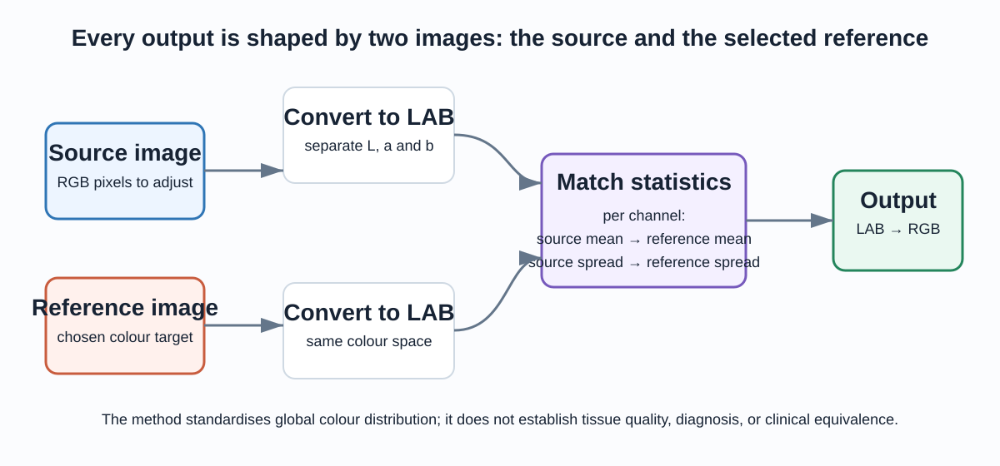
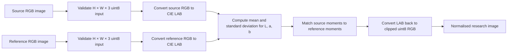
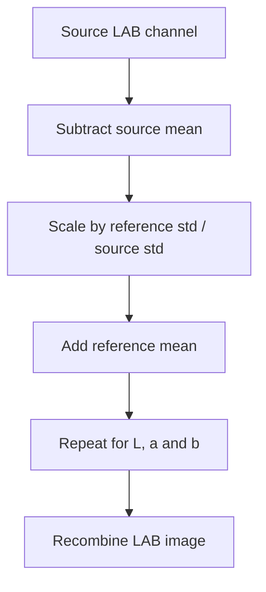
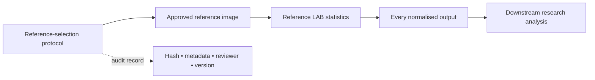
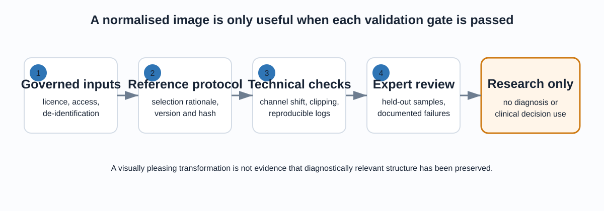

# Histology Colour Normalisation

Colour is a powerful but unstable signal in histology imagery. Changes in stain
batch, scanner, illumination, or preparation can make similar tissue look
different before a research model has seen any biology at all. This project
demonstrates a **reference-based LAB colour-normalisation** workflow: it shifts
the global colour distribution of a source image toward a deliberately chosen
reference image.

It is a focused image-preprocessing project—not a classifier, diagnostic tool,
or claim about disease. The normalised images are research artefacts and must
not be used for clinical interpretation or decision-making.



## What this project answers

The central question is simple: **how can a batch of RGB images be made more
consistent in colour while keeping the transformation explicit, reproducible,
and testable?**

The answer used here is a global statistical transfer in the CIE LAB colour
space. For every source image, the workflow measures the mean and standard
deviation of each LAB channel, then maps them to the corresponding statistics
of the reference image. It is intentionally compact, so each choice can be
inspected and challenged.

| Component | Responsibility | Why it matters |
|---|---|---|
| Source image | The RGB image being transformed | Its original pixels remain the starting point. |
| Reference image | The selected visual target | Its colour distribution determines the direction of every transformation. |
| LAB conversion | Separates lightness-like and opponent-colour axes | Lets the transfer act independently on L, a and b statistics. |
| Moment matching | Aligns channel mean and spread | Reduces global colour variation in a reproducible way. |
| Output checks | Enforce RGB shape, type and displayable range | Prevents silent format errors and makes clipping visible for future studies. |

## The workflow, from pixels to output



The method does not compare two images pixel by pixel. The reference and source
can have different dimensions and tissue arrangements because only their
global channel statistics are used. That makes the method convenient for
batch-level colour alignment, but also means it cannot prove that local tissue
structures or clinically relevant visual features are preserved.

## Why use CIE LAB?

Standard image files use RGB: each pixel stores red, green and blue intensity.
LAB represents colour differently:

- **L** is a perceptual-lightness-like axis.
- **a** runs approximately from green to red/magenta.
- **b** runs approximately from blue to yellow.

This separation gives the procedure a clean model: align lightness variation
and chromatic variation channel by channel, rather than applying an opaque
RGB filter. It is still a mathematical colour transform—not a biological model
of staining and not evidence that two slides are equivalent.

For a channel \(c \in \{L, a, b\}\), each source value is transformed as:

\[
c' = \left(c - \mu_{source}\right)
     \frac{\sigma_{reference}}{\max(\sigma_{source}, \epsilon)}
     + \mu_{reference}
\]

The first term centres the source channel, the ratio aligns its spread with the
reference, and the final addition moves it to the reference mean. A small
positive \(\epsilon\) is essential: a completely uniform channel has standard
deviation zero and must not trigger a divide-by-zero failure.



## The reference image is part of the model

There is no neutral reference image. Choosing one slide defines what the whole
batch will resemble, so it deserves the same care as a model configuration.
A defensible research protocol records its stain process, scanner, tissue type,
reviewer rationale, immutable file hash, and version. It also prevents a
reference selected from evaluation data from leaking information into a later
experiment.



Changing the reference should change the output; this repository verifies that
behaviour with synthetic colour patches. That is a correctness check, not a
quality metric and not a claim about medical utility.

## Run the portable implementation

The historical notebooks are retained as exploration records. The supported
code path is [`src/color_normalization.py`](src/color_normalization.py), a
pure-NumPy implementation with no notebook runtime or private Drive paths.

```bash
python -m pip install -r requirements.txt
python -m pytest -q
```

Use it with RGB `uint8` arrays (for example, arrays read with Pillow):

```python
import numpy as np
from PIL import Image

from src.color_normalization import normalize_rgb_to_reference

source = np.asarray(Image.open("source.png").convert("RGB"))
reference = np.asarray(Image.open("reference.png").convert("RGB"))
normalised = normalize_rgb_to_reference(source, reference)
Image.fromarray(normalised).save("normalised.png")
```

The function deliberately rejects grayscale, alpha-channel, BGR and
floating-point arrays rather than guessing what they mean. That boundary makes
the colour ordering and output contract explicit.

## What the tests prove

The test suite uses synthetic colour patches—no medical-image label or quality
claim is implied. It verifies that the implementation:

1. returns a new `uint8` RGB image with the source image’s dimensions;
2. keeps every output value in the displayable `[0, 255]` interval;
3. produces a different colour distribution when the reference changes; and
4. handles constant source channels without division by zero.

These are software regression guards. They do not replace visual review,
pathology expertise, or downstream task validation.

## What a credible evaluation would look like



Before reporting any research benefit, an evaluation should lock its protocol
before inspecting results, preserve patient/case and site boundaries, and show
both successes and failures. Useful measures include the amount of channel
shift, count of clipped pixels, repeatability of output hashes, and expert
review of held-out samples. If a downstream model is studied, it needs
case-level splits, calibration, uncertainty analysis, and a baseline without
normalisation.

PSNR and SSIM are not default success metrics here. They assess similarity to a
known pixel-level target, while colour normalisation intentionally changes
pixels to align a distribution. A visually pleasing output is likewise not
evidence of structural preservation.

## Data, governance, and safe scope

The image names in `data/final-images/` suggest pathology-related material,
but filenames do not establish licence, diagnosis, consent, case identity, or
ground truth. Treat these files as local demonstration assets only until their
provenance is documented. Do not train, evaluate, publish, or redistribute
them on the basis of filenames alone.

For an authorised study, keep approved data access-controlled and outside Git;
record a manifest containing source institution, licence, de-identification
status, stain/scanner metadata, reference selection, and hashes. Keep every
patient/case entirely in one split before any downstream analysis.

## Repository guide

```text
09-histology-color-normalization/
├── README.md                        # this self-contained project guide
├── src/
│   ├── color_normalization.py        # portable, tested LAB implementation
│   └── batch_colour_normalisation.py # preserved historical Colab experiment
├── tests/                            # synthetic regression tests
├── notebooks/                        # retained exploratory records
├── data/final-images/                # local assets; provenance not established
├── docs/
│   ├── index.html                    # standalone technical walkthrough
│   └── assets/                       # workflow and validation diagrams
└── LEGACY_README.md                  # original historical description
```

## Further reading

Open the [standalone walkthrough](docs/index.html) for the same explanation in
a presentation-ready format. The historical [legacy README](LEGACY_README.md)
and notebooks remain available for provenance; they are not the recommended
entry point for understanding or running the project.
