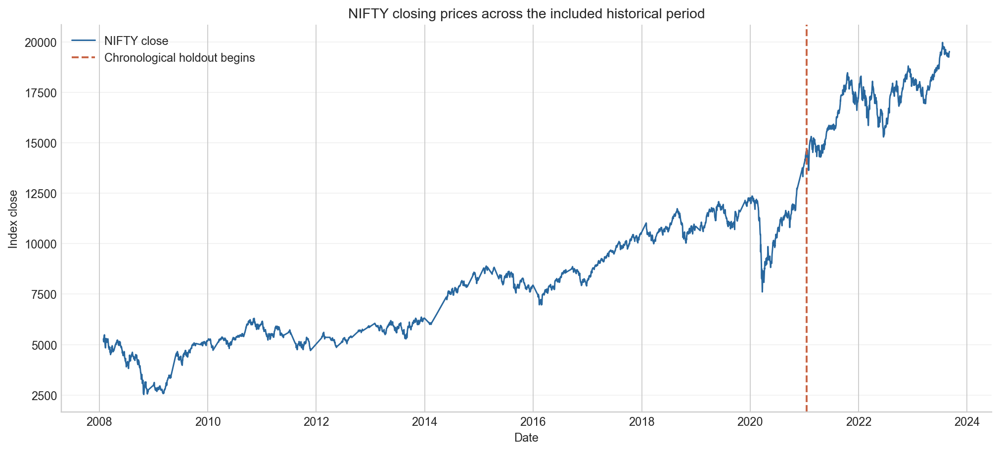
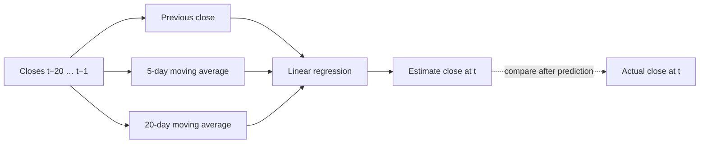
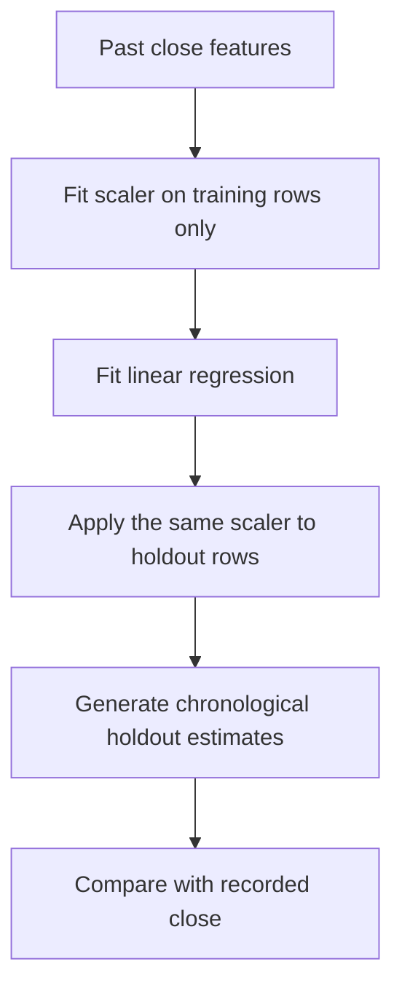
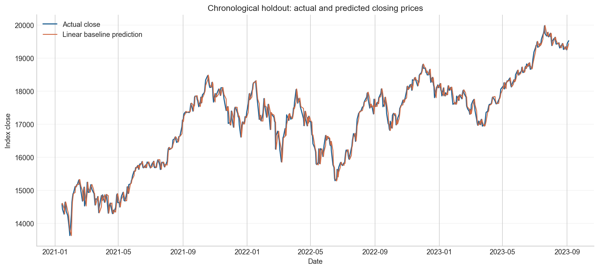
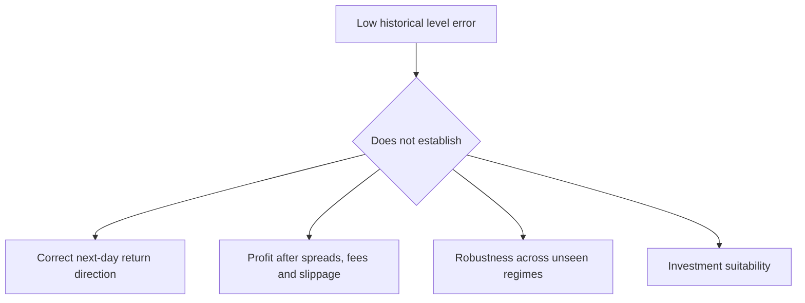

# NIFTY Closing-Price Analysis

This project builds an honest baseline for a narrow forecasting question:

> Given only closing-price information available before a trading day, how closely can a simple model estimate that day’s recorded NIFTY close?

It uses **3,872** daily observations from **2008-01-01 to 2023-09-04** and evaluates the final chronological 20% of the series. It is educational historical analysis—not investment advice, a trading system, or a claim of future performance.



## Why time order is the whole project

Time-series data has a rule that ordinary tabular data does not: the future must remain unavailable during training. A random split can let a later market date influence a model evaluated on an earlier date, producing an attractive but invalid score. This workflow uses the earliest 80% of engineered rows for training and reserves the latest 20% as the holdout.


That makes the resulting estimate interpretable: it describes error on later historical dates that were not available to the model. It does not guarantee the same performance on future markets.

## Dataset at a glance

The included `data/NSEI.csv` contains daily Date, Open, High, Low, Close, Adjusted Close and Volume fields. The baseline deliberately uses only `Close`: the aim is to demonstrate a leakage-aware close-to-close forecast rather than to suggest a complete financial model.

| Data property | Value | Interpretation |
|---|---:|---|
| Rows | 3,872 | One local historical record per included day |
| Period | 2008-01-01 → 2023-09-04 | Covers several market conditions, but ends in 2023 |
| Close range | 2,524.20 → 19,979.15 | Index levels change substantially over the sample |
| Usable feature rows | 3,852 | First 20 rows lack the past history needed by SMA-20 |
| Training period | 2008-01-29 → 2021-01-13 | Earliest 80% of usable rows |
| Holdout period | 2021-01-14 → 2023-09-04 | Latest 20%, never used for fitting |

The CSV is a local learning dataset, not a trading-grade market feed. It does not establish adjustment policy, survivorship controls, execution prices, or all market events required for an investable strategy.

## Features: what the model is allowed to know

For a target close on day *t*, every input comes from day *t−1* or earlier. This is the key leakage control.

| Feature | Definition | Information available before close *t*? |
|---|---|---|
| `prev_close` | Closing price at *t−1* | Yes |
| `sma_5` | Mean close from the five preceding rows | Yes |
| `sma_20` | Mean close from the twenty preceding rows | Yes |
| `target_close` | Closing price at *t* | No — used only after prediction |



The first 20 rows are dropped because there is no full prior 20-day window. That is an honest absence of history, not a missing value to be guessed.

## Baseline model

The model is a `StandardScaler` followed by `LinearRegression`. This is a deliberately conservative choice: it produces an inspectable baseline before adding nonlinear models that could fit historical regimes more closely without showing a durable predictive mechanism.



The scaler is fitted only on training rows. Fitting it on the entire series would let holdout distribution information leak into preprocessing.

## Verified holdout results

Running `python -m src.train` against the included CSV produces:

| Metric | Result | Plain-language meaning |
|---|---:|---|
| MAE | **119.36 index points** | Typical absolute miss across holdout days |
| RMSE | **157.86 index points** | Heavier penalty for larger misses |
| MAPE | **0.71%** | Mean absolute level error relative to the actual close |



The lines are close because the previous close and moving averages strongly track a smooth index *level*. This does not mean the model forecasts profitable price movements. A level forecast can be accurate while missing return direction, failing during a regime shift, or losing after realistic costs.

## Reading the metrics correctly



MAE answers “how far off were predictions on average?” RMSE puts more emphasis on large misses. MAPE makes the error relative to index level. None evaluate a trade: the project contains no buy/sell signal, position sizing, turnover, drawdown, transaction-cost model, or out-of-sample live execution.

## Run it yourself

```powershell
python -m pip install -r requirements.txt
python -m src.train
python -m pytest -q
```

To regenerate the figures shown above from the CSV and baseline:

```powershell
python -m scripts.generate_figures
```

The test suite protects four important contracts:

1. lagged feature columns exist and use prior rows;
2. the training set ends before the test set begins;
3. error metrics use the expected arithmetic; and
4. the command-line runner resolves the dataset from `data/NSEI.csv`.

## Project map

```text
10-nifty-price-analysis/
├── data/NSEI.csv                   # included historical input data
├── src/
│   ├── nifty_model.py              # features, time split and metrics
│   └── train.py                    # executable baseline runner
├── tests/test_nifty_model.py       # regression checks
├── scripts/generate_figures.py     # documentation figure generator
├── notebooks/                      # exploratory and guided notebook records
├── docs/
│   ├── index.html                  # standalone technical walkthrough
│   └── assets/                     # data-backed charts
└── requirements.txt
```

## Limitations and next steps

- It uses one historical CSV which ends in September 2023.
- It predicts an index level, not a return, direction, volatility, or signal.
- It uses a single fixed holdout rather than rolling walk-forward retraining.
- It excludes macro events, news, interest rates, liquidity, corporate actions, and market microstructure.
- It does not benchmark against a naïve “tomorrow equals today” baseline.

The right next step is not a larger model. First, add a naïve persistence benchmark and walk-forward evaluation, then report errors across distinct market periods. That would show whether complexity adds anything beyond the previous close.

For a presentation-ready version of this explanation, open the [technical walkthrough](docs/index.html).
