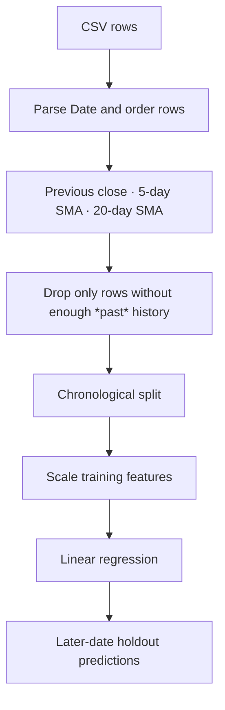
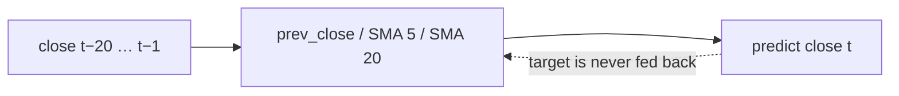
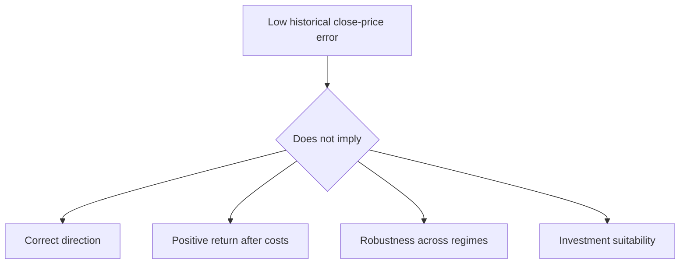

# NIFTY Closing-Price Analysis

**A chronological, leakage-aware baseline for predicting the next recorded NIFTY closing price from prior closing-price history.**

`3,872 rows · 2008-01-01 to 2023-09-04 · 3 lagged features · 3 tests · no trading claim`

> The original notebook is preserved. This README documents the corrected workflow and the analytical boundary that makes its score meaningful: **a model must never train on dates after the date it is asked to predict.**

---

## Contents

| | | |
|---|---|---|
| [1 · The future-leakage problem](#1--the-future-leakage-problem) | [5 · The baseline](#5--the-baseline) | [9 · Verification](#9--verification) |
| [2 · System at a glance](#2--system-at-a-glance) | [6 · Results](#6--results) | [10 · Limitations](#10--limitations) |
| [3 · Data contract](#3--data-contract) | [7 · Why the score is not a strategy](#7--why-the-score-is-not-a-strategy) | [A · Commands and layout](#a--commands-and-layout) |
| [4 · Feature timing](#4--feature-timing) | [8 · The original failure](#8--the-original-failure) | |

## 1 · The future-leakage problem

The original notebook created lag features and then used a random `train_test_split`. That allows a row from 2023 to train a model that is evaluated on a row from 2010. It is not a minor statistical preference: markets are ordered in time, prices are autocorrelated, and a random split makes a next-period claim look far stronger than it is.

The corrected workflow makes one narrower claim: after training on the earliest 80% of the available feature rows, how closely can a linear baseline reproduce closing prices in the remaining, later 20%?


The model is not predicting returns, directions, profits, or a trading signal. It predicts an index level one step ahead under a historical evaluation protocol.

## 2 · System at a glance

| Artefact | Responsibility | Status |
|---|---|---|
| `NSEI.csv` | Included historical price data | Read locally |
| `Untitled.ipynb` | Preserved original exploration | Retained, not the recommended workflow |
| `nifty_model.py` | Feature timing, chronological split, error metrics | 3 unit tests |
| `main.py` | End-to-end baseline run | Executed locally |
| `final_nifty_market_analysis.ipynb` | Guided trend, features, holdout plot | Executed; zero saved errors |
| `docs/index.html` | Standalone walkthrough | Mirrors the project account |



## 3 · Data contract

The local `NSEI.csv` contains **3,872** daily rows from **2008-01-01** through **2023-09-04**. It has Date, Open, High, Low, Close, Adjusted Close, and Volume fields. The baseline uses Close only because its task is explicitly a close-to-close persistence-style forecast.

| Observation | Measured value | Consequence |
|---|---:|---|
| Close range | 2,524.20–19,979.15 | Error must be interpreted in context of a changing index level |
| Median close | 8,219.27 | The series spans multiple market regimes |
| Missing values | 180 | Feature construction drops incomplete lag rows rather than inventing prices |
| Zero-volume rows | 1,256 | Volume is not used; zero may reflect source conventions rather than no market activity |

No claim is made that this is an adjusted, survivorship-bias-free, trading-grade market feed. It is the historical CSV stored in the repository.

## 4 · Feature timing

Every feature for day *t* is shifted. The close at day *t* is the target; it never appears in the input vector for its own prediction.

| Feature | Definition | Available before target close? |
|---|---|---|
| `prev_close` | Close at t−1 | Yes |
| `sma_5` | Mean close from t−5 through t−1 | Yes |
| `sma_20` | Mean close from t−20 through t−1 | Yes |
| `target_close` | Close at t | No — target only |



This is the project’s explicit leakage guard. The accompanying tests assert that the split is chronological and that feature rows contain the expected shifted columns.

## 5 · The baseline

The model is linear regression preceded by a standard scaler. This is intentionally modest. With only lagged price-level features, a complex model can easily memorise regime-specific shapes without learning a durable market mechanism.

| Choice | Decision | Why |
|---|---|---|
| Split | First 80% train, final 20% test | Mimics a forward-in-time prediction boundary |
| Features | Prior close, SMA 5, SMA 20 | Minimal signals known before the target close |
| Model | Linear regression | Transparent baseline before model complexity |
| Scaling | Training-only `StandardScaler` | Stable coefficients and reusable pipeline |
| Metrics | MAE, RMSE, MAPE | Point error in both index units and relative terms |

The resulting dates are 2008-01-29–2021-01-13 for training and 2021-01-14–2023-09-04 for the holdout. The first 20 rows are unavailable to the 20-day moving average by construction; that is missing history, not missing data to impute.

## 6 · Results

The verified local command run produced:

| Metric | Value | Interpretation |
|---|---:|---|
| MAE | **119.36** index points | Typical absolute miss on later historical dates |
| RMSE | **157.86** index points | Larger misses have more influence |
| MAPE | **0.71%** | Mean absolute relative close-price error |

```text
Training dates: 2008-01-29 to 2021-01-13
Test dates: 2021-01-14 to 2023-09-04
MAE: 119.36 index points
RMSE: 157.86 index points
MAPE: 0.71%
```

The final notebook plots actual and predicted closes over the holdout period. A low MAPE is expected for an autoregressive level baseline in a smooth, high-valued series; it is not evidence of tradable excess return.

## 7 · Why the score is not a strategy

The model is evaluated on **level error**, not on a decision that trades money. A model can predict tomorrow’s level close to today’s level and still fail every question a strategy must answer: will the return be positive after costs, is uncertainty bounded, does it survive a market-regime break, and can it trade at available liquidity?



## 8 · The original failure

The original notebook had useful trend and moving-average exploration, but repeated its training/evaluation cells and randomly split the series. It also placed predictions against the final date range irrespective of the randomly selected test dates, visually suggesting an ordered forecast where the evaluation was unordered.

The replacement preserves the original ideas—trend line, previous close, and moving average—while making the time boundary explicit and testable. The old notebook remains in the repository rather than being deleted.

## 9 · Verification

```text
3 passed in 1.60s
Final notebook: 12 cells; saved errors: 0
```

| Check | Guard |
|---|---|
| Feature construction | Required lag columns exist and precede target price |
| Chronological split | Latest train date is before earliest test date |
| Metrics | MAE/RMSE/MAPE return the intended price-error values |
| Command-line run | Reads the included CSV and measures a real later-date holdout |

## 10 · Limitations

- **One historical file:** the included data ends in September 2023 and may contain source-specific quirks.
- **Level prediction, not return prediction:** point accuracy is not a trading evaluation.
- **No walk-forward retraining:** one fixed split is a baseline, not a full rolling-origin study.
- **Three price-only features:** news, rates, volatility, liquidity, corporate actions, and macro conditions are absent.
- **No transaction-cost model:** there is no strategy, position sizing, turnover, or drawdown analysis.
- **Regime sensitivity:** the series covers several market regimes but the model does not explicitly detect them.

**Current state:** verified educational baseline. **Open next step:** compare against a naïve previous-close benchmark under walk-forward validation before adding model complexity.

## A · Commands and layout

```powershell
python -m venv .venv
.venv\Scripts\Activate.ps1
pip install -r requirements.txt
python main.py
python -m pytest tests -q
```

```text
nifty/
├── NSEI.csv
├── Untitled.ipynb                  # preserved original
├── final_nifty_market_analysis.ipynb
├── nifty_model.py
├── main.py
├── tests/
└── docs/index.html
```

> Educational historical analysis only. This repository does not provide financial advice or investment recommendations.
