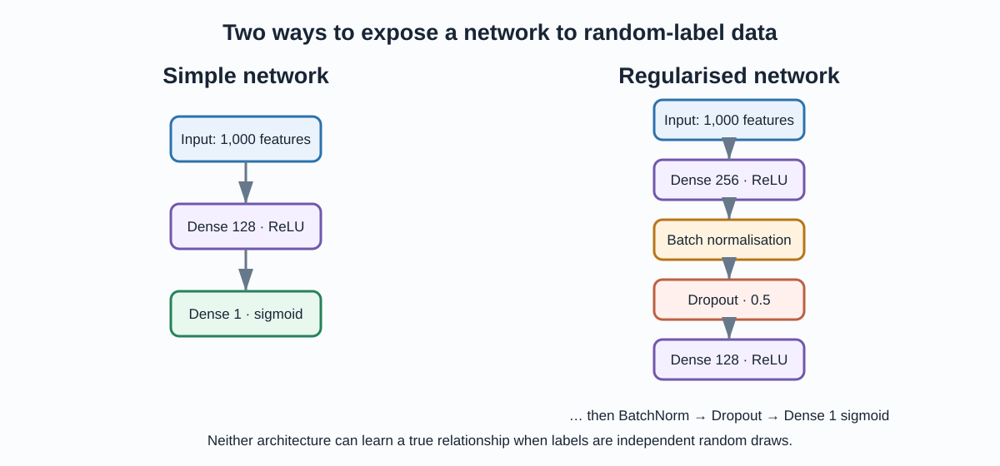
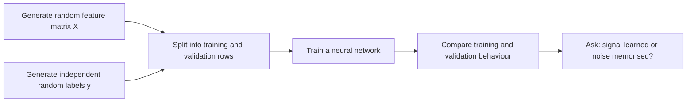
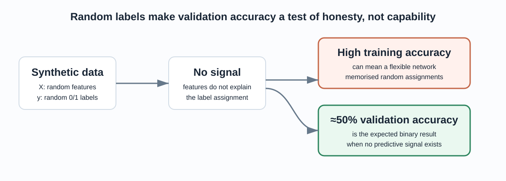
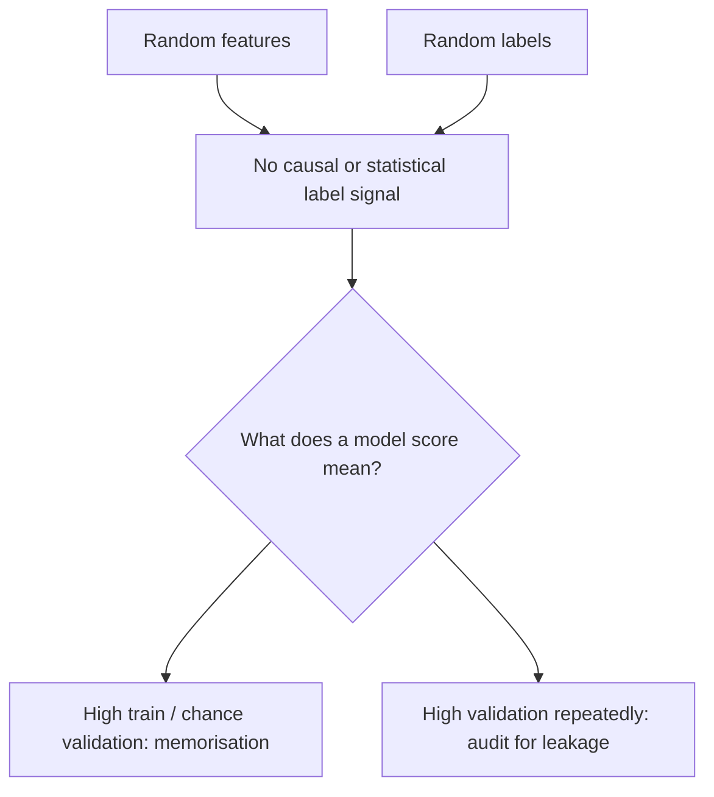

# Neural Network Experiments: Learning From Noise

This project is a Keras learning laboratory built around a deliberately
unforgiving dataset: random feature vectors paired with random binary labels.
Because there is no relationship between inputs and targets, the project makes
one important machine-learning idea impossible to miss:

> A high training score does not prove a model has learned anything useful.

The experiments compare a small dense network with a deeper regularised
network, practise the TensorFlow/Keras workflow, and show why validation on
independent data matters. This is not a real classification task and the
reported accuracy values are not performance claims.



## The experiment in one view



Each run generates 1,000 samples with 1,000 random features and a binary target
drawn independently of those features. In a balanced binary problem with no
signal, a model should generalise at roughly 50% accuracy. That is the baseline
for interpretation—not a disappointing result.

## Why random labels are useful

Synthetic random data isolates model capacity from real-world complexity. No
model can discover a genuine predictive rule because none exists. If a flexible
network drives training accuracy upward, it is fitting accidental patterns in
the finite sample. When it is evaluated on new random rows, those accidental
patterns disappear.



This makes the project a clean demonstration of overfitting:

| Observation | Correct interpretation |
|---|---|
| Training accuracy rises on random labels | The network has enough capacity to memorise the training set. |
| Validation accuracy stays around chance | The model has not found a transferable relationship. |
| Regularisation suppresses memorisation | The model is less able to fit sample-specific noise. |
| A single unusually high validation result | Investigate the split, seed, labels and reuse of state before making a claim. |

## Data design

```python
X = np.random.rand(1000, 1000)      # 1,000 samples × 1,000 random features
y = np.random.randint(2, size=1000) # independent random binary labels
```

The design intentionally violates the usual project goal of finding signal.
Here it acts as a controlled negative example. If validation accuracy reliably
surpassed chance on repeated independent runs, that would be a reason to audit
the procedure for leakage or unintended correlations—not evidence of a useful
classifier.



## Architectures compared

### Simple dense network

```text
Input (1,000)
    → Dense(128, ReLU)
    → Dense(1, sigmoid)
```

The first dense layer alone has 128,128 trainable parameters. That is ample
capacity relative to a 1,000-sample random training set, so it can fit noise.

### Regularised dense network

```text
Input (1,000)
    → Dense(256, ReLU) → BatchNormalization → Dropout(0.5)
    → Dense(128, ReLU) → BatchNormalization → Dropout(0.5)
    → Dense(1, sigmoid)
```

| Design choice | Role in this experiment |
|---|---|
| Dense + ReLU layers | Give the model flexible nonlinear capacity. |
| Batch normalization | Keeps intermediate activations in a more stable range during optimisation. |
| Dropout at 0.5 | Randomly removes half of activations during training, making memorisation harder. |
| Sigmoid output | Returns a probability-like value for a binary label. |
| Binary cross-entropy | Measures error for a binary probabilistic prediction. |

Batch normalisation and dropout are not magic generalisation switches. They can
reduce a network’s tendency to fit noise, but they cannot create signal that is
absent from the data.

## What was practised

The notebook exercises the practical mechanics of the Keras API:

- building `keras.Sequential` models;
- compiling binary classifiers with Adam and binary cross-entropy;
- creating train/validation splits;
- applying batch normalisation and dropout;
- using early stopping;
- saving models in `.h5` and TensorFlow SavedModel formats; and
- configuring mixed precision through `LossScaleOptimizer`.

Mixed precision uses lower-precision arithmetic where hardware supports it,
which can reduce memory use and increase throughput. It does not improve the
statistical quality of a model, and its benefit depends on compatible hardware.

## How to run the experiments

```powershell
python -m venv .venv
.venv\Scripts\Activate.ps1
python -m pip install -r requirements.txt
jupyter notebook notebooks/01_neural_network_experiments.ipynb
```

No external dataset download is needed. The random generator is unseeded, so
the exact curves and accuracy values will differ between runs. For a repeatable
teaching experiment, add explicit NumPy and TensorFlow random seeds and log
every split and hyperparameter.

## Project guide

```text
11-neural-net-experiments/
├── README.md                         # self-contained project guide
├── notebooks/
│   └── 01_neural_network_experiments.ipynb
├── models/
│   ├── simple_nn_model.h5            # saved teaching artefact
│   ├── improved_nn_model.h5           # saved teaching artefact
│   └── improved_nn_model/             # TensorFlow SavedModel export
├── docs/
│   ├── index.html                     # standalone visual walkthrough
│   └── assets/                        # architecture and interpretation diagrams
└── requirements.txt
```

The saved models show Keras serialisation formats. Because the input/label data
is regenerated and unseeded, they should not be presented as reusable trained
classifiers.

## Honest next steps

To turn this from an API practice notebook into a rigorous experiment, first
make it reproducible: fix random seeds, remove duplicate exploratory code,
record environment versions, and run repeated trials. Then add a deliberately
learnable synthetic task with a known data-generating rule. Compare its results
against the random-label control so that generalisation—not a headline training
score—remains the success criterion.

Open the [standalone walkthrough](docs/index.html) for a presentation-ready
version of the experiment.
