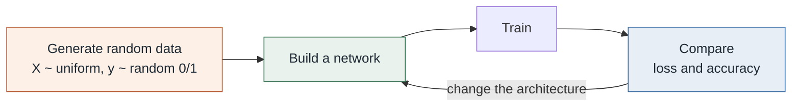
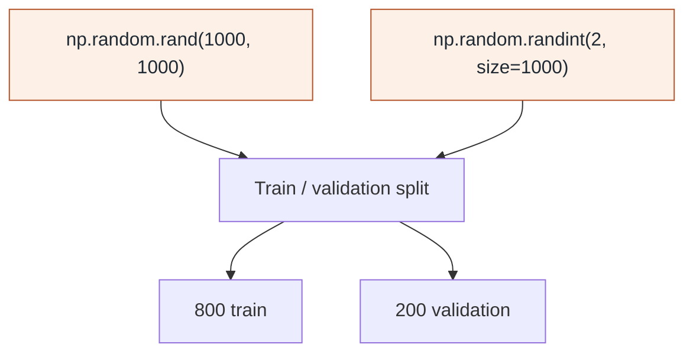
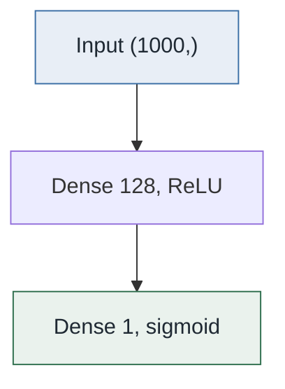
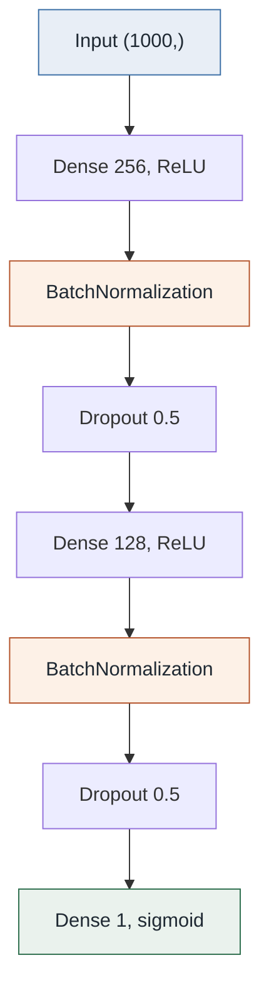
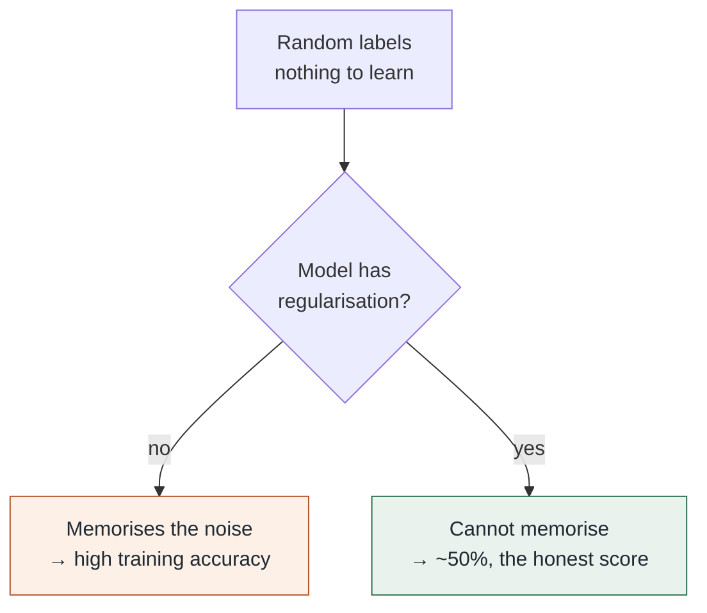

# 11 — Neural Network Experiments

**A Keras sandbox for comparing network architectures on synthetic data.**

September 2023 · TensorFlow/Keras · Dense networks · Batch normalisation · Dropout · Mixed precision

---

> This project exists to practise the Keras API and observe how architectural
> choices behave, not to solve a task. The data is **generated at random**, so
> the accuracy figures below are exactly what they should be — and that is the
> point worth understanding.

---

## Contents

1. [What this project is](#1--what-this-project-is)
2. [The data](#2--the-data)
3. [The two architectures](#3--the-two-architectures)
4. [Results, and why they look like that](#4--results-and-why-they-look-like-that)
5. [Techniques practised](#5--techniques-practised)
6. [Layout](#6--layout)
7. [Running it](#7--running-it)

---

## 1 · What this project is

A notebook that builds several feed-forward networks, trains each on randomly
generated data, and compares how they behave.



The purpose is mechanical fluency: how to stack layers, where batch
normalisation goes, what dropout does to the training curve, how to save and
reload a model, and how to enable mixed-precision training.

---

## 2 · The data

There is no dataset. Every run generates its own:

```python
X = np.random.rand(1000, 1000)      # 1,000 samples, 1,000 features
y = np.random.randint(2, size=1000) # random binary labels
```



**The labels are independent of the features.** There is no relationship to
learn, by construction. A later cell reduces the input to 100 features to make
the runs faster, but the data is generated the same way.

---

## 3 · The two architectures

### Simple



Two layers. 128,000 parameters in the first dense layer alone.

### Improved



Wider, deeper, and regularised at every stage.

| | Simple | Improved |
|---|---|---|
| Hidden layers | 1 | 2 |
| Batch normalisation | — | after each hidden layer |
| Dropout | — | 0.5 after each hidden layer |
| Epochs | 10 | 20 |

**What each addition does.** `BatchNormalization` rescales each layer's outputs
to a stable distribution, which keeps gradients well-behaved and lets training
use a higher learning rate. `Dropout(0.5)` randomly zeroes half the activations
on each training pass, so the network cannot rely on any single unit.

---

## 4 · Results, and why they look like that

| Model | Training accuracy | Validation accuracy |
|---|---:|---:|
| Simple, 10 epochs | rises steadily | **0.86** on one evaluation |
| Improved, 20 epochs | ~0.51 | **~0.50** |

**The improved model scoring 50% is the correct result.** The labels are random,
so 50% is the ceiling — there is genuinely nothing to learn. Regularisation is
doing its job: batch normalisation and dropout prevent the network from
memorising noise, so it reports the honest score.

**The simple model's 0.86 is memorisation.** With 1,000 features and 1,000
samples and no regularisation, the network has more than enough capacity to fit
random noise exactly. A high number here measures capacity, not skill.



This is the most useful thing the project demonstrates: on data with no signal,
a high training score is evidence of over-capacity, and a score at chance level
is evidence the regularisation is working.

---

## 5 · Techniques practised

| Technique | Where |
|---|---|
| `keras.Sequential` model building | every cell |
| Batch normalisation | improved architecture |
| Dropout regularisation | improved architecture |
| Mixed-precision training (`LossScaleOptimizer`) | first cell |
| Train/validation splitting with scikit-learn | throughout |
| Saving and reloading models | `models/` |
| Writing generated data to CSV | later cells |

**Mixed precision** runs most operations in 16-bit floating point instead of
32-bit, roughly halving memory use and speeding up training on supported GPUs.
`LossScaleOptimizer` wraps the optimizer to scale the loss upward before the
backward pass, preventing small gradients from underflowing to zero in 16-bit.

The notebook's saved output records `Could not find cuda drivers on your
machine, GPU will not be used` — these runs were on CPU, so the mixed-precision
setup was exercised but not accelerated.

---

## 6 · Layout

```
11-neural-net-experiments/
├── README.md                                 this walkthrough
├── requirements.txt
├── notebooks/
│   └── 01_neural_network_experiments.ipynb   the experiments, with saved output
├── models/
│   ├── simple_nn_model.h5                    the simple architecture, trained
│   ├── improved_nn_model.h5                  the regularised architecture
│   └── improved_nn_model/                    the same, in SavedModel format
└── docs/
    └── assets/
```

Both saved-model formats are kept because the notebook demonstrates each:
the single-file `.h5` format and TensorFlow's `SavedModel` directory layout.

---

## 7 · Running it

```bash
cd 11-neural-net-experiments
python -m venv .venv
source .venv/bin/activate        # Windows: .venv\Scripts\activate
pip install -r requirements.txt
jupyter notebook notebooks/01_neural_network_experiments.ipynb
```

No dataset is needed — the notebook generates its own on every run. Because the
data is random and unseeded, your numbers will differ from the saved output.

Load a trained model:

```python
from tensorflow import keras

model = keras.models.load_model("models/improved_nn_model.h5")
model.summary()
```

---

## Scope

Synthetic data, no task, no claim. This project is a record of learning the
Keras API and the behaviour of common regularisation layers. The accuracy
figures describe how each architecture responds to noise and are not a
performance result.

---

**Previous:** [10 — NIFTY Price Analysis](../10-nifty-price-analysis/) · **Next:** [12 — Image Super-Resolution](../12-image-super-resolution/) · **Portfolio:** [index](../)
