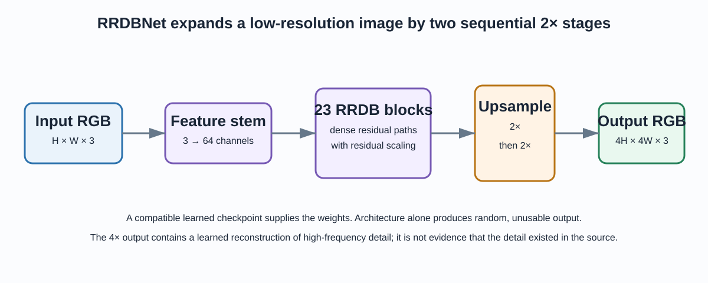
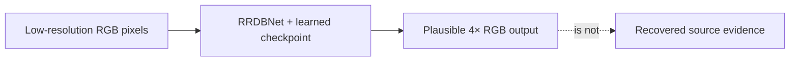
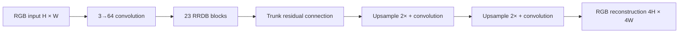
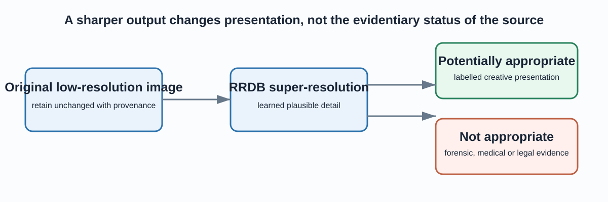

# ESRGAN / RRDB Image Super-Resolution

This project explores **4× single-image super-resolution** with an ESRGAN-style
Residual-in-Residual Dense Block network (RRDBNet). Given a low-resolution RGB
image, the network produces an image that is four times wider and four times
taller by synthesising plausible high-frequency detail from patterns learned
by a pretrained checkpoint.

That last phrase matters: super-resolution creates a learned reconstruction. It
does **not** recover ground-truth pixels that were absent from the source.
This repository is therefore appropriate for learning, presentation, and
authorised creative experiments—not forensic, medical, legal, identity, or
safety-critical interpretation.



## The problem this project solves

An image with dimensions `H × W × 3` has limited spatial detail. Enlarging it
with conventional interpolation creates more pixels but cannot infer texture or
edges that were not recorded. A trained super-resolution network instead uses a
learned image prior to generate a `4H × 4W × 3` output that often appears more
detailed.



The output can be useful visually, but individual generated details must always
be treated as model-produced content.

## How RRDBNet produces a 4× output

RRDBNet first extracts 64 feature channels from the RGB input. It then passes
those features through 23 **Residual-in-Residual Dense Blocks**. Each block
contains three dense residual blocks, where later convolutions receive earlier
feature maps as well as the original block input. Residual connections make the
deep path easier to optimise; residual scaling (`0.2`) keeps that path from
overwhelming the main signal.

Finally, two nearest-neighbour upsampling stages, each followed by convolution,
grow the spatial size by `2 × 2 = 4`.



| Part | Role |
|---|---|
| Dense residual block | Reuses intermediate feature maps to model textured detail. |
| RRDB | Nests three dense residual blocks behind another residual connection. |
| Residual scaling | Multiplies residual updates by 0.2 for stable deep feature flow. |
| Two 2× upsampling stages | Defines the model’s total 4× spatial scaling. |
| Pretrained checkpoint | Supplies the learned parameters; the Python architecture alone has random weights. |

## A safe interpretation boundary



Keep the original image unchanged and store the model name, checkpoint hash,
settings, timestamp and output path beside every transformed file. Enhancement
does not alter image ownership, privacy requirements, consent obligations, or
the evidentiary status of the original.

## Run the verified inference path

The supported runner is [`src/run_esrgan.py`](src/run_esrgan.py). It makes paths
and device selection explicit, detects missing prerequisites before allocating
the full network, automatically selects CPU when CUDA is unavailable, and never
overwrites the input images.

```powershell
python -m pip install -r requirements.txt
python -m pytest -q
python -m src.run_esrgan --device auto
```

Inference requires an **authorised, compatible** ESRGAN checkpoint at:

```text
models/RRDB_ESRGAN_x4.pth
```

The checkpoint is intentionally not committed to this repository. Review its
licence and provenance before using it, and keep large weights outside ordinary
Git history. Once it is available, run a specific folder safely:

```powershell
python -m src.run_esrgan `
  --checkpoint models/RRDB_ESRGAN_x4.pth `
  --input-dir data/samples `
  --output-dir results `
  --device cpu
```

The runner writes `*_x4.png` files to the output folder. It performs no model
training and does not claim a quality score.

## What is verified locally

The tests do not pretend to validate visual quality without a controlled
low-resolution/high-resolution benchmark. They verify the engineering contract:

1. a small RRDBNet instance transforms an RGB tensor from `H × W` to `4H × 4W`;
2. CPU selection works without a CUDA runtime; and
3. preflight reports both a missing checkpoint and a missing input directory
   clearly, before an opaque low-level exception occurs.

PSNR, SSIM and LPIPS require a known high-resolution reference. The supplied
sample images are useful as local inputs, but they are not a paired benchmark,
so this checkout makes no visual-quality or upstream-benchmark claim.

## Project map

```text
12-image-super-resolution/
├── data/samples/                  # local sample images
├── src/
│   ├── rrdbnet_arch.py            # RRDBNet architecture
│   ├── run_esrgan.py              # supported preflight + inference runner
│   ├── net_interp.py              # historical checkpoint interpolation utility
│   └── transfer_rrdb_models.py    # historical checkpoint conversion utility
├── tests/test_run_esrgan.py       # architecture and preflight checks
├── notebooks/                     # original exploration notebook
├── docs/
│   ├── index.html                 # standalone visual walkthrough
│   ├── assets/                    # architecture and safety diagrams
│   └── reference/                 # upstream ESRGAN reference material
└── requirements.txt
```

## What a quality evaluation needs

To report a credible super-resolution result, use a versioned test set with
known high-resolution ground truth. Create low-resolution inputs using a
documented degradation procedure, keep those pairs separate from training,
compare against bicubic interpolation and another baseline, and report PSNR,
SSIM, perceptual measures, failures and visual crops. For any real use case,
judge whether generated detail is acceptable for that purpose before relying on
it.

Open the [standalone walkthrough](docs/index.html) for the same explanation in
a presentation-ready format.
