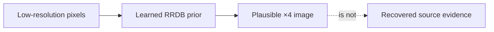
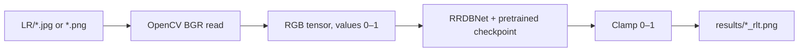
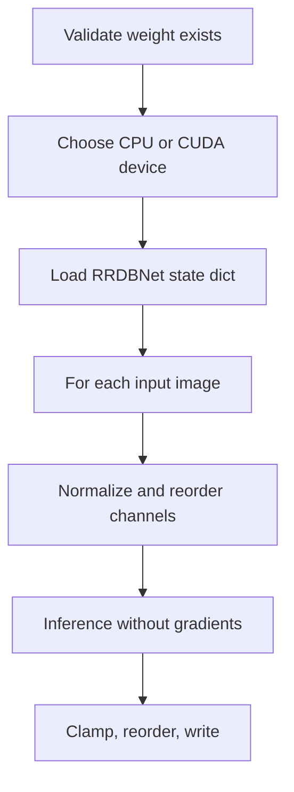

# Image Enhancer — ESRGAN / RRDB Super-Resolution

**A preserved ESRGAN-style ×4 image-super-resolution experiment, with its original RRDB architecture and sample images retained locally.**

`4 RRDB utility scripts · 6 original image assets · pretrained checkpoint absent · inference intentionally unverified`

> Super-resolution creates a plausible high-resolution image conditioned on a learned image prior. It does **not** recover ground-truth pixels that the source image did not contain. This is the most important interpretation boundary in the project.

---

## Contents

| | | |
|---|---|---|
| [1 · Enhancement is not recovery](#1--enhancement-is-not-recovery) | [5 · Inference path](#5--inference-path) | [9 · Verification and state](#9--verification-and-state) |
| [2 · System at a glance](#2--system-at-a-glance) | [6 · Architecture](#6--architecture) | [10 · Responsible use](#10--responsible-use) |
| [3 · What is preserved](#3--what-is-preserved) | [7 · Model-weight boundary](#7--model-weight-boundary) | [A · Commands and layout](#a--commands-and-layout) |
| [4 · Data contract](#4--data-contract) | [8 · Original operational risks](#8--original-operational-risks) | |

## 1 · Enhancement is not recovery

The model takes a low-resolution RGB image and synthesises a four-times-larger image. Its output can be sharper and visually more plausible, but a detail in the output is a learned reconstruction—not proof that the detail existed in the input.



This rules out forensic, medical, legal, identity, and safety-critical interpretation. An enhanced image may be useful for visual presentation or non-critical creative work; it must not replace the original image in an evidentiary workflow.

## 2 · System at a glance



| Artefact | Responsibility | State |
|---|---|---|
| `RRDBNet_arch.py` | RRDB residual-dense network definition | Preserved source |
| `test.py` | Original batch inference loop | Requires absent weight file |
| `net_interp.py` | Blend two compatible checkpoints | Requires both absent weight files |
| `transer_RRDB_models.py` | Checkpoint-key conversion utility | Requires source checkpoint |
| Sample JPG/PNG files | Original experiment assets | Present locally |
| `UPSTREAM_ESRGAN_REFERENCE.md` | Preserved upstream ESRGAN documentation | Renamed, not removed |

## 3 · What is preserved

This is not a new model trained by this repository. The useful original material is retained: the RRDB network architecture, inference/conversion utilities, sample images, and upstream ESRGAN reference. The project README now distinguishes your local experiment from upstream claims and benchmark tables.

The upstream reference is valuable background, but its published Set5/Set14/Urban100 scores belong to the upstream model and evaluation setup. They are not results produced by this checkout.

## 4 · Data contract

Inputs are images placed under `LR/`; outputs are written under `results/`. The repository contains several JPEG and PNG assets, but it does not contain a controlled low-resolution/high-resolution benchmark pair. Therefore PSNR, SSIM, LPIPS, or perceptual-quality claims cannot be measured here.

| Input requirement | Why |
|---|---|
| Readable RGB image | The network is instantiated with three input channels |
| Separate original retained | Output should never overwrite an evidentiary source image |
| Known image rights | Enhancement does not change copyright, privacy, or consent obligations |
| Comparable HR reference for a quality claim | Without it, visual quality is illustrative only |

## 5 · Inference path

The original script reads `LR/*`, converts BGR OpenCV arrays to RGB tensor order, executes the model under `torch.no_grad()`, clamps values to `[0, 1]`, and writes a PNG result. The path is conceptually correct, but it currently hard-codes CUDA and a missing checkpoint.



## 6 · Architecture

`RRDBNet` begins with a convolution, passes features through 23 Residual-in-Residual Dense Blocks, adds a trunk residual connection, then upsamples twice by a factor of two. Each RRDB contains three dense residual blocks; each dense block concatenates earlier feature maps before its later convolutions. Residual scaling (`0.2`) reduces the magnitude of each deep residual path.

That architecture explains why the checkpoint is load-bearing: the network definition alone has random weights and cannot produce a meaningful enhancement.

## 7 · Model-weight boundary

The required file is absent:

```text
models/RRDB_ESRGAN_x4.pth
```

It must be obtained from an authorised upstream source, with its licence and model-card conditions reviewed, before inference is run. Large model files should remain outside Git or use a storage mechanism designed for them.

## 8 · Original operational risks

The original `test.py` assumes all of the following without a preflight check:

1. CUDA is available.
2. `models/RRDB_ESRGAN_x4.pth` exists and matches the architecture.
3. An `LR/` directory exists and contains readable images.
4. A writable `results/` directory exists.

Those assumptions turn a missing asset into a low-level exception. They are documented here rather than hidden. The next code change should add argument-driven paths, automatic CPU/GPU selection, and an explicit preflight report before attempting inference.

## 9 · Verification and state

| State | Evidence |
|---|---|
| Architecture preserved | `RRDBNet_arch.py` and original utilities remain local |
| Sample assets present | Six JPG/PNG assets remain local |
| Inference unverified | Required pretrained checkpoint is absent |
| Quantitative quality unverified | No controlled LR/HR benchmark pair exists |
| Upstream evidence preserved | Original README renamed to `UPSTREAM_ESRGAN_REFERENCE.md` |

No image-enhancement result is claimed from this revamped checkout.

## 10 · Responsible use

- Never treat generated image detail as recovered fact.
- Do not enhance medical scans, surveillance, identity, legal, or forensic material for evidentiary interpretation.
- Preserve originals, transformation settings, model version, and output provenance for every legitimate creative or research use.
- Do not upload images containing private or protected content to a third-party model host without authority.

**Current state:** documented, preserved, and blocked on an external model weight. **Open next step:** restore an authorised checkpoint, add a preflight CLI, then run output-size and pixel-range checks before presenting an example result.

## A · Commands and layout

```powershell
# Install the PyTorch build appropriate to this machine from pytorch.org first
pip install numpy opencv-python
python test.py
```

```text
image_enhancer/
├── UPSTREAM_ESRGAN_REFERENCE.md
├── README.md
├── RRDBNet_arch.py
├── models/RRDB_ESRGAN_x4.pth  # required; not committed
├── LR/                        # input images
├── results/                   # generated outputs
└── test.py
```
