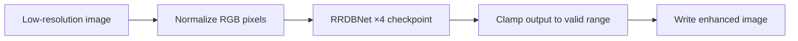

# Image Enhancer — Project Guide

This folder contains an ESRGAN-style ×4 super-resolution experiment built around
the Residual-in-Residual Dense Block (RRDB) network. The upstream ESRGAN README
is intentionally retained as `README.md`; this document explains the local project.

## What is included

| File | Purpose |
|---|---|
| `RRDBNet_arch.py` | PyTorch RRDB network definition used for inference |
| `test.py` | Original single-image/batch inference script |
| `net_interp.py` | Network-interpolation utility for two compatible checkpoints |
| `transer_RRDB_models.py` | Checkpoint-key conversion helper |
| Sample `.jpg` / `.png` files | Original visual inputs and outputs |

## Required model weight

The inference code expects `models/RRDB_ESRGAN_x4.pth` (or the PSNR-oriented
alternative). That checkpoint is **not included** in this repository, so an
enhancement run cannot be verified locally until it is restored.



## Recommended local layout

```text
image_enhancer/
├── models/
│   └── RRDB_ESRGAN_x4.pth   # download separately; ignored by Git
├── LR/                      # input images
├── results/                 # generated images
├── RRDBNet_arch.py
└── test.py
```

## Environment and run command

Install a PyTorch build appropriate for your CPU or GPU from the official PyTorch
selector, then install the remaining packages:

```powershell
pip install numpy opencv-python
python test.py
```

The original `test.py` currently defaults to CUDA. On a CPU-only machine, change
the configured device to CPU before running, or use a future wrapper that accepts
the device as a command-line option.

## Responsible interpretation

Super-resolution generates plausible high-frequency image detail; it does not
recover ground-truth information that was absent in the input. Do not use enhanced
medical, forensic, legal, or safety-critical images as evidentiary originals.

## Verification status

Architecture code and supplied samples are preserved. Actual inference remains
unverified in this checkout because the required pretrained checkpoint is absent.
