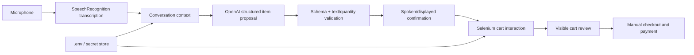
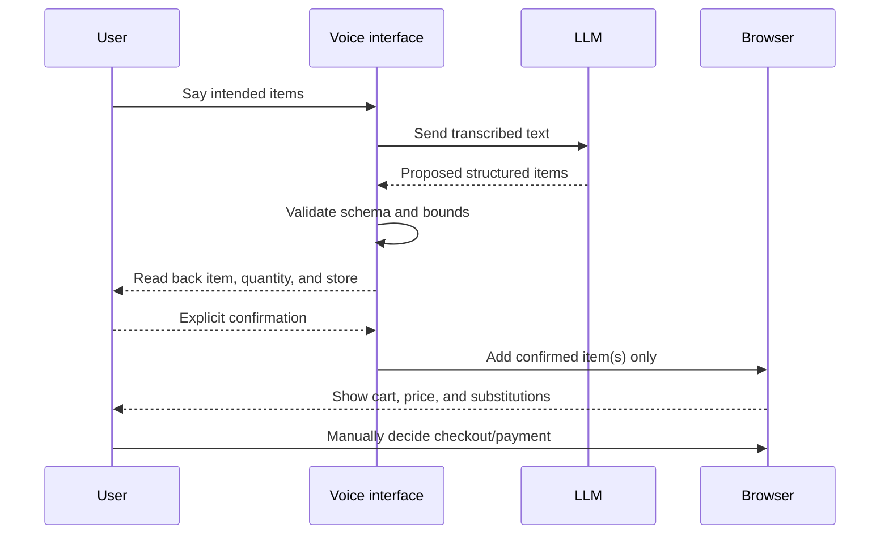

# Voice-Guided Grocery Cart Prototype

> **Project status — partially runnable, intentionally non-production.** This
> desktop prototype accepts microphone input, uses an OpenAI model to structure
> grocery intent, and drives browser automation for retailer sites. It has a
> validation boundary for model-produced cart data, but it has not been executed
> end-to-end in this revamp. A microphone, API key, user-owned retailer account,
> current site selectors, and explicit user permission are required.

## What it does—and what it deliberately does not do

The intended flow is voice input → text transcription → conversational item
extraction → user confirmation → browser-assisted cart building. It is a
portfolio prototype for combining speech, an LLM, and web automation.

It is **not** a payment agent. It must never submit an order, payment, address,
or irreversible purchase based only on a spoken request or an LLM response.
Checkout and payment remain a visible manual user action. Retailer terms,
website changes, MFA/captcha, prices, substitutions, stock, age restrictions,
and delivery choices can invalidate automation assumptions.

## Architecture and control points



The browser must not be the authority on what the user meant. The user must see
and confirm items, quantities, store, price, substitutions, delivery details,
and the final retailer checkout page.

## Repository map

| File | Responsibility | State |
|---|---|---|
| `voice_shop_openai.py` | Most complete voice, LLM, and Selenium flow | Compiles; external E2E run not performed |
| `voice.py` | Smaller voice/cart prototype | Compiles; item intent now validated |
| `new.py` | Historical alternative prototype | Retained; credential example removed |
| `order_validation.py` | Pure validation boundary for LLM cart proposals | Tested: 13 tests pass |
| `.env.example` | Required configuration names, no values | Added |
| `test_tts.py` | Manual text-to-speech smoke utility | Preserved |

## Why LLM output is treated as untrusted input

Language models can return malformed JSON, invent quantities, concatenate
instructions, or misunderstand speech. `order_validation.py` accepts only an
object with a compact item name, optional compact details, and—in the list
flow—an integer quantity from 1 to 100. It rejects lists, nested structures,
empty text, booleans, fractional quantities, and oversized strings before
Selenium receives the data.

```text
LLM JSON → parse → validate shape → validate item/details text
         → validate quantity bounds → ask user → browser action

Anything invalid → stop that proposal and ask the user to repeat/clarify.
```

Validation is necessary but not sufficient. Brand, size, dietary constraints,
and substitutions must still be resolved with the user before cart actions.

## Setup without exposing secrets

```bash
cd voiceshopping
python -m venv .venv
.\.venv\Scripts\Activate.ps1
python -m pip install -r requirements.txt
Copy-Item .env.example .env
```

Populate the ignored `.env` file locally:

| Variable | Purpose | Safe default |
|---|---|---|
| `OPENAI_API_KEY` | Enables model calls | Required only for LLM flows |
| `COLES_*`, `WOOLWORTHS_*` | Optional user-owned retailer credentials | Empty and disabled |
| `COLES_ENABLED`, `WOOLWORTHS_ENABLED` | Explicitly permit store automation | `false` |
| `BROWSER_HEADLESS` | Controls browser visibility | `false`; visible review is safer |
| `VOICE_RATE`, `VOICE_VOLUME` | Local TTS controls | Non-sensitive defaults |

Never put keys or retailer passwords in source code, a notebook, issue, commit,
screenshot, or terminal recording. `.env` is ignored by Git. Browser logs and
screenshots are also ignored because they can contain account or cart details.

## Safe operating sequence



If transcription is uncertain, model output is invalid, the site layout has
changed, MFA/captcha appears, or the cart differs from the request, stop and
switch to manual control. Do not work around retailer safeguards.

## Verification performed

```bash
python -m pytest tests -q
python -m py_compile order_validation.py voice.py new.py voice_shop_openai.py
```

Result: **13 tests passed** and the four Python entry points compiled. Those
checks prove only the new validation boundary and syntax. They do not prove
microphone access, speech quality, OpenAI responses, retailer login, or live
site automation.

## Known limitations and next hardening steps

- Browser selectors are retailer-site dependent and can break without notice.
- Transcripts and LLM calls may contain shopping preferences; obtain consent and
  retain minimal data before any production use.
- Current prototypes expose raw exception text in some console paths; production
  logging needs redaction and non-sensitive structured diagnostics.
- A production version needs a reviewable UI, per-action approval, cart-diff
  checks, price/quantity caps, mock external-service tests, and accessibility
  review.
- Live automation was not performed here to avoid interacting with user
  accounts or retailer systems without an explicit request.

See the [technical walkthrough](docs/index.html) for threat model, failure
controls, and an end-to-end execution checklist.
