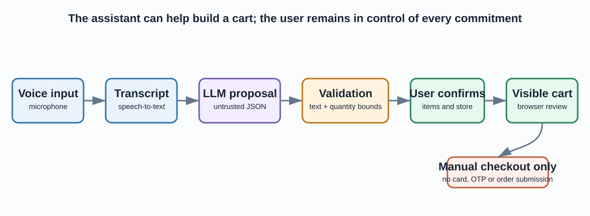
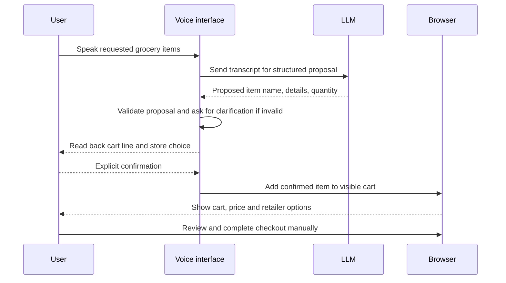
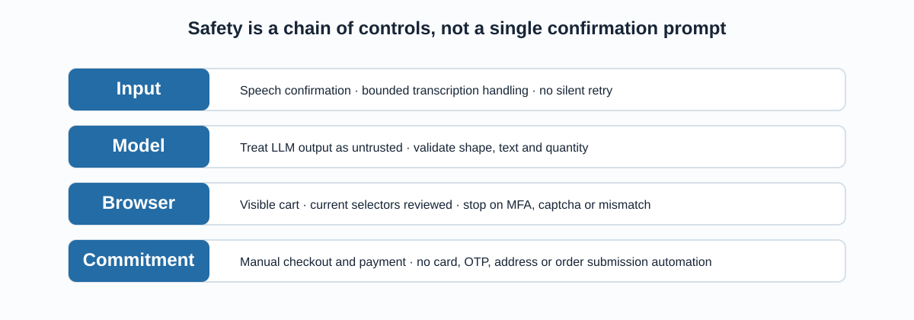
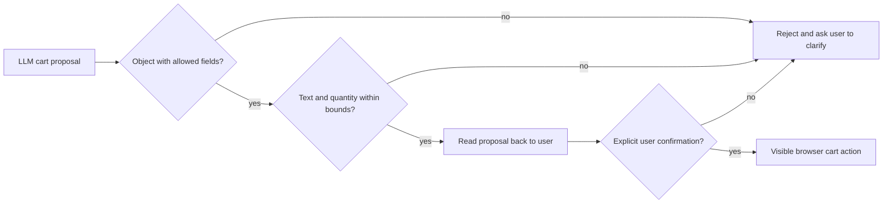
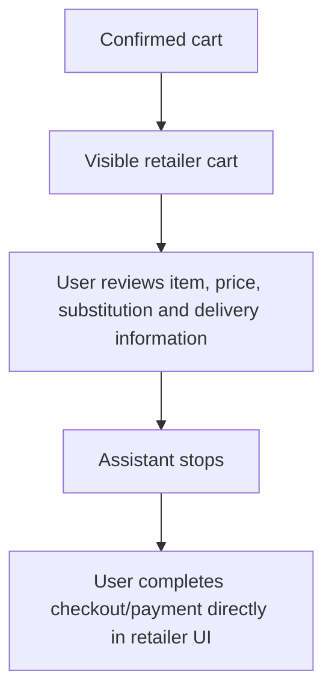

# Voice-Guided Grocery Cart Prototype

This project explores a multimodal shopping interaction: speak a grocery list, turn it into a bounded cart proposal, confirm it with the user, and assist with visible browser cart updates. It combines speech recognition, text-to-speech, an OpenAI-backed conversation layer, validation, and Selenium browser automation.

It is deliberately **a cart-assistance prototype, not an autonomous purchasing agent**. The assistant does not collect card details or OTP codes, submit an order, or complete payment. The user reviews the browser cart and completes any checkout manually.



## The user journey



Speech and language-model output are both fallible. The system treats the proposed cart object as untrusted input, then asks the user to confirm the actual item, details, quantity and store before an external browser action.

## Architecture

| Layer | Responsibility | Important boundary |
|---|---|---|
| Voice I/O | Microphone transcription and local spoken prompts | Ask again when speech is uncertain. |
| Conversation | Translate a natural-language request into cart-line proposals | LLM output is not trusted or executed directly. |
| Validation | Restrict item text and quantity before browser automation | Reject malformed data, nested objects, booleans and quantities outside 1–100. |
| Browser assistance | Add confirmed items to a visible user-owned retailer cart | Stop for site changes, safeguards, review and manual checkout. |



## Why validation sits between the model and the browser

Language models can mishear a transcript, invent fields, return malformed JSON or over-specify an item. [`src/order_validation.py`](src/order_validation.py) accepts only a narrow cart-line schema:

```python
{
    "item": "milk",             # required, non-empty text, max 120 characters
    "details": "full cream",    # optional compact text
    "quantity": 2               # integer from 1 through 100
}
```



The validator is an engineering guard, not product matching intelligence. A valid string such as “milk” can still map to an unsuitable brand, size, substitute or price. The user must see the retailer’s actual cart before taking any further action.

## Safety boundary: cart assistance only

The supported implementation has a hard manual-checkout boundary in [`src/checkout_safety.py`](src/checkout_safety.py). Any route that reaches the historical checkout method announces that the cart is ready and returns without capturing payment data, OTPs, addresses, or submitting an order.



Do not bypass MFA, captchas, retailer safeguards, age checks or other platform controls. If any of these appear—or the cart does not match the spoken request—stop automation and hand control to the user.

## Run the local prototype safely

```powershell
python -m venv .venv
.venv\Scripts\Activate.ps1
python -m pip install -r requirements.txt
Copy-Item .env.example .env
python -m pytest -q
```

Keep credentials only in the ignored `.env` file or an operating-system secret store. Do not commit them, paste them into source code, or include them in logs or screenshots.

| Setting | Purpose | Safe default |
|---|---|---|
| `OPENAI_API_KEY` | Enables optional conversation calls | Empty |
| `COLES_ENABLED`, `WOOLWORTHS_ENABLED` | Explicitly allow retailer browser automation | `false` |
| `COLES_*`, `WOOLWORTHS_*` | Credentials for a user-owned account | Empty |
| `BROWSER_HEADLESS` | Controls browser visibility | `false`, so the cart remains visible |
| `VOICE_RATE`, `VOICE_VOLUME` | Local text-to-speech controls | Non-sensitive defaults |

The project needs a microphone, supported speech/TTS services, a browser driver, a user-owned retailer account, current selectors, and explicit user authority for any real cart interaction. Those external dependencies are intentionally not exercised by the automated test suite.

## What the test suite verifies

```powershell
python -m pytest -q
python -m py_compile src/order_validation.py src/checkout_safety.py src/voice.py src/new.py src/voice_shop_openai.py
```

The current suite verifies 14 behaviours: valid text is cleaned; malformed, empty, nested or oversized fields are rejected; quantities must be integers from 1 to 100; and the checkout boundary always instructs manual payment. These checks do not certify microphone quality, LLM reliability, retailer site compatibility, browser login, product matching, pricing, stock or any external service.

## Project map

```text
13-voice-shopping-agent/
├── src/
│   ├── order_validation.py        # strict validation for model cart proposals
│   ├── checkout_safety.py         # hard manual-checkout boundary
│   ├── voice.py                   # compact voice/cart prototype
│   ├── voice_shop_openai.py       # fuller voice, LLM and Selenium prototype
│   └── new.py                     # retained historical alternative
├── tests/                         # validation and checkout-safety tests
├── scripts/tts_smoke_check.py     # optional local audio diagnostic
├── docs/
│   ├── index.html                 # standalone visual walkthrough
│   └── assets/                    # architecture and control diagrams
├── .env.example                   # secret-free environment contract
└── requirements.txt               # direct runtime and test dependencies
```

## Professional next steps

Before treating this as a production application, add a visual approval screen with cart-diff and price/quantity caps, structured redacted audit logging, mocked retailer integration tests, accessibility testing, explicit consent and data-retention policy, current retailer terms review, and a robust product matching strategy. Keep payment and order submission outside the assistant’s authority.

Open the [standalone walkthrough](docs/index.html) for a presentation-ready version of the project.
