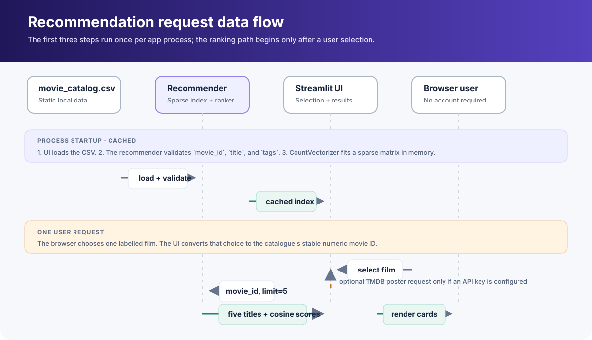
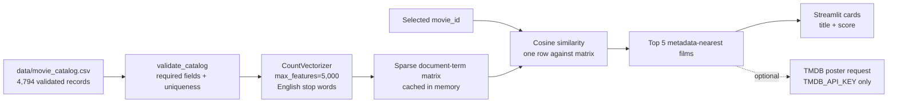
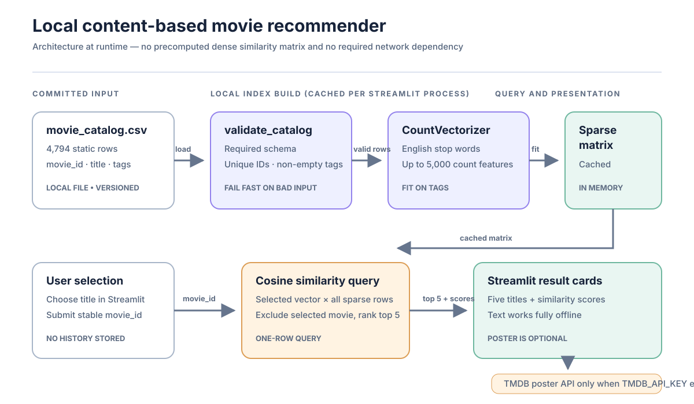
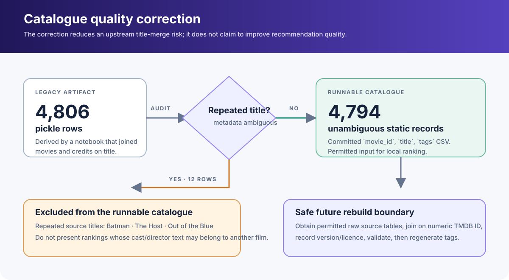
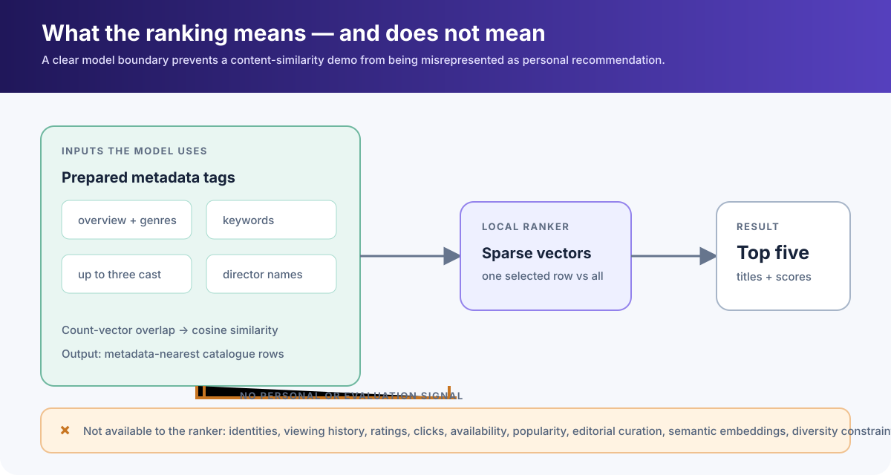

# Content-Based Movie Recommender

> A local, reproducible content-based recommender built from a static TMDB-derived catalogue. It recommends films from text metadata; it is **not** a personalised ranking system, a current TMDB catalogue, or evidence that a user will enjoy a film.

## Executive summary

This project migrates the runnable parts of the former `movie-recommender-system` repository into the machine-learning portfolio. The original Streamlit app could not start because it referenced two missing files under `model/`, embedded a TMDB API key, used a removed Streamlit API, and relied on a dense precomputed similarity matrix that was not included in the repository.

The repaired application builds a sparse count-vector representation from the committed `movie_catalog.csv` at startup and computes cosine similarity only for the selected row. The implementation is protected by **14 automated test cases** across ten correctness concerns: data validation, stable selection, rankings, error paths, the Streamlit journey, and the real committed catalogue. There is deliberately no accuracy, precision, or “recommendation quality” score: the catalogue has no user-preference labels or relevance judgments.

| Verified fact | Value | Boundary |
| --- | ---: | --- |
| Runnable catalogue records | 4,794 | Static, TMDB-derived text metadata—not live catalogue data |
| Source artifact rows before correction | 4,806 | Legacy pickle export from the upstream notebook |
| Ambiguous rows excluded | 12 | Repeated-title rows created by an unsafe title-based table merge |
| Text features | 5 groups | Overview, genres, keywords, up to three cast names, director names |
| Recommendation method | Cosine similarity | Similarity of metadata, not a measure of taste or quality |
| Regression tests | 14 | Correctness guards, not human evaluation |

## Start here

```powershell
cd 14-movie-recommender
python -m venv .venv
.venv\Scripts\Activate.ps1
python -m pip install --upgrade pip
pip install -r requirements.txt

# Verify the recommender contract and the committed catalogue.
python -m pytest --cov=src --cov-report=term-missing --cov-fail-under=80

# Start the local UI at the URL Streamlit prints.
streamlit run app.py
```

On macOS or Linux, activate the environment with `source .venv/bin/activate`.

The recommender works without network access once dependencies are installed. Poster images are optional: set a personal `TMDB_API_KEY` environment variable before launching Streamlit if you want the UI to request them. Never commit that key; no credential is stored in this project.

## What happens when a user asks for a recommendation?

```mermaid
sequenceDiagram
    participant U as User
    participant UI as Streamlit app
    participant R as ContentRecommender
    participant C as movie_catalog.csv
    participant T as TMDB API (optional)

    UI->>C: Load and validate catalogue once
    C-->>R: 4,794 movie_id, title, tags records
    R->>R: CountVectorizer fit on tags (cached sparse matrix)
    U->>UI: Select one unambiguous movie ID
    UI->>R: recommend(movie_id, limit=5)
    R->>R: Cosine similarity: selected vector × catalogue matrix
    R-->>UI: Five titles and similarity scores
    opt TMDB_API_KEY is configured
        UI->>T: Fetch poster for each recommended TMDB ID (10s timeout)
        T-->>UI: Poster path or error
    end
    UI-->>U: Recommendations; text still renders if poster lookup fails
```

The Streamlit UI caches the fitted recommender for its process lifetime. It does **not** save selection history, telemetry, ratings, or personal data.



The rendered diagram separates the one-time, cached catalogue/index initialization from a single user request. Each request uses a validated `movie_id`, ranks one selected sparse vector against the catalogue, and returns five titles with cosine-similarity scores.

## System at a glance





This figure is a static SVG so it renders both in GitHub and in the local standalone walkthrough. The required runtime path stops at the Streamlit result cards; the TMDB poster API is a clearly labelled optional side path.

### Why this is not the original dense matrix approach

The original notebook calls `cosine_similarity(vector)` for the whole dataset, and the old app expects the resulting `similarity.pkl`. A dense 4,806 × 4,806 `float64` matrix alone occupies about 176 MiB before pickle overhead. That artifact was absent from the standalone repository.

The portfolio implementation keeps the vector matrix sparse and computes only `cosine_similarity(selected_row, all_rows)` after a selection. It produces the same type of count-vector/cosine ranking without committing a large, version-sensitive matrix.

## Data contract and quality correction

[`data/movie_catalog.csv`](data/movie_catalog.csv) has exactly these columns:

| Column | Type in CSV | Role |
| --- | --- | --- |
| `movie_id` | Integer | Stable selection key and optional TMDB poster lookup ID |
| `title` | Text | Label displayed to the user |
| `tags` | Text | Preprocessed content representation used by the vectorizer |

The original notebook reads `tmdb_5000_movies.csv` and `tmdb_5000_credits.csv` then merges them on `title`. That is unsafe: the titles `Batman`, `The Host`, and `Out of the Blue` recur in the source. The legacy export contains 12 rows in which overview/genre data can be paired with cast/director data for a different film.




This is a data-integrity correction, not a model-quality claim. A future rebuild should join the TMDB source tables on their numeric movie identifier, validate source-version/licensing terms, and then regenerate `tags` before deciding whether to restore the excluded films.

### Dataset boundaries

- The CSV is a static derived catalogue, not a live TMDB mirror.
- `tags` are English-language text and named entities from the legacy preparation; language coverage and transliteration are not evaluated.
- The repository contains no user interactions, watch history, ratings, or relevance labels.
- This project does not make copyright, streaming-availability, age-rating, or content-safety claims.
- Poster retrieval is an optional external request and must comply with TMDB’s current API terms and the caller’s credentials.



The diagram makes the inference boundary explicit: the ranker only sees prepared metadata tags. It has no personal-preference or evaluation signal, so its result is a metadata-nearest list rather than evidence of user satisfaction.

## Design decisions

| Decision | Chosen approach | Why | What it does not solve |
| --- | --- | --- |
| Representation | `CountVectorizer(max_features=5000, stop_words="english")` | Preserves the original notebook’s simple, inspectable bag-of-words approach | Meaning beyond token overlap, spelling variants, multilingual semantics |
| Ranking | Cosine similarity | Normalises document length and directly ranks metadata overlap | Personal preference, novelty, diversity, or popularity |
| Selection key | Unique `movie_id` | Avoids selecting the first result when titles repeat | Upstream metadata correctness outside the cleaned catalogue |
| Runtime matrix | Sparse vectors plus one query at a time | Removes the missing dense `similarity.pkl` dependency | Cold-start feature quality or semantic retrieval |
| Posters | Optional, environment-supplied TMDB key | Keeps secrets out of source and leaves recommendations local | A stable poster service or offline imagery |
| Ambiguous data | Exclude repeated-title legacy rows | Avoids recommending from mixed film metadata | Recovery of those records without the raw source tables |

## Repository walkthrough

```text
14-movie-recommender/
├── app.py                              # Streamlit UI and optional poster fetcher
├── requirements.txt                    # Isolated runtime and test dependencies
├── pytest.ini                          # Test discovery configuration
├── data/
│   ├── movie_catalog.csv               # 4,794-record runnable catalogue
│   └── README.md                       # Source, schema, and cleaning boundary
├── notebooks/
│   └── 01_legacy_tmdb_workflow.ipynb   # Preserved original feature-engineering notebook
├── src/
│   └── recommender.py                  # Validation, vectorization, and ranking logic
├── tests/
│   └── test_recommender.py             # Unit + committed-catalogue regression checks
└── docs/
    ├── assets/                         # Rendered architecture, flow, data-quality, and boundary SVGs
    │   ├── architecture.svg
    │   ├── recommendation-flow.svg
    │   ├── data-quality-correction.svg
    │   └── ranking-boundary.svg
    └── index.html                      # Standalone visual walkthrough
```

### The code path

1. `app.py` calls `load_catalog(data/movie_catalog.csv)` through Streamlit’s resource cache.
2. `validate_catalog` checks required fields, non-empty titles/tags, and unique movie IDs; exact repeated rows are normalised away, while conflicting ID collisions fail fast.
3. `ContentRecommender.from_catalog` fits a sparse `CountVectorizer` on the `tags` column.
4. A user selects an ID from the validated catalogue.
5. `recommend` compares that row to every catalogue row, excludes the selected row, and returns descending cosine scores.
6. The UI renders the five results. If `TMDB_API_KEY` is absent or a request fails, titles and scores still display.

## Verification

The suite is intentionally small and focused. Run it with the command in [Start here](#start-here).

| Test area | Failure prevented |
| --- | --- |
| Required schema | Running a CSV without `movie_id`, `title`, or `tags` |
| ID collision | Quietly choosing an arbitrary record when one ID maps to incompatible metadata |
| Exact duplicate normalisation | Recommending the same identical record twice |
| Ranking | Returning the selected film or an ascending / unstable result list |
| Duplicate titles | Selecting by stable ID instead of taking the first matching title |
| Invalid requests | Unknown IDs and non-positive limits producing silent nonsense |
| Empty tags | Vectorizer failures with an empty vocabulary |
| CSV loading | A wrongly formatted input artifact |
| Real catalogue | Committed data loads, has unique IDs/titles, and supports five results |
| Streamlit journey | The user can render the local app and receive five recommendation cards without a TMDB key |

The test suite verifies code and the included derived data contract. It does not validate the original TMDB raw files, assess recommendation relevance with people, or call the external TMDB service.

## Original work and migration record

The standalone source repository was reviewed at local commit `28d5230`. Its `app.py`, `movie_list.pkl`, and notebook were the available project material. The original notebook is preserved here as [`notebooks/01_legacy_tmdb_workflow.ipynb`](notebooks/01_legacy_tmdb_workflow.ipynb) for provenance; it expects raw TMDB CSV inputs that are not included.

| Upstream issue | Portfolio correction |
| --- | --- |
| `model/movie_list.pkl` and `model/similarity.pkl` missing | Commit a portable CSV and build a sparse index from it |
| Hard-coded TMDB API key | Read optional `TMDB_API_KEY` only from the runtime environment |
| `st.beta_columns(5)` | Use current `st.columns(...)` |
| Lookup by title and `.index[0]` | Select and rank by validated numeric `movie_id` |
| Title-based source merge | Exclude the 12 ambiguous legacy records and document a safe rebuild |
| No tests or walkthrough | Add a test suite, data contract, detailed README, and web walkthrough |

## Limitations and responsible use

- Content similarity is not a recommendation evaluation. Without user feedback, claims about satisfaction, click-through, diversity, or ranking quality would be unsupported.
- Bag-of-words models ignore word order and much semantic context; a shared token can outweigh an important conceptual difference.
- Cast and director names are metadata, not consent or suitability signals.
- The source snapshot and external poster responses may be stale, incomplete, or unavailable.
- Do not use this project to infer protected traits, make content-access decisions, or represent TMDB data as current or complete.

## Next defensible steps

1. Obtain the permitted raw TMDB movies and credits tables with clear version and licence records.
2. Join those tables on the numeric movie ID, rerun data checks, and regenerate the catalogue.
3. Add offline relevance judgments or anonymised user feedback before measuring ranking metrics such as Precision@K, recall, coverage, or diversity.
4. Compare the count-vector baseline with a TF-IDF and sentence-embedding approach on the same judged set.
5. Keep poster fetching optional and separate from model evaluation.

## Master walkthrough

Open [`docs/index.html`](docs/index.html) in a browser for a self-contained visual version of this walkthrough. It includes four real, local SVG figures: system architecture, request-level data flow, catalogue correction flowchart, and the ranking capability boundary.
