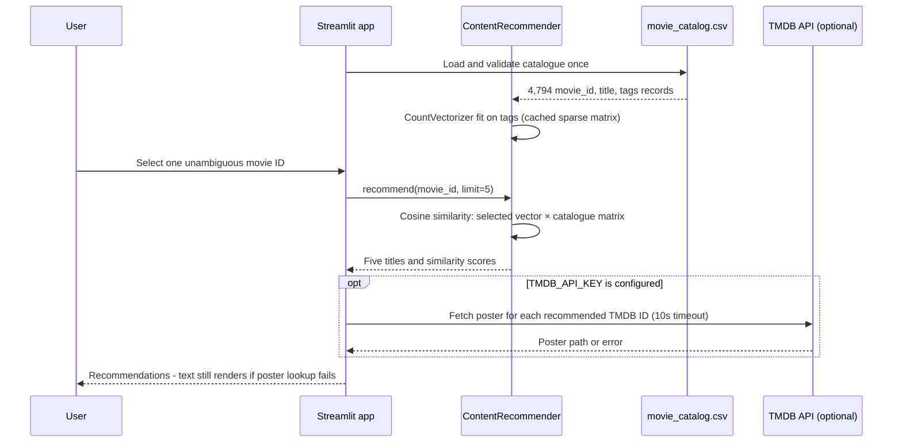
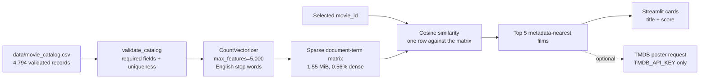
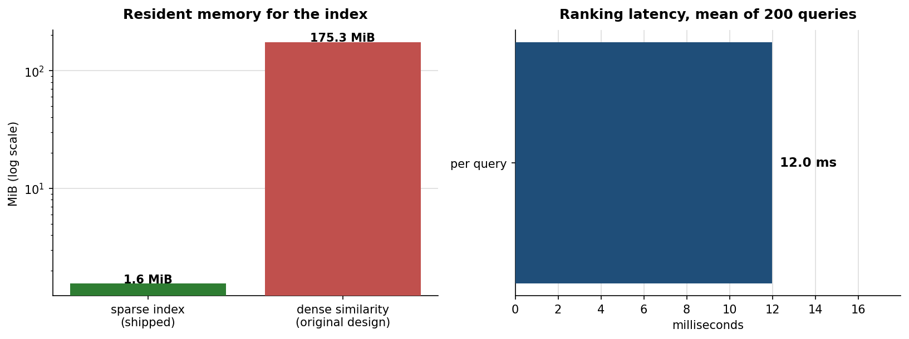
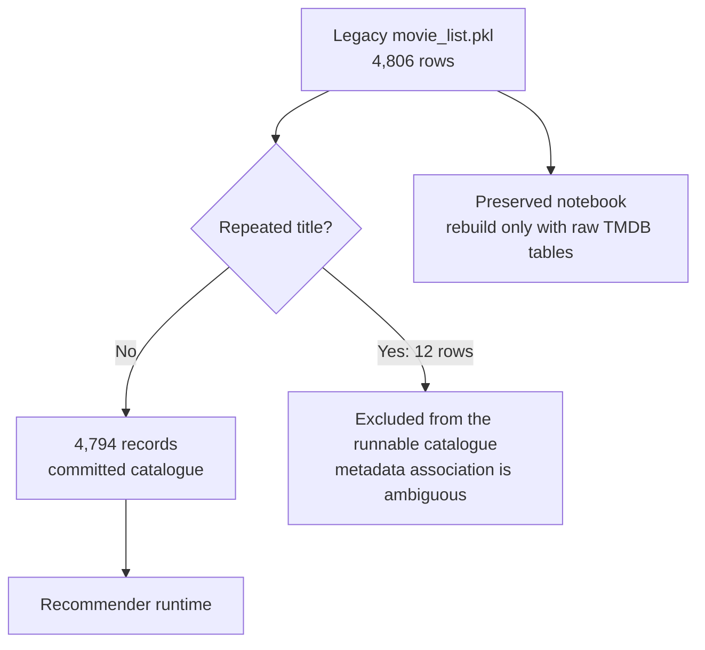
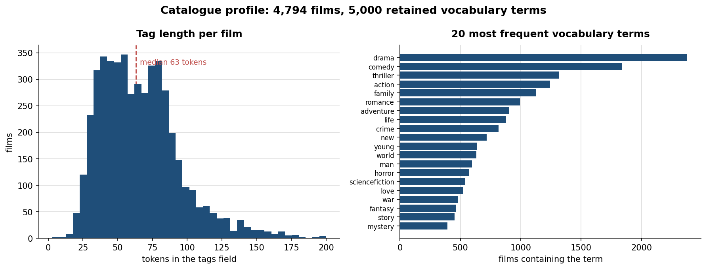
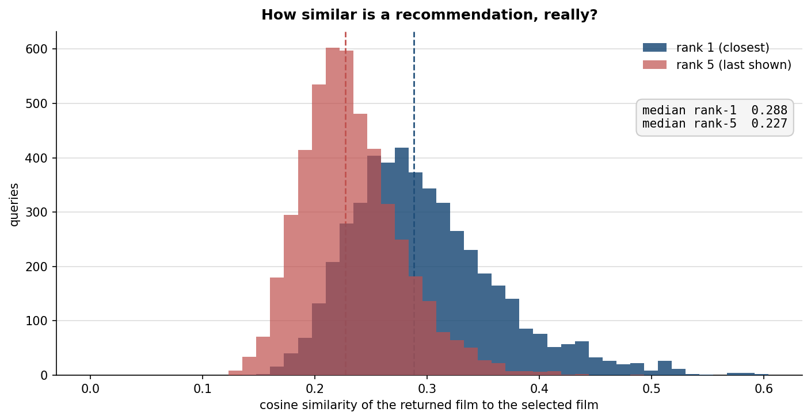
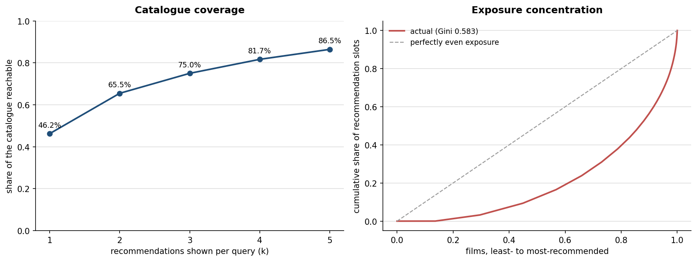
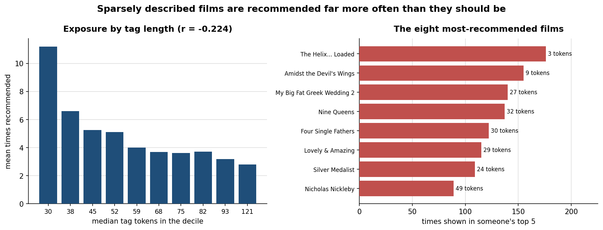
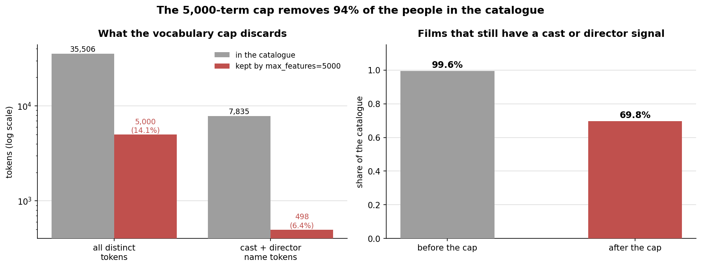
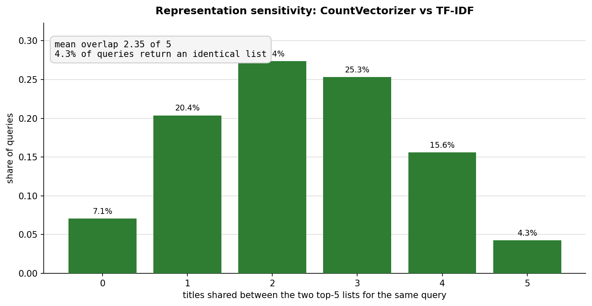

<div align="center">

# Content-Based Movie Recommender

**A local, reproducible content-based recommender over a 4,794-film TMDB-derived catalogue — and a measured account of where it works, where it fails, and why.**

[](https://www.python.org/downloads/)
[](#verification)
[](#verification)
[](https://streamlit.io/)
[](#optional-posters)
[](#quickstart)

</div>

> It recommends films whose **text metadata** is closest to the film you picked. It is **not** a personalised ranking system, **not** a live TMDB catalogue, and **not** evidence that a person will enjoy a film.

---

## What measurement found

The catalogue has no ratings, watch history or relevance judgments, so there is deliberately **no accuracy or precision score** here — see [why](#why-there-is-no-accuracy-score). But plenty about a ranker can be measured without labels, and doing so turned up three concrete defects that a demo screenshot would have hidden.

| # | Finding | Evidence |
|---|---|---|
| 1 | **Sparsely described films are recommended 12.8× more than everything else.** The seven films with under 15 tag tokens appear in someone's top 5 **62.7 times on average**; the other 4,787 average **4.9**. The single most-recommended film in the entire catalogue is *The Helix... Loaded*, whose complete tag text is `Action Comedy ScienceFiction`. | [chart](#finding-1-short-tags-win-more-than-they-should) |
| 2 | **`max_features=5000` throws away 94% of the cast and director names.** The catalogue holds 35,506 distinct tokens; the cap keeps 5,000 (14.1%). Of 7,835 name tokens it keeps 498 (6.4%), so **1,430 films lose every cast and director signal** they had. | [chart](#finding-2-the-vocabulary-cap-deletes-the-people) |
| 3 | **Over half the shipped list is an artefact of the representation.** Swapping `CountVectorizer` for `TfidfVectorizer` — same data, same cosine ranking — changes the top 5 for **95.7% of queries**, with a mean overlap of only **2.35 of 5** titles. | [chart](#finding-3-half-the-list-is-a-representation-choice) |

None of these are visible from the app. All three come from [`scripts/build_report_assets.py`](scripts/build_report_assets.py), which regenerates every figure and number below in one command.

---

## Contents

- [What measurement found](#what-measurement-found)
- [Quickstart](#quickstart)
- [How it works](#how-it-works)
- [Data contract and the quality correction](#data-contract-and-the-quality-correction)
- [Does it actually work? Worked examples](#does-it-actually-work-worked-examples)
- [Measured behaviour](#measured-behaviour)
- [Why there is no accuracy score](#why-there-is-no-accuracy-score)
- [Design decisions](#design-decisions)
- [Repository walkthrough](#repository-walkthrough)
- [Verification](#verification)
- [Migration record](#migration-record)
- [Limitations and responsible use](#limitations-and-responsible-use)
- [What to do next](#what-to-do-next)

---

## Quickstart

```bash
cd 14-movie-recommender
python -m venv .venv
source .venv/bin/activate        # Windows: .venv\Scripts\Activate.ps1
pip install -r requirements.txt
```

```bash
python -m pytest --cov=src --cov-report=term-missing --cov-fail-under=80
```

```bash
streamlit run app.py
```

Reproduce every figure and number in this README:

```bash
python scripts/build_report_assets.py
```

The recommender needs **no network access** once dependencies are installed.

### Optional posters

Set a personal `TMDB_API_KEY` in the environment before launching Streamlit if you want poster images. Recommendations work without it, and the UI still renders titles and scores if a poster request fails. **No credential is committed anywhere in this project** — the upstream repository had one hard-coded, which is [issue #2 in the migration record](#migration-record).

---

## How it works







### The code path

1. `app.py` calls `load_catalog(data/movie_catalog.csv)` through Streamlit's resource cache.
2. `validate_catalog` checks required fields, non-empty titles and tags, and unique movie IDs. Exact repeated rows are normalised away; conflicting ID collisions fail fast.
3. `ContentRecommender.from_catalog` fits a sparse `CountVectorizer` on the `tags` column.
4. The user selects an ID from the validated catalogue.
5. `recommend` compares that one row to every catalogue row, excludes the selected row, and returns descending cosine scores.
6. The UI renders five results. If `TMDB_API_KEY` is absent or a request fails, titles and scores still display.

### Why not the original dense matrix

The upstream notebook calls `cosine_similarity(vector)` over the whole dataset and the old app expects the resulting `similarity.pkl` — an artefact that was never committed. That claim is now **measured rather than estimated**:



| | Sparse index (shipped) | Dense similarity matrix (original design) |
|---|---:|---:|
| Resident memory | **1.55 MiB** | **175.3 MiB** |
| Ratio | 1× | **113×** |
| Stored values | 133,467 non-zeros (0.56% dense) | 22,982,436 float64 cells |
| Ranking latency | **9.6 ms** per query | — |

The runtime keeps the vectors sparse and computes `cosine_similarity(selected_row, all_rows)` only after a selection. Same ranking, 113× less memory, no large version-sensitive artefact in git.

---

## Data contract and the quality correction

[`data/movie_catalog.csv`](data/movie_catalog.csv) has exactly these columns:

| Column | Type | Role |
|---|---|---|
| `movie_id` | Integer | Stable selection key and optional TMDB poster lookup ID |
| `title` | Text | Label displayed to the user |
| `tags` | Text | Preprocessed content representation used by the vectorizer |

The original notebook merges `tmdb_5000_movies.csv` and `tmdb_5000_credits.csv` **on `title`**. That is unsafe: `Batman`, `The Host` and `Out of the Blue` each recur in the source, so overview and genre data can be paired with the cast and director of a different film.




This is a **data-integrity correction, not a model-quality claim**. A future rebuild should join the TMDB source tables on their numeric movie identifier, confirm source-version and licensing terms, and regenerate `tags` before deciding whether to restore the excluded films.

### Dataset boundaries

- The CSV is a static derived catalogue, not a live TMDB mirror.
- `tags` are English-language text and named entities from the legacy preparation. Language coverage and transliteration are not evaluated.
- The repository contains no user interactions, watch history, ratings or relevance labels.
- No copyright, streaming-availability, age-rating or content-safety claims are made.
- Poster retrieval is an optional external request and must comply with TMDB's current API terms.


---

## Does it actually work? Worked examples

Real output from the committed catalogue. Judge it yourself — that is the point of printing it rather than describing it.

**Query: The Dark Knight** — franchise recall is exactly what content similarity is good at.

| Rank | Recommendation | Cosine |
|---:|---|---:|
| 1 | The Dark Knight Rises | 0.415 |
| 2 | Batman Begins | 0.379 |
| 3 | Batman Returns | 0.312 |
| 4 | Batman Forever | 0.279 |
| 5 | Batman & Robin | 0.271 |

**Query: The Avengers** — same story across a shared universe.

| Rank | Recommendation | Cosine |
|---:|---|---:|
| 1 | Avengers: Age of Ultron | 0.363 |
| 2 | Captain America: Civil War | 0.329 |
| 3 | Iron Man 3 | 0.312 |
| 4 | Captain America: The First Avenger | 0.298 |
| 5 | Iron Man | 0.292 |

**Query: Toy Story** — the first two are right, then it falls apart.

| Rank | Recommendation | Cosine | |
|---:|---|---:|---|
| 1 | Toy Story 2 | 0.472 | ✅ |
| 2 | Toy Story 3 | 0.449 | ✅ |
| 3 | The 40 Year Old Virgin | 0.310 | ⚠️ shares "comedy", little else |
| 4 | Heartbeeps | 0.183 | ❌ |
| 5 | Max Keeble's Big Move | 0.157 | ❌ |

**Query: Pulp Fiction** — no franchise to lean on, and the result is generic crime films.

| Rank | Recommendation | Cosine |
|---:|---|---:|
| 1 | Easy Money | 0.270 |
| 2 | Nine Queens | 0.253 |
| 3 | The Man | 0.239 |
| 4 | Blood Ties | 0.233 |
| 5 | Dead Man Down | 0.228 |

Two things are worth noticing. Pulp Fiction keeps three of its four name tokens (`JohnTravolta`, `UmaThurman`, `QuentinTarantino` survive the vocabulary cap; `SamuelL.Jackson` does not, because the period splits it), so this is not a missing-metadata problem. And *Nine Queens* at rank 2 is the **fourth most over-recommended film in the catalogue** — it appears in 137 different top-5 lists. That is [finding #1](#finding-1-short-tags-win-more-than-they-should) showing up in a single query.

**The honest summary: ranks 1–2 are usually defensible, ranks 3–5 frequently are not.**

---

## Measured behaviour

Everything in this section is produced by `python scripts/build_report_assets.py`, which ranks all 4,794 films against all 4,794 films and writes [`docs/assets/metrics.json`](docs/assets/metrics.json). No figure or number here is hand-written.

### Catalogue profile



| Property | Value |
|---|---:|
| Films | 4,794 |
| Tag tokens per film | min 3 · median 63 · mean 66.2 · max 200 |
| Distinct tokens in the catalogue | 35,506 |
| Vocabulary retained by the model | 5,000 |

The most frequent terms are `drama`, `comedy`, `thriller`, `action`, `family`, `romance`, `adventure` — genre words shared by hundreds of films. They dominate the vector space, which is the root of both finding #1 and the mediocre similarity scores below.

### How similar is a recommendation, really?



| Statistic | Value |
|---|---:|
| Median cosine of the **closest** film (rank 1) | **0.288** |
| 10th–90th percentile of rank 1 | 0.223 – 0.385 |
| Median cosine of the **last shown** film (rank 5) | **0.227** |
| Queries whose closest match scores below 0.2 | 149 |
| Queries whose closest match scores above 0.5 | 54 |

Read that first row carefully. For a typical film, the single most similar item in a 4,794-film catalogue shares **under 30% of its metadata direction**. Only 54 queries — about 1% — find a genuinely close neighbour. The UI displays a score for exactly this reason: 0.47 and 0.16 mean very different things, and both get rendered as "a recommendation".

### Coverage and concentration



| Metric | Value | Meaning |
|---|---:|---|
| Coverage @ 1 | 46.3% | Share of the catalogue that is *anyone's* closest match |
| Coverage @ 5 | **86.5%** | Share reachable at all through the UI |
| Never recommended | **649 films (13.5%)** | Unreachable no matter which film you pick |
| Gini of exposure | **0.583** | 0 would be perfectly even exposure |
| Share of slots taken by the top 1% of films | **13.0%** | 48 films take an eighth of all recommendation slots |

A seventh of the catalogue can never surface. That is a property of the ranking function, not of the films.

### Finding 1: short tags win more than they should



Cosine similarity divides by vector length. A film described by three generic genre words has a short vector pointing almost exactly at any query sharing one of them — so it can outrank a film that genuinely matches on ten specific terms.

| | Films | Mean times recommended |
|---|---:|---:|
| Tags under 15 tokens | 7 | **62.7** |
| Everything else | 4,787 | **4.9** |
| | | **12.8× over-exposure** |

Correlation between tag length and recommendation frequency: **r = −0.224**. Every one of the eight most-recommended films in the catalogue is sparsely described, led by *The Helix... Loaded* at 176 appearances with a three-word tag string.

**Fix:** either enforce a minimum tag length in `validate_catalog`, or switch to TF-IDF so that common genre tokens stop carrying full weight. Both are one-line changes; neither should ship without the offline judgments described in [what to do next](#what-to-do-next).

### Finding 2: the vocabulary cap deletes the people



`max_features=5000` is inherited from the upstream notebook. Measuring what it discards turns out to matter, because the discarded tail is almost entirely cast and director names — the only tokens that distinguish two films sharing a genre.

| | In the catalogue | Kept by the cap | Retention |
|---|---:|---:|---:|
| Distinct tokens | 35,506 | 5,000 | 14.1% |
| Cast + director name tokens | 7,835 | 498 | **6.4%** |
| Films with at least one name signal | 99.6% | **69.8%** | — |

**1,430 films lose every cast and director token they had.** For those films the recommender is ranking on genre and overview words alone, which is the weakest signal available.

### Finding 3: half the list is a representation choice



Same catalogue, same cosine ranking, same `max_features` — only the weighting changes.

| Metric | Value |
|---|---:|
| Mean titles shared between the two top-5 lists | **2.35 of 5** |
| Queries returning an identical list | **4.3%** |
| Queries sharing no titles at all | 7.1% |

With no relevance labels this **cannot** say which is better. It can say something more useful: **more than half of what the app shows is a consequence of an undocumented default, not of the data.** Any future comparison of the two needs judgments, not intuition.

---

## Why there is no accuracy score

Because there is nothing to score against.

Precision@K, recall, NDCG, hit rate and every other ranking metric require **relevance judgments** — a record of which recommendations were actually good for someone. This catalogue contains film metadata and nothing else: no ratings, no watch history, no clicks, no human labels.

A number could be manufactured — hold out a genre tag and check whether recommendations share it, for instance — but it would measure whether cosine similarity on bag-of-words recovers bag-of-words, which is circular. Reporting it as "accuracy" would be the most misleading thing in this repository.

So the metrics above are all **label-free properties of the ranker itself**: coverage, concentration, score distribution, representation sensitivity, memory, latency. Each one is a fact about the system. None of them is a claim about taste.

---

## Design decisions

| Decision | Chosen approach | Why | What it does not solve |
|---|---|---|---|
| Representation | `CountVectorizer(max_features=5000, stop_words="english")` | Preserves the original notebook's simple, inspectable bag-of-words approach | Meaning beyond token overlap; spelling variants; multilingual semantics. See [finding #2](#finding-2-the-vocabulary-cap-deletes-the-people) and [#3](#finding-3-half-the-list-is-a-representation-choice) |
| Ranking | Cosine similarity | Normalises document length and directly ranks metadata overlap | Personal preference, novelty, diversity, popularity. Introduces [finding #1](#finding-1-short-tags-win-more-than-they-should) |
| Selection key | Unique `movie_id` | Avoids silently picking the first result when titles repeat | Upstream metadata correctness outside the cleaned catalogue |
| Runtime matrix | Sparse vectors, one query at a time | Removes the missing dense `similarity.pkl` dependency; 113× less memory | Cold-start feature quality or semantic retrieval |
| Posters | Optional, environment-supplied TMDB key | Keeps secrets out of source and recommendations local | A stable poster service or offline imagery |
| Ambiguous data | Exclude the 12 repeated-title legacy rows | Avoids recommending from mixed film metadata | Recovery of those records without the raw source tables |

---

## Repository walkthrough

```text
14-movie-recommender/
├── app.py                              # Streamlit UI and optional poster fetcher
├── requirements.txt                    # Isolated runtime and test dependencies
├── pytest.ini                          # Test discovery configuration
├── data/
│   ├── movie_catalog.csv               # 4,794-record runnable catalogue
│   └── README.md                       # Source, schema, and cleaning boundary
├── notebooks/
│   └── 01_legacy_tmdb_workflow.ipynb   # Preserved original feature-engineering notebook
├── scripts/
│   └── build_report_assets.py          # Regenerates every figure and metrics.json
├── src/
│   └── recommender.py                  # Validation, vectorization, and ranking logic
├── tests/
│   ├── test_recommender.py             # Unit + committed-catalogue regression checks
│   └── test_app.py                     # Streamlit journey
└── docs/
    ├── assets/
    │   ├── architecture.svg            # hand-authored diagrams
    │   ├── recommendation-flow.svg
    │   ├── data-quality-correction.svg
    │   ├── ranking-boundary.svg
    │   ├── catalog-profile.png         # measured figures, all regenerated
    │   ├── similarity-distribution.png
    │   ├── catalog-coverage.png
    │   ├── exposure-bias.png
    │   ├── vocabulary-cap.png
    │   ├── vectorizer-ablation.png
    │   ├── performance.png
    │   └── metrics.json                # every number in this README
    └── index.html                      # Standalone visual walkthrough
```

---

## Verification

```bash
python -m pytest --cov=src --cov-report=term-missing --cov-fail-under=80
```

**14 test cases** across ten correctness concerns. They verify the code and the committed data contract. They do **not** validate the original TMDB raw files, assess relevance with people, or call the external TMDB service.

| Test area | Failure prevented |
|---|---|
| Required schema | Running a CSV without `movie_id`, `title` or `tags` |
| ID collision | Quietly choosing an arbitrary record when one ID maps to incompatible metadata |
| Exact duplicate normalisation | Recommending the same identical record twice |
| Ranking | Returning the selected film, or an ascending / unstable result list |
| Duplicate titles | Selecting by stable ID instead of taking the first matching title |
| Invalid requests | Unknown IDs and non-positive limits producing silent nonsense |
| Empty tags | Vectorizer failures with an empty vocabulary |
| CSV loading | A wrongly formatted input artefact |
| Real catalogue | Committed data loads, has unique IDs and titles, and supports five results |
| Streamlit journey | The local app renders and returns five cards without a TMDB key |

---

## Migration record

The upstream repository's history has been merged into this repository, so commit `28d5230` is reachable here and no longer depends on a separate repo continuing to exist. Its `app.py`, `movie_list.pkl` and notebook were the available material.

```bash
git show 28d5230:movie_list.pkl > movie_list.pkl   # recover the original artifact
git show 28d5230:app.py                            # the original Streamlit app
```

That artifact is worth keeping: it no longer loads on modern pandas, because pandas 2.x removed `pandas.core.indexes.numeric`, which the 1.x pickle references. Reading it now needs a compatibility shim — which is the strongest argument for the CSV migration. The original notebook is preserved as [`notebooks/01_legacy_tmdb_workflow.ipynb`](notebooks/01_legacy_tmdb_workflow.ipynb) for provenance; it expects raw TMDB CSV inputs that are not included here.

| # | Upstream issue | Correction |
|---|---|---|
| 1 | `model/movie_list.pkl` and `model/similarity.pkl` missing — the app could not start | Commit a portable CSV and build a sparse index from it at startup |
| 2 | Hard-coded TMDB API key in source | Read an optional `TMDB_API_KEY` from the environment only |
| 3 | `st.beta_columns(5)` — removed from Streamlit | Use the current `st.columns(...)` |
| 4 | Lookup by title with `.index[0]` | Select and rank by validated numeric `movie_id` |
| 5 | Title-based source merge mixing 12 films' metadata | Exclude the ambiguous legacy records and document a safe rebuild |
| 6 | A 176 MiB dense similarity matrix as a required artefact | Rank one sparse row per query — 1.55 MiB resident |
| 7 | No tests, no data contract, no walkthrough | 14 tests, a documented schema, this README, and a web walkthrough |

---

## Limitations and responsible use

- **Content similarity is not a recommendation evaluation.** Without user feedback, any claim about satisfaction, click-through, diversity or ranking quality would be unsupported.
- **Bag-of-words ignores word order and most semantic context.** A shared token can outweigh an important conceptual difference — see the Toy Story example at rank 3.
- **Exposure is uneven by construction.** 649 films are unreachable and sparsely described films are over-recommended 12.8×.
- **Cast and director names are metadata, not consent or suitability signals.**
- **The snapshot and any poster responses may be stale, incomplete or unavailable.**
- Do not use this project to infer protected traits, make content-access decisions, or represent TMDB data as current or complete.

---

## What to do next

Ordered by what the measurements above actually justify.

1. **Fix the exposure bias** (finding #1). Enforce a minimum tag length in `validate_catalog`, or move to TF-IDF so shared genre words stop carrying full weight. Re-run `build_report_assets.py` and check that the Gini falls and coverage@5 rises.
2. **Revisit `max_features`** (finding #2). The cap costs 30% of films their entire cast and director signal while saving a matrix that is already only 1.55 MiB. Measure the memory and latency cost of removing it before assuming it is needed.
3. **Obtain the permitted raw TMDB movies and credits tables** with clear version and licence records, join them on the numeric movie ID, rerun the data checks, and regenerate the catalogue — restoring the 12 excluded films safely.
4. **Collect offline relevance judgments** or anonymised user feedback. Until that exists, Precision@K, NDCG and diversity metrics cannot be computed honestly.
5. **Then, and only then, compare representations** (finding #3) — counts vs TF-IDF vs sentence embeddings — on the same judged set. The ablation above shows the choice matters enormously; it cannot show which choice is right.
6. **Keep poster fetching optional** and outside any evaluation path.

---

## Master walkthrough

Open [`docs/index.html`](docs/index.html) in a browser for a self-contained visual version of this walkthrough.
