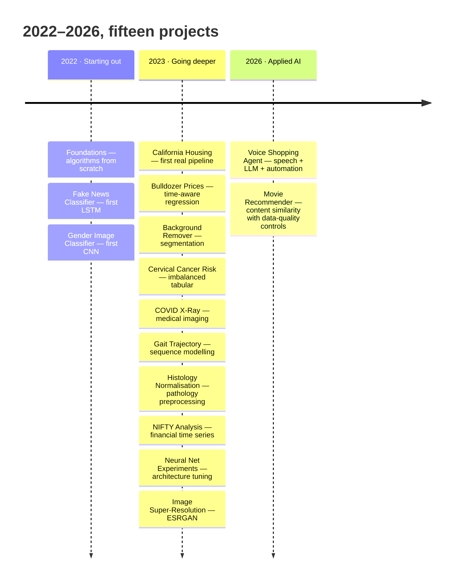
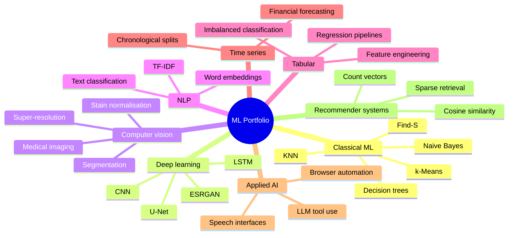
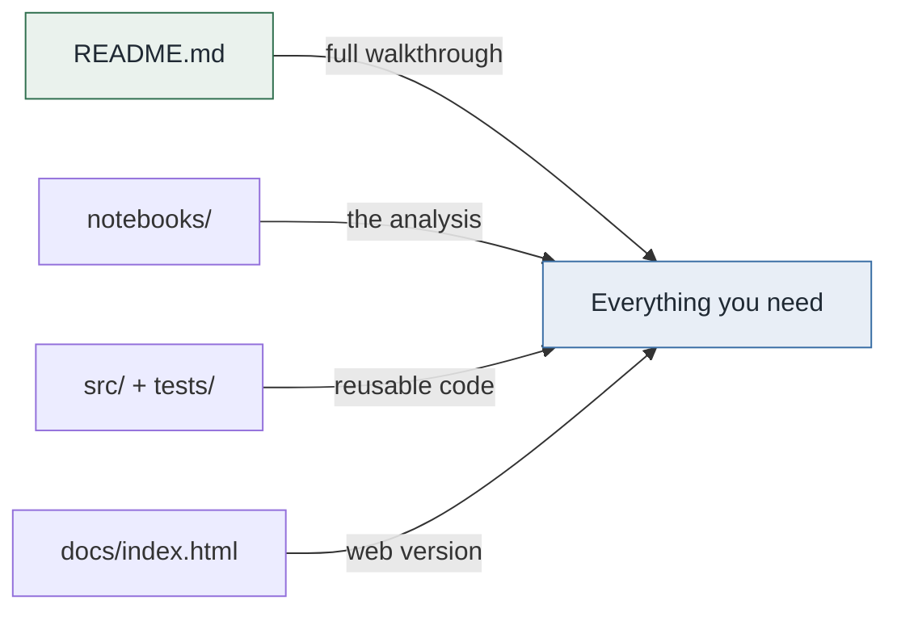

# Machine Learning Projects

**Fifteen projects, December 2022 to September 2026.** Classical algorithms
written from scratch, computer vision, NLP, time-series forecasting, medical
imaging, and an LLM-driven voice agent — in the order they were built.

---

## The journey



Each project folder is numbered in the order it was built, so the directory
listing reads as a timeline. Every one has its own README that works as a
complete standalone walkthrough — diagrams, explanation, and results, with no
need to open the code.

---

## Projects

| # | Project | Domain | Techniques |
|---|---|---|---|
| 00 | [Foundations](00-foundations/) | Classical ML | Find-S, ID3, KNN, Naive Bayes, k-means — written from scratch in NumPy |
| 01 | [Fake News Classifier](01-fake-news-classifier/) | NLP | Keras LSTM, word embeddings, TF-IDF baseline |
| 02 | [Gender Image Classifier](02-gender-image-classifier/) | Computer vision | CNN image classification |
| 03 | [California Housing](03-california-housing/) | Regression | scikit-learn pipelines, feature engineering |
| 04 | [Bulldozer Price Regression](04-bulldozer-price-regression/) | Tabular regression | Time-aware validation, random forests |
| 05 | [Background Remover](05-background-remover/) | Segmentation | Detectron2, U-Net, Flask app |
| 06 | [Cervical Cancer Risk](06-cervical-cancer-risk/) | Imbalanced classification | Leakage control, resampling, calibration |
| 07 | [COVID X-Ray Classifier](07-covid-xray-classifier/) | Medical imaging | CNN on chest radiographs |
| 08 | [Gait Trajectory](08-gait-trajectory/) | Sequence modelling | LSTM and dense networks on motion data |
| 09 | [Histology Colour Normalisation](09-histology-color-normalization/) | Medical imaging | Reinhard/Macenko stain normalisation |
| 10 | [NIFTY Price Analysis](10-nifty-price-analysis/) | Time series | Chronological splits, forecasting baselines |
| 11 | [Neural Net Experiments](11-neural-net-experiments/) | Deep learning | Architecture and regularisation comparisons |
| 12 | [Image Super-Resolution](12-image-super-resolution/) | Computer vision | ESRGAN, RRDBNet, model interpolation |
| 13 | [Voice Shopping Agent](13-voice-shopping-agent/) | Applied AI | Speech recognition, LLM tool use, browser automation |
| 14 | [Content-Based Movie Recommender](14-movie-recommender/) | Recommender systems | Count vectors, cosine similarity, sparse retrieval |

---

## By skill



---

## Repository layout

Every project follows the same shape, so navigation is identical throughout:

```
NN-project-name/
├── README.md            the complete walkthrough — diagrams, method, results
├── requirements.txt     project-local dependencies
├── notebooks/           the analysis, with explanatory markdown
├── src/                 importable, tested modules
├── tests/               automated checks
├── data/                datasets, or a README explaining how to obtain them
├── docs/
│   ├── index.html       the same walkthrough as a web page
│   └── assets/          generated figures
└── scripts/             figure generation and other reproducible tooling
```

Not every project has every directory — a notebook-only project has no `src/`.
Where a directory exists, it means the same thing across all fifteen.



---

## Running any project

Each project pins its own dependencies, because the runtimes differ
substantially — TensorFlow vision work, scikit-learn tabular work, and
speech/browser automation should not share one environment.

```bash
cd 00-foundations                # or any other project
python -m venv .venv
source .venv/bin/activate        # Windows: .venv\Scripts\activate
pip install -r requirements.txt
pytest
```

The root `requirements.txt` predates this structure and is kept only for
historical reference. Use the project-local one.

---

## A note on data

Several projects depend on datasets that are **not committed** here — medical
images, licensed corpora, and files too large to version sensibly. In every such
case the project's `data/README.md` records what the dataset is, where it came
from, and what schema the code expects, so the work can be reproduced by
supplying it.

Where a dataset is small and freely redistributable — the classical teaching
datasets in `00-foundations`, for instance — it is committed alongside the code.

---

## Scope

These are learning and portfolio projects. Results reported in each README come
from the runs described there and are not benchmark claims. Projects touching
medical, financial, or personal data document their limitations explicitly in
their own READMEs, and none of them should be used to make real decisions in
those domains.

---

## License

Repository code is released under the [MIT License](LICENSE). Datasets, model
weights, and third-party packages carry their own terms — each project README
identifies these where they apply.

The previous root overview is preserved in [LEGACY_README.md](LEGACY_README.md).
