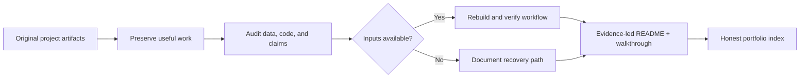
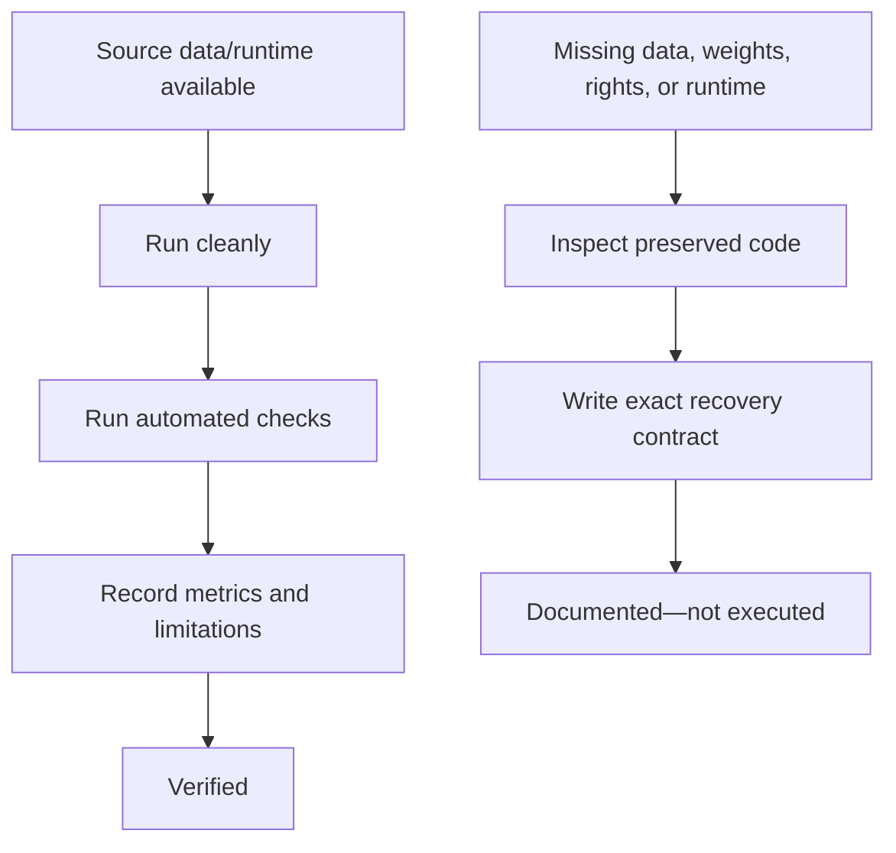
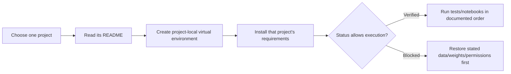

# Machine-Learning Portfolio

> A curated, evidence-led portfolio of machine learning, computer vision, NLP,
> time-series, and applied-AI projects. Each project documents what was actually
> verified locally, what remains blocked by missing data or runtime assets, and
> what would be required before making a real-world claim.

## Start here: how to read this repository

This is not a collection of inflated notebook scores. Some projects can be run
and tested end-to-end from the checked-in data; others preserve valuable
exploration but are missing the original dataset, model weights, consent record,
or cloud runtime. The status label beside every project is deliberate.



Read the [documentation standard](docs/PORTFOLIO_DOCUMENTATION_STANDARD.md) for
the portfolio-wide definition of a professional README and master walkthrough.
The [revamp status ledger](docs/PORTFOLIO_REVAMP_STATUS.md) is the source of
truth for execution evidence and recovery dependencies.

## Portfolio map

| Project | Area | Evidence state | Best starting point |
|---|---|---|---|
| [Cervical Cancer Risk-Factor Modeling](001_Cervical_Cancer_Predection_with_ML/README.md) | Imbalanced tabular classification | **Verified** | Leakage-aware EDA, modeling, and clinical-use limits |
| [California House Price Predictor](CaliforniaHousePricePredictor/README.md) | Regression | **Verified** | Reusable sklearn pipeline and 0.806 holdout R² |
| [NIFTY Closing-Price Analysis](nifty/readme.md) | Time-series regression | **Verified** | Chronological split and 0.71% MAPE baseline |
| [Fake News Classifier](FakeNewsClassifier/readme.md) | NLP classification | Implementation/tests verified; data blocked | TF-IDF baseline and careful non-fact-checking scope |
| [Blue Book for Bulldozers](Bluetooth%20Sale%20Predictor/README.md) | Tabular regression | Data blocked | Time-aware auction-price workflow recovery plan |
| [Background Remover](background_remover/README.md) | Image segmentation | Data/runtime blocked | Detectron2 mask workflow and deployment boundaries |
| [COVID-19 Chest X-Ray Study](Covid%2019%20predictor/README.md) | Medical image classification | Data/metadata blocked | Patient/site leakage and responsible-use protocol |
| [Gait-Trajectory Study](Gait%20trajectory/README.md) | Sequence modeling | Data blocked | Participant-level sequence-split design |
| [Image Enhancer](image_enhancer/README.md) | Super-resolution | Weights blocked | ESRGAN recovery and visual-quality boundaries |
| [Histology Colour Normalisation](ImageCRC/README.md) | Medical-image preprocessing | Governance/runtime blocked | Reference-image and pathology-data controls |
| [Appearance-Label Classifier](ManWomanClassifier/README.md) | Image classification | Data blocked | Ethical label framing and group-safe evaluation |
| [Voice-Guided Grocery Cart](voiceshopping/README.md) | Speech, LLM, and automation | Local validation verified; E2E not run | Untrusted-model validation and manual checkout boundary |

## What “verified” means here



| Label | Meaning | It does not mean |
|---|---|---|
| **Verified** | The current local implementation, tests, and/or notebook execution were checked with available inputs. | Production-ready, externally validated, or universally reproducible. |
| **Implementation/tests verified; data blocked** | Pure logic and tests run, but the original training corpus is missing. | A trained-model score exists. |
| **Documentation and recovery path complete; execution blocked** | Code/assets were inspected and the exact missing inputs, safeguards, and rerun path are documented. | The historical experiment ran during the revamp. |
| **Live workflow not run** | Local safety checks compile/pass while external accounts, hardware, or APIs were intentionally untouched. | Live integrations work today. |

## Recommended review paths

### For a hiring manager or reviewer

1. Start with [California House Price Predictor](CaliforniaHousePricePredictor/README.md) for a compact, verified, reusable regression pipeline.
2. Read [NIFTY Closing-Price Analysis](nifty/readme.md) to see why a random split is wrong for time series and how the chronological baseline is evaluated.
3. Read [Cervical Cancer Risk-Factor Modeling](001_Cervical_Cancer_Predection_with_ML/README.md) for the deepest end-to-end notebook, EDA/model separation, leakage controls, metrics, diagrams, and health-data limitations.
4. Read [Voice-Guided Grocery Cart](voiceshopping/README.md) for applied LLM validation, secret handling, and user-confirmation design.

### For responsible-AI and data-governance review

```text
Medical imagery: COVID-19 study → Histology normalisation
Human-labelled imagery: Appearance-label classifier
Human motion: Gait trajectory
Consumer automation: Voice-guided grocery cart

Common controls:
provenance → consent/rights → split boundary → validated workflow
→ uncertainty/failure analysis → prohibited uses
```

### For computer-vision review

Move from segmentation ([Background Remover](background_remover/README.md)),
to super-resolution ([Image Enhancer](image_enhancer/README.md)), to medical
colour preprocessing ([Histology Colour Normalisation](ImageCRC/README.md)).
These are intentionally framed as distinct tasks: a sharper image is not a
diagnosis, and a mask is not a production deployment.

## Project structure

```text
machine-learning-projects/
├── 001_Cervical_Cancer_Predection_with_ML/  # verified notebooks + tests
├── CaliforniaHousePricePredictor/            # verified regression pipeline
├── nifty/                                    # verified chronological baseline
├── FakeNewsClassifier/                       # tested NLP implementation
├── Bluetooth Sale Predictor/                 # data-recovery documentation
├── background_remover/                       # segmentation recovery documentation
├── Covid 19 predictor/                       # medical-image recovery documentation
├── Gait trajectory/                          # sequence-modeling recovery documentation
├── image_enhancer/                           # ESRGAN recovery documentation
├── ImageCRC/                                 # histology-normalisation documentation
├── ManWomanClassifier/                       # label/ethics-aware documentation
├── voiceshopping/                            # validated LLM input boundary
├── docs/                                     # portfolio standard and audit ledger
├── formatting/, lab/, random/, scripts/      # utilities; not portfolio projects
├── LEGACY_README.md                          # preserved previous root README
└── LICENSE
```

Each portfolio project contains a GitHub-facing README and a standalone
`docs/index.html` master walkthrough. Where the original README was valuable as
historical context, it remains as `LEGACY_README.md` or an explicitly named
upstream reference rather than being discarded.

## Reproducibility model

Projects have isolated requirements because their runtimes vary substantially:
TensorFlow/vision work, sklearn tabular work, notebooks, and speech/browser
automation should not be installed as one monolithic environment.



For a verified project, use its project-level instructions. Do not assume the
root `requirements.txt` is a universal environment; it predates the revamp and
is retained for historical compatibility.

## Portfolio standards applied during the revamp

- Preserve useful notebooks, figures, scripts, and legacy documentation.
- Separate exploratory analysis from final modeling when the project supports it.
- Make dataset contracts, leakage boundaries, evaluation design, and actual
  metrics explicit.
- Prefer diagrams that clarify data flow, decision points, and failure controls.
- Never fabricate data, weights, results, medical validity, or live integration
  evidence when a required input is unavailable.
- State limitations, prohibited uses, and the exact next step needed to recover
  a blocked project.

## License and third-party data

The repository includes an [MIT License](LICENSE) for repository code. Dataset,
model-weight, image, website, and third-party package terms are separate. Every
project README identifies when rights, consent, attribution, or a specific
source must be verified before a rerun or redistribution.

---

The previous root overview is preserved in [LEGACY_README.md](LEGACY_README.md).
